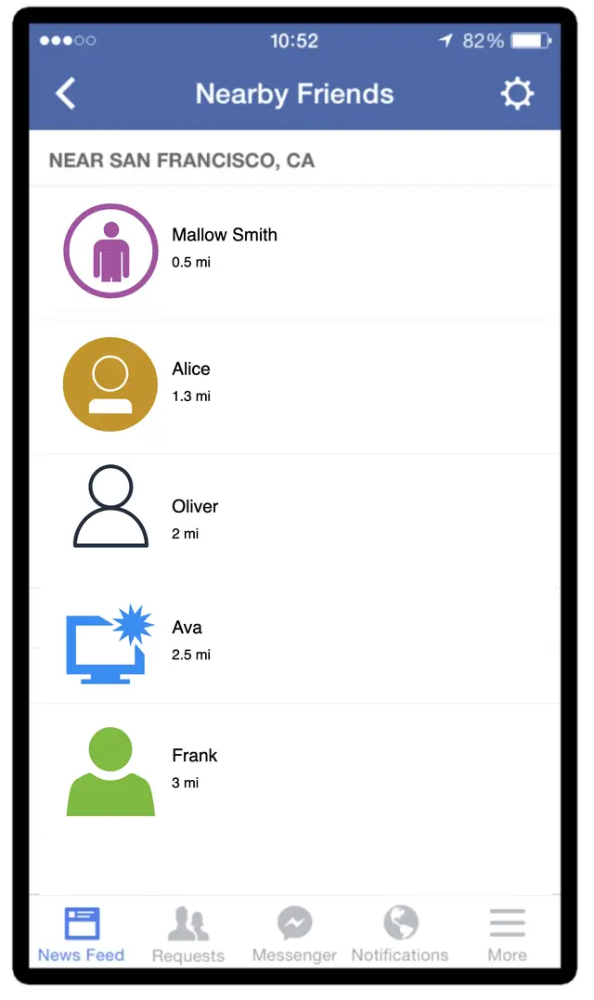
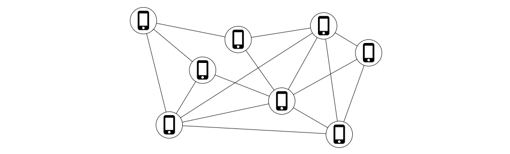
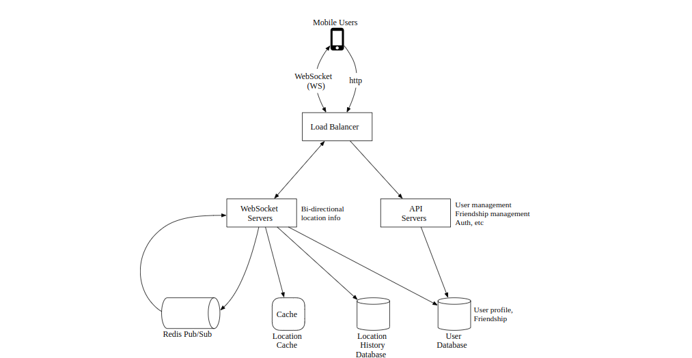
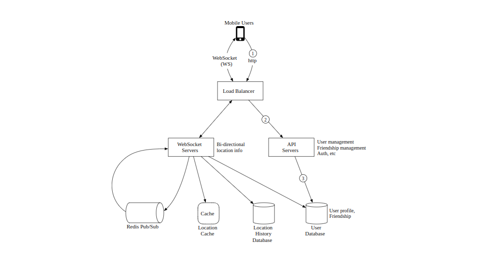
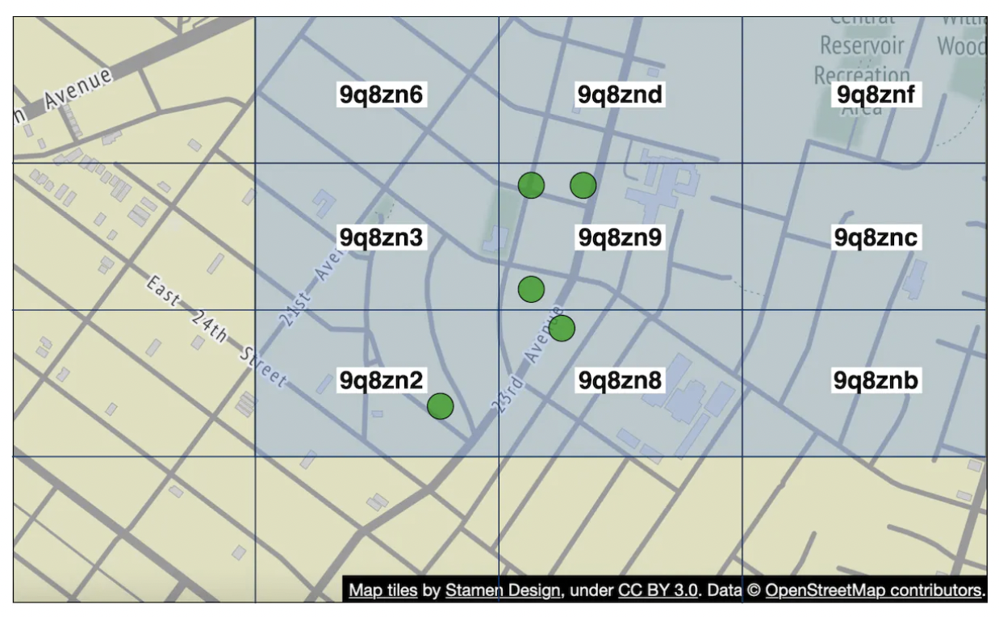

# Nearby Friends
In this chapter, we design a scalable backend system for a new mobile app feature called "Nearby Friends''. For an opt-in user who grants permission to access their location, the mobile client presents a list of friends who are geographically nearby. If you are looking for a real-world example, please refer to this article [1] about a similar feature in the Facebook app.

	Figure 1 Facebook’s nearby friends
	
If you read the Proximity Service chapter, you may wonder why we need a separate chapter for designing “nearby friends” since it looks similar to proximity services. If you think carefully though, you will find major differences. In proximity services, the addresses for businesses are static as their locations do not change, while in "nearby friends", data is more dynamic because user locations change frequently.

## Step 1 - Understand the Problem and Establish Design Scope

Any backend system at the Facebook scale is complicated. Before starting with the design, we need to ask clarification questions to narrow down the scope.

<b>Candidate</b>: How geographically close is considered to be “nearby”?

<b>Interviewer</b>: 5 miles. This number should be configurable.

<b>Candidate</b>: Can I assume the distance is calculated as the straight-line distance between two users? In real life, there could be, for example, a river in between the users, resulting in a longer travel distance.

<b>Interviewer</b>: Yes, that’s a reasonable assumption.

<b>Candidate</b>: How many users does the app have? Can I assume 1 billion users and 10% of them use the nearby friends feature?

<b>Interviewer</b>: Yes, that’s a reasonable assumption.

<b>Candidate</b>: Do we need to store location history?

<b>Interviewer</b>: Yes, location history can be valuable for different purposes such as machine learning.

<b>Candidate</b>: Could we assume if a friend is inactive for more than 10 minutes, that friend will disappear from the nearby friend list? Or should we display the last known location?

<b>Interviewer</b>: We can assume inactive friends will no longer be shown.

<b>Candidate</b>: Do we need to worry about privacy and data laws such as GDPR or CCPA?

<b>Interviewer</b>: Good question. For simplicity, don’t worry about it for now.

### Functional requirements

 * Users should be able to see nearby friends on their mobile apps. Each entry in the nearby friend list has a distance and a timestamp indicating when the distance was last updated.

 * Nearby friend lists should be updated every few seconds.

### Non-functional requirements

 * Low latency. It’s important to receive location updates from friends without too much delay.

 * Reliability. The system needs to be reliable overall, but occasional data point loss is acceptable.

 * Eventual consistency. The location data store doesn’t need strong consistency. A few seconds delay in receiving location data in different replicas is acceptable.

### Back-of-the-envelope estimation

Let’s do a back-of-the-envelope estimation to determine the potential scale and challenges our solution will need to address. Some constraints and assumptions are listed below:

 * Nearby friends are defined as friends whose locations are within a 5-mile radius.

 * The location refresh interval is 30 seconds. The reason for this is that human walking speed is slow (average 3-4 miles per hour). The distance traveled in 30 seconds does not make a significant difference on the “nearby friends” feature.

 * On average, 100 million users use the “nearby friends” feature every day.

 * Assume the number of concurrent users is 10% of DAU, so the number of concurrent users is 10 million.

 * On average, a user has 400 friends. Assume all of them use the “nearby friends” feature.

 * The app displays 20 nearby friends per page and may load more nearby friends upon request.
 

## Step 2 - Propose High-Level Design and Get Buy-In

In this section, we will discuss the following:

 * High-level design

 * API design

 * Data model

In other chapters, we usually discuss API design and data model before the high-level design. However, for this problem, the communication protocol between client and server might not be a straightforward HTTP protocol, as we need to push location data to all friends. Without understanding the high-level design, it’s difficult to know what the APIs look like. Therefore, we discuss the high-level design first.

### High-level design

At a high level, this problem calls for a design with efficient message passing. Conceptually, a user would like to receive location updates from every active friend nearby. It could in theory be done purely peer-to-peer, that is, a user could maintain a persistent connection to every other active friend in the vicinity (Figure 2).

	Figure 2 Peer-to-peer
	
This solution is not practical for a mobile device with sometimes flaky connections and a tight power consumption budget, but the idea sheds some light on the general design direction.

A more practical design would have a shared backend and look like this:

	Figure 3 Shared backend
	
What are the responsibilities of the backend in Figure 3?

 * Receive location updates from all active users.

 * For each location update, find all the active friends who should receive it and forward it to those users’ devices.

 * If the distance between two users is over a certain threshold, do not forward it to the recipient’s device.

This sounds pretty simple. What is the issue? Well, to do this at scale is not easy. We have 10 million active users. With each user updating the location information every 30 seconds, there are 334K updates per second. If on average each user has 400 friends, and we further assume that roughly 10% of those friends are online and nearby, every second the backend forwards 334K * 400 * 10% = 14 million location updates per second. That is a lot of updates to forward.

#### Proposed design

We will first come up with a high-level design for the backend at a lower scale. Later in the deep dive section, we will optimize the design for scale.

Figure 4 shows the basic design that should satisfy the functional requirements. Let’s go over each component in the design.

	Figure 4 High-level design

#### Load balancer

The load balancer sits in front of the RESTful API servers and the stateful, bi-directional WebSocket servers. It distributes traffic across those servers to spread out load evenly.

#### RESTful API servers

This is a cluster of stateless HTTP servers that handles the typical request/response traffic. The API request flow is highlighted in Figure 5. This API layer handles auxiliary tasks like adding/removing friends, updating user profiles, etc. These are very common and we will not go into more detail.

	Figure 5 RESTful API request flow

## API Design
Websocket Routines we'll need to support:
 * periodic location update - user sends location data to websocket server
 * client receives location update - server sends friend location data and timestamp
 * websocket client initialization - client sends user location, server sends back nearby friends location data
 * Subscribe to a new friend - websocket server sends a friend ID mobile client is supposed to track eg when friend appears online for the first time
 * Unsubscribe a friend - websocket server sends a friend ID, mobile client is supposed to unsubscribe from due to eg friend going offline

HTTP API - traditional request/response payloads for auxiliary responsibilities.

## Data model
 * The location cache will store a mapping between `user_id` and `lat,long,timestamp`. Redis is a great choice for this cache as we only care about current location and it supports TTL eviction which we need for our use-case.
 * Location history table stores the same data but in a relational table \w the four columns stated above. Cassandra can be used for this data as it is optimized for write-heavy loads.

## Step 3 - Design Deep Dive
Let's discuss how we scale the high-level design so that it works at the scale we're targetting.

### How well does each component scale?
 * API servers - can be easily scaled via autoscaling groups and replicating server instances
 * Websocket servers - we can easily scale out the ws servers, but we need to ensure we gracefully shutdown existing connections when tearing down a server. Eg we can mark a server as "draining" in the load balancer and stop sending connections to it, prior to being finally removed from the server pool
 * Client initialization - when a client first connects to a server, it fetches the user's friends, subscribes to their channels on redis pubsub, fetches their location from cache and finally forwards to client
 * User database - We can shard the database based on user_id. It might also make sense to expose user/friends data via a dedicated service and API, managed by a dedicated team
 * Location cache - We can shard the cache easily by spinning up several redis nodes. Also, the TTL puts a limit on the max memory we could have taken up at a time. But we still want to handle the large write load
 * Redis pub/sub server - we leverage the fact that no memory is consumed if there are channels initialized but are not in use. Hence, we can pre-allocate channels for all users who use the nearby friends feature to avoid having to deal with eg bringing up a new channel when a user comes online and notifying active websocket servers

## Scaling deep-dive on redis pub/sub component
We will need around 200gb of memory to maintain all pub/sub channels. This can be achieved by using 2 redis servers with 100gb each.

Given that we need to push ~14mil location updates per second, we will however need at least 140 redis servers to handle that amount of load, assuming that a single server can handle ~100k pushes per second.

Hence, we'll need a distributed redis server cluster to handle the intense CPU load.

In order to support a distributed redis cluster, we'll need to utilize a service discovery component, such as zookeeper or etcd, to keep track of which servers are alive.

What we need to encode in the service discovery component is this data:

Web socket servers use that encoded data, fetched from zookeeper to determine where a particular channel lives. For efficiency, the hash ring data can be cached in-memory on each websocket server.

In terms of scaling the server cluster up or down, we can setup a daily job to scale the cluster as needed based on historical traffic data. We can also overprovision the cluster to handle spikes in loads.

The redis cluster can be treated as a stateful storage server as there is some state maintained for the channels and there is a need for coordination with subscribers so that they hand-off to newly provisioned nodes in the cluster.

We have to be mindful of some potential issues during scaling operations:
 * There will be a lot of resubscription requests from the web socket servers due to channels being moved around
 * Some location updates might be missed from clients during the operation, which is acceptable for this problem, but we should still minimize it from happening. Consider doing such operation when traffic is at lowest point of the day.
 * We can leverage consistent hashing to minimize amount of channels moved in the event of adding/removing servers

## Adding/removing friends
Whenever a friend is added/removed, websocket server responsible for affected user needs to subscribe/unsubscribe from the friend's channel.

Since the "nearby friends" feature is part of a larger app, we can assume that a callback on the mobile client side can be registered whenever any of the events occur and the client will send a message to the websocket server to do the appropriate action.

## Users with many friends
We can put a cap on the total number of friends one can have, eg facebook has a cap of 5000 max friends.

The websocket server handling the "whale" user might have a higher load on its end, but as long as we have enough web socket servers, we should be okay.

## Nearby random person
What if the interviewer wants to update the design to include a feature where we can occasionally see a random person pop up on our nearby friends map?

One way to handle this is to define a pool of pubsub channels, based on geohash:

Anyone within the geohash subscribes to the appropriate channel to receive location updates for random users:

We could also subscribe to several geohashes to handle cases where someone is close but in a bordering geohash:

## Alternative to Redis pub/sub
An alternative to using Redis for pub/sub is to leverage Erlang - a general programming language, optimized for distributed computing applications.

With it, we can spawn millions of small, erland processes which communicate with each other. We can handle both websocket connections and pub/sub channels within the distributed erlang application.

A challenge with using Erlang, though, is that it's a niche programming language and it could be hard to source strong erlang developers.

# Step 4 - Wrap Up
We successfully designed a system, supporting the nearby friends features.

Core components:
 * Web socket servers - real-time comms between client and server
 * Redis - fast read and write of location data + pub/sub channels

We also explored how to scale restful api servers, websocket servers, data layer, redis pub/sub servers and we also explored an alternative to using Redis Pub/Sub. We also explored a "random nearby person" feature.
