# Ad Click Event Aggregation

With the rise of Facebook, YouTube, TikTok, and the online media economy, digital advertising is taking an ever-bigger share of the total advertising spending. As a result, tracking ad click events is very important. In this chapter, we explore how to design an ad click event aggregation system at Facebook or Google scale.

Before we dive into technical design, let’s learn about the core concepts of online advertising to better understand this topic. One core benefit of online advertising is its measurability, as quantified by real-time data.

Digital advertising has a core process called Real-Time Bidding (RTB), in which digital advertising inventory is bought and sold. Figure 1 shows how the online advertising process works.

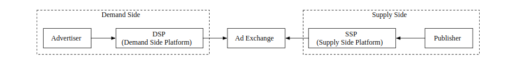

	Figure 1 RTB process
	
The speed of the RTB process is important as it usually occurs in less than a second.

Data accuracy is also very important. Ad click event aggregation plays a critical role in measuring the effectiveness of online advertising, which essentially impacts how much money advertisers pay. Based on the click aggregation results, campaign managers can control the budget or adjust bidding strategies, such as changing targeted audience groups, keywords, etc. The key metrics used in online advertising, including click-through rate (CTR) [1] and conversion rate (CVR) [2], depend on aggregated ad click data.

## Step 1 - Understand the Problem and Establish Design Scope

The following set of questions helps to clarify requirements and narrow down the scope.

<b>Candidate</b>: What is the format of the input data?

<b>Interviewer</b>: It’s a log file located in different servers and the latest click events are appended to the end of the log file. The event has the following attributes: ad_id, click_timestamp, user_id, ip, and country.

<b>Candidate</b>: What’s the data volume?

<b>Interviewer</b>: 1 billion ad clicks per day and 2 million ads in total. The number of ad click events grows 30% year-over-year.

<b>Candidate</b>: What are some of the most important queries to support?

<b>Interviewer</b>: The system needs to support the following 3 queries:

 * Return the number of click events for a particular ad in the last M minutes.

 * Return the top 100 most clicked ads in the past 1 minute. Both parameters should be configurable. Aggregation occurs every minute.

 * Support data filtering by ip, user_id, or country for the above two queries.

<b>Candidate</b>: Do we need to worry about edge cases? I can think of the following:

 * There might be events that arrive later than expected.
 
 * There might be duplicated events.
 
 * Different parts of the system might be down at any time, so we need to consider system recovery.

<b>Interviewer</b>: That’s a good list. Yes, take these into consideration.

<b>Candidate</b>: What is the latency requirement?

<b>Interviewer</b>: A few minutes of end-to-end latency. Note that latency requirements for RTB and ad click aggregation are very different. While latency for RTB is usually less than one second due to the responsiveness requirement, a few minutes of latency is acceptable for ad click event aggregation because it is primarily used for ad billing and reporting.

With the information gathered above, we have both functional and non-functional requirements.

### Functional requirements

 * Aggregate the number of clicks of ad_id in the last M minutes.

 * Return the top 100 most clicked ad_id every minute.

 * Support aggregation filtering by different attributes.

 * Dataset volume is at Facebook or Google scale (see the back-of-envelope estimation section below for detailed system scale requirements).

### Non-functional requirements

 * Correctness of the aggregation result is important as the data is used for RTB and ads billing.

 * Properly handle delayed or duplicate events.

 * Robustness. The system should be resilient to partial failures.

 * Latency requirement. End-to-end latency should be a few minutes, at most.
 
### Back-of-the-envelope estimation

Let’s do an estimation to understand the scale of the system and the potential challenges we will need to address.

 * 1 billion DAU.

 * Assume on average each user clicks 1 ad per day. That’s 1 billion ad click events per day.

 * Ad click QPS = 10^9 events / 10^5 seconds in a day = 10,000

 * Assume peak ad click QPS is 5 times the average number. Peak QPS = 50,000 QPS.

 * Assume a single ad click event occupies 0.1 KB storage. Daily storage requirement is: 0.1 KB * 1 billion = 100 GB. The monthly storage requirement is about 3 TB.
 
## Step 2 - Propose High-Level Design and Get Buy-In

In this section, we discuss query API design, data model, and high-level design.

### Query API Design

The purpose of the API design is to have an agreement between the client and the server. In a consumer app, a client is usually the end-user who uses the product. In our case, however, a client is the dashboard user (data scientist, product manager, advertiser, etc.) who runs queries against the aggregation service.

Let’s review the functional requirements so we can better design the APIs:

 * Aggregate the number of clicks of ad_id in the last M minutes.

 * Return the top N most clicked ad_ids in the last M minute.

 * Support aggregation filtering by different attributes.

We only need two APIs to support those three use cases because filtering (the last requirement) can be supported by adding query parameters to the requests.

<b>API 1: Aggregate the number of clicks of ad_id in the last M minutes.</b>

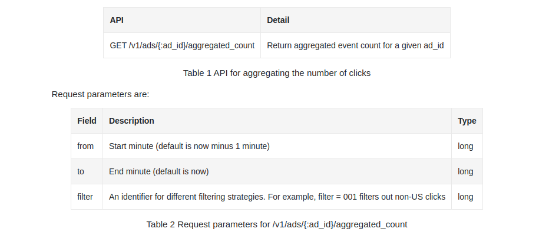

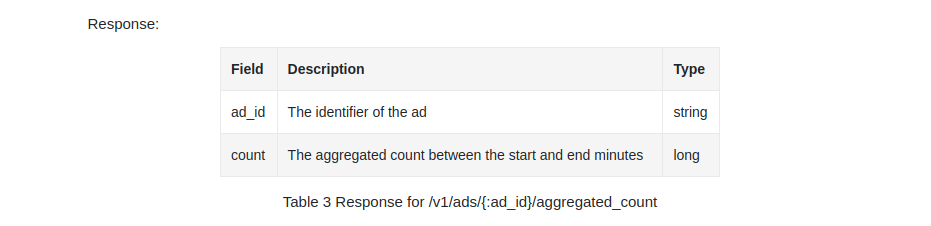

<b>API 2: Return top N most clicked ad_ids in the last M minutes</b>

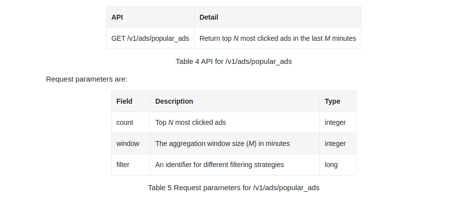

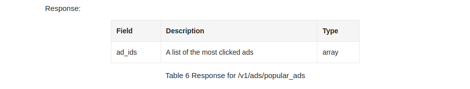

### Data model

There are two types of data in the system: raw data and aggregated data.

#### Raw data

Below shows what the raw data looks like in log files:

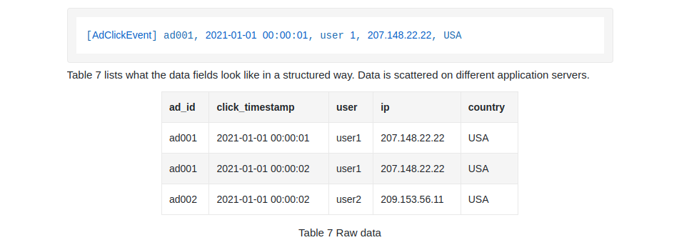

#### Aggregated data

Assume that ad click events are aggregated every minute. Table 8 shows the aggregated result.

To support ad filtering, we add an additional field called filter_id to the table. Records with the same ad_id and click_minute are grouped by filter_id as shown in Table 9, and filters are defined in Table 10.

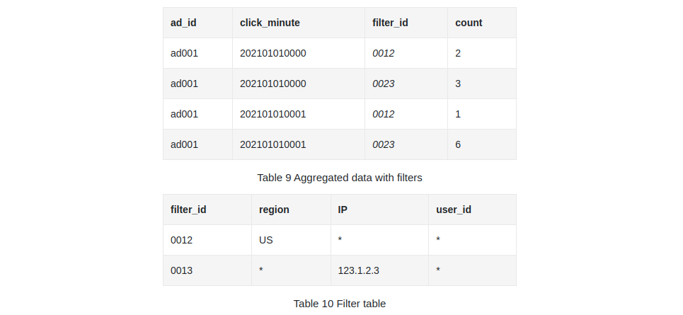

To support the query to return the top N most clicked ads in the last M minutes, the following structure is used.

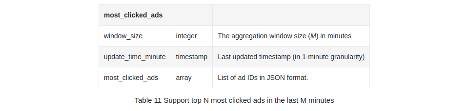

#### Comparison

The comparison between storing raw data and aggregated data is shown below:

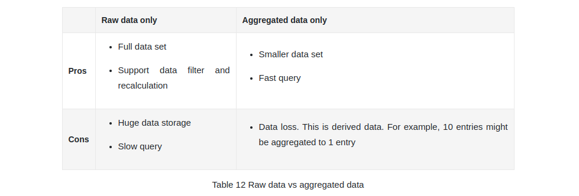

Should we store raw data or aggregated data? Our recommendation is to store both. Let’s take a look at why.

 * It’s a good idea to keep the raw data. If something goes wrong, we could use the raw data for debugging. If the aggregated data is corrupted due to a bad bug, we can recalculate the aggregated data from the raw data, after the bug is fixed.

 * Aggregated data should be stored as well. The data size of the raw data is huge. The large size makes querying raw data directly very inefficient. To mitigate this problem, we run read queries on aggregated data.

 * Raw data serves as backup data. We usually don’t need to query raw data unless recalculation is needed. Old raw data could be moved to cold storage to reduce costs.

 * Aggregated data serves as active data. It is tuned for query performance.
 
#### Choose the right database

When it comes to choosing the right database, we need to evaluate the following:

 * What does the data look like? Is the data relational? Is it a document or a blob?

 * Is the workflow read-heavy, write-heavy, or both?

 * Is transaction support needed?

 * Do the queries rely on many online analytical processing (OLAP) functions [3] like SUM, COUNT?

Let’s examine the raw data first. Even though we don’t need to query the raw data during normal operations, it is useful for data scientists or machine learning engineers to study user response prediction, behavioral targeting, relevance feedback, etc. [4].

As shown in the back of the envelope estimation, the average write QPS is 10,000, and the peak QPS can be 50,000, so the system is write-heavy. On the read side, raw data is used as backup and a source for recalculation, so in theory, the read volume is low.

Relational databases can do the job, but scaling the write can be challenging. NoSQL databases like Cassandra and InfluxDB are more suitable because they are optimized for write and time-range queries.

Another option is to store the data in Amazon S3 using one of the columnar data formats like ORC [5], Parquet [6], or AVRO [7]. We could put a cap on the size of each file (say, 10GB) and the stream processor responsible for writing the raw data could handle the file rotation when the size cap is reached. Since this setup may be unfamiliar for many, in this design we use Cassandra as an example.

For aggregated data, it is time-series in nature and the workflow is both read and write heavy. This is because, for each ad, we need to query the database every minute to display the latest aggregation count for customers. This feature is useful for auto-refreshing the dashboard or triggering alerts in a timely manner. Since there are two million ads in total, the workflow is read-heavy. Data is aggregated and written every minute by the aggregation service, so it’s write-heavy as well. We could use the same type of database to store both raw data and aggregated data.

Now we have discussed query API design and data model, let’s put together the high-level design.

### High-level design

In real-time big data [8] processing, data usually flows into and out of the processing system as unbounded data streams. The aggregation service works in the same way; the input is the raw data (unbounded data streams), and the output is the aggregated results (see Figure 2).

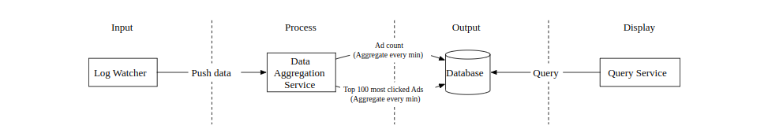

	Figure 2 Aggregation workflow

#### Asynchronous processing

The design we currently have is synchronous. This is not good because the capacity of producers and consumers is not always equal. Consider the following case; if there is a sudden increase in traffic and the number of events produced is far beyond what consumers can handle, consumers might get out-of-memory errors or experience an unexpected shutdown. If one component in the synchronous link is down, the whole system stops working.

A common solution is to adopt a message queue (Kafka) to decouple producers and consumers. This makes the whole process asynchronous and producers/consumers can be scaled independently.

Putting everything we have discussed together, we come up with the high-level design as shown in Figure 3. Log watcher, aggregation service, and database are decoupled by two message queues. The database writer polls data from the message queue, transforms the data into the database format, and writes it to the database.

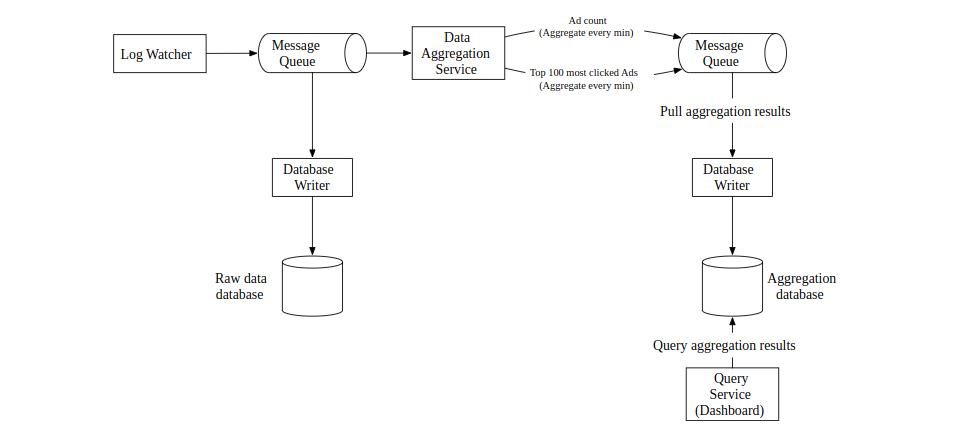

	Figure 3 High-level design
	
What is stored in the first message queue? It contains ad click event data as shown in Table 13.

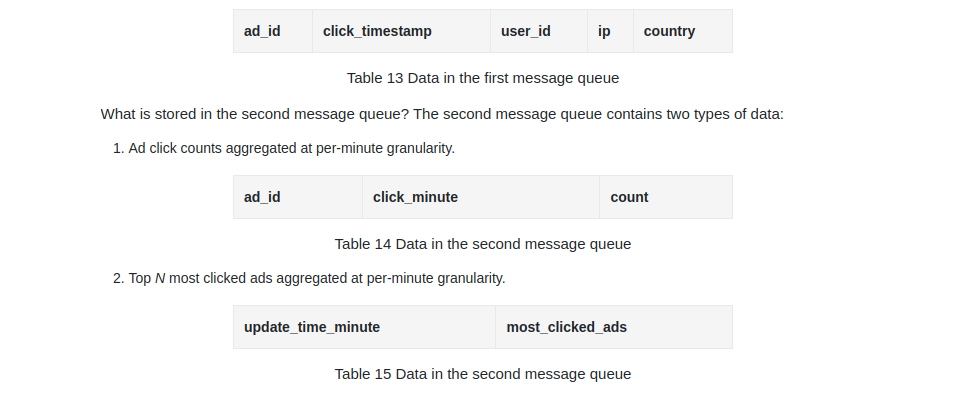

You might be wondering why we don’t write the aggregated results to the database directly. The short answer is that we need the second message queue like Kafka to achieve end-to-end exactly-once semantics (atomic commit).

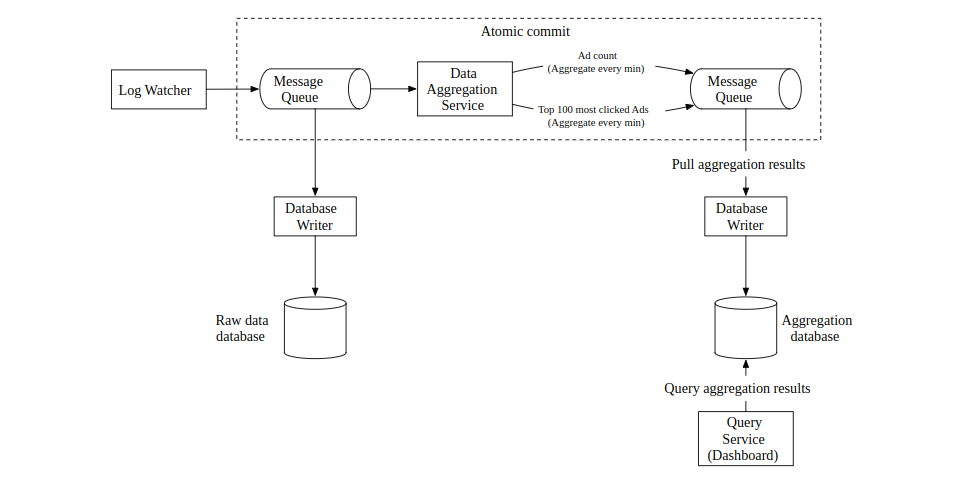

	Figure 4: End-to-end exactly once
	
Next, let’s dig into the details of the aggregation service.

#### Aggregation service

The MapReduce framework is a good option to aggregate ad click events. The directed acyclic graph (DAG) is a good model for it [9]. The key to the DAG model is to break down the system into small computing units, like the Map/Aggregate/Reduce nodes, as shown in Figure 5.

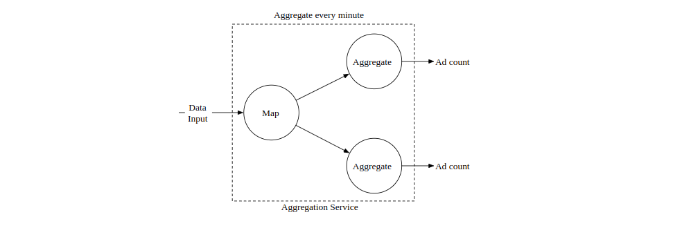

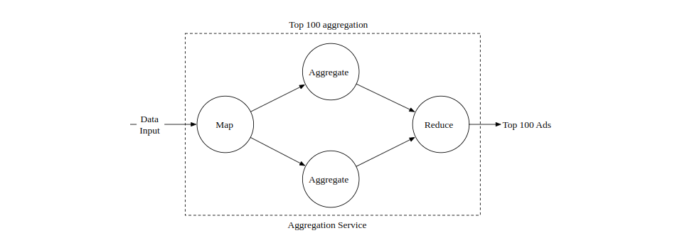

	Figure 5 Aggregation service
	
Each node is responsible for one single task and it sends the processing result to its downstream nodes.

<b>Map node</b>

A Map node reads data from a data source, and then filters and transforms the data. For example, a Map node sends ads with ad_id % 2 = 0 to node 1, and the other ads go to node 2, as shown in Figure 6.

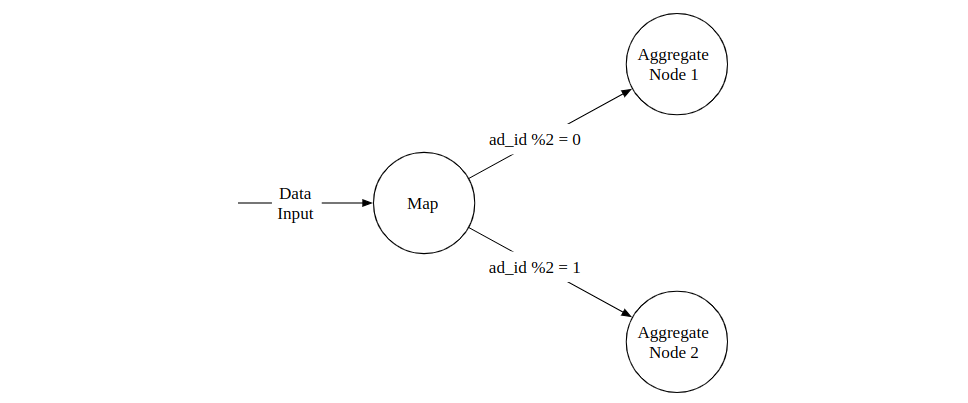

	Figure 6 Map operation
	
You might be wondering why we need the Map node. An alternative option is to set up Kafka partitions or tags and let the aggregate nodes subscribe to Kafka directly. This works, but the input data may need to be cleaned or normalized, and these operations can be done by the Map node. Another reason is that we may not have control over how data is produced and therefore events with the same ad_id might land in different Kafka partitions.

<b>Aggregate node</b>

An Aggregate node counts ad click events by ad_id in memory every minute. In the MapReduce paradigm, the Aggregate node is part of the Reduce. So the map-aggregate-reduce process really means map-reduce-reduce.

<b>Reduce node</b>

A Reduce node reduces aggregated results from all “Aggregate” nodes to the final result. For example, as shown in Figure 7, there are three aggregation nodes and each contains the top 3 most clicked ads within the node. The Reduce node reduces the total number of most clicked ads to 3.

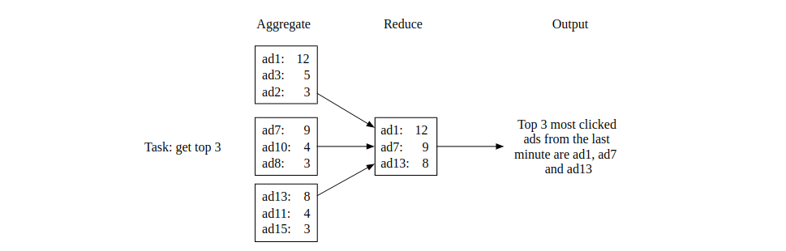

	Figure 7 Reduce node
	
The DAG model represents the well-known MapReduce paradigm. It is designed to take big data and use parallel distributed computing to turn big data into little- or regular-sized data.

In the DAG model, intermediate data can be stored in memory and different nodes communicate with each other through either TCP (nodes running in different processes) or shared memory (nodes running in different threads).

#### Main use cases

Now that we understand how MapReduce works at the high level, let’s take a look at how it can be utilized to support the main use cases:

 * Aggregate the number of clicks of adid in the last _M mins.

 * Return top N most clicked adids in the last _M minutes.

 * Data filtering.

<b>Use case 1: aggregate the number of clicks</b>

As shown in Figure 8, input events are partitioned by ad_id (ad_id % 3) in Map nodes and are then aggregated by Aggregation nodes.

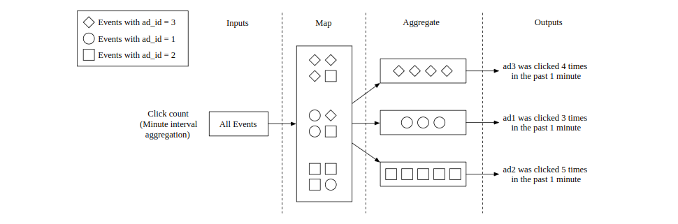

	Figure 8 Aggregate the number of clicks
	
<b>Use case 2: return top N most clicked ads</b>

Figure 9 shows a simplified design of getting the top 3 most clicked ads, which can be extended to top N. Input events are mapped using ad_id and each Aggregate node maintains a heap data structure to get the top 3 ads within the node efficiently. In the last step, the Reduce node reduces 9 ads (top 3 from each aggregate node) to the top 3 most clicked ads every minute.

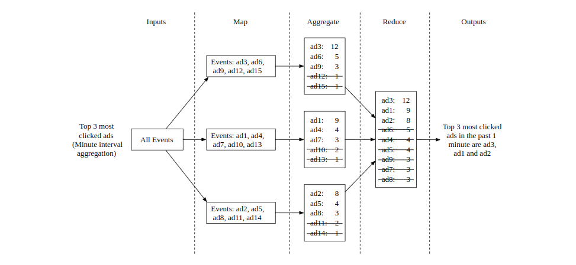

<b>Use case 3: data filtering</b>

To support data filtering like “show me the aggregated click count for ad001 within the USA only”, we can pre-define filtering criteria and aggregate based on them. For example, the aggregation results look like this for ad001 and ad002:

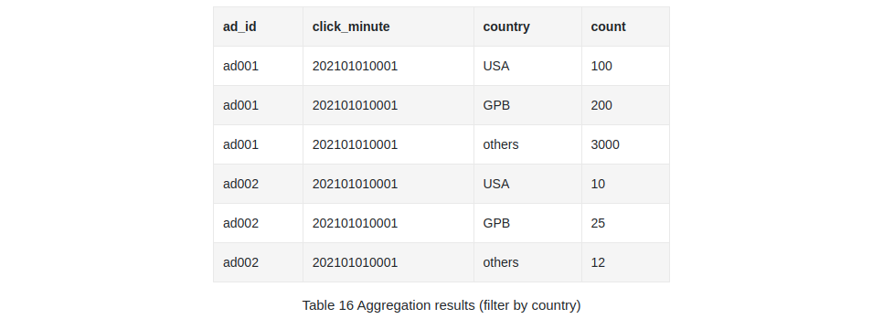

This technique is called the star schema [11], which is widely used in data warehouses. The filtering fields are called dimensions. This approach has the following benefits:

 * It is simple to understand and build.

 * The current aggregation service can be reused to create more dimensions in the star schema. No additional component is needed.

 * Accessing data based on filtering criteria is fast because the result is pre-calculated.

A limitation with this approach is that it creates many more buckets and records, especially when we have a lot of filtering criteria.

# Step 3 - Design Deep Dive
Let's dive deeper into some of the more interesting topics.

## Streaming vs. Batching
The high-level architecture we proposed is a type of stream processing system. 
Here's a comparison between three types of systems:
|                         | Services (Online system)      | Batch system (offline system)                          | Streaming system (near real-time system)     |
|-------------------------|-------------------------------|--------------------------------------------------------|----------------------------------------------|
| Responsiveness          | Respond to the client quickly | No response to the client needed                       | No response to the client needed             |
| Input                   | User requests                 | Bounded input with finite size. A large amount of data | Input has no boundary (infinite streams)     |
| Output                  | Responses to clients          | Materialized views, aggregated metrics, etc.           | Materialized views, aggregated metrics, etc. |
| Performance measurement | Availability, latency         | Throughput                                             | Throughput, latency                          |
| Example                 | Online shopping               | MapReduce                                              | Flink [13]                                   |

In our design, we used a mixture of batching and streaming. 

We used streaming for processing data as it arrives and generates aggregated results in near real-time.
We used batching, on the other hand, for historical data backup.

A system which contains two processing paths - batch and streaming, simultaneously, this architecture is called lambda.
A disadvantage is that you have two processing paths with two different codebases to maintain.

Kappa is an alternative architecture, which combines batch and stream processing in one processing path.
The key idea is to use a single stream processing engine.

Lambda architecture:
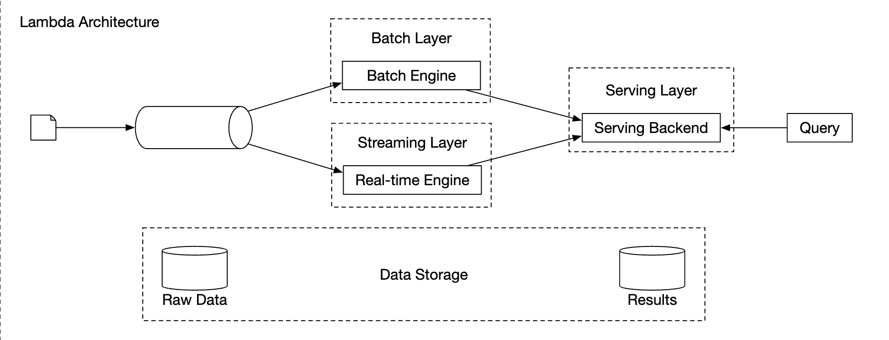

Kappa architecture:

Our high-level design uses Kappa architecture as reprocessing of historical data also goes through the aggregation service.

Whenever we have to recalculate aggregated data due to eg a major bug in aggregation logic, we can recalculate the aggregation from the raw data we store.
 * Recalculation service retrieves data from raw storage. This is a batch job.
 * Retrieved data is sent to a dedicated aggregation service, so that the real-time processing aggregation service is not impacted.
 * Aggregated results are sent to the second message queue, after which we update the results in the aggregation database.

## Time
We need a timestamp to perform aggregation. It can be generated in two places:
 * event time - when ad click occurs
 * Processing time - system time when the server processes the event

Due to the usage of async processing (message queues) and network delays, there can be significant difference between event time and processing time.
 * If we use processing time, aggregation results can be inaccurate
 * If we use event time, we have to deal with delayed events

There is no perfect solution, we need to consider trade-offs:
|                 | Pros                                  | Cons                                                                                 |
|-----------------|---------------------------------------|--------------------------------------------------------------------------------------|
| Event time      | Aggregation results are more accurate | Clients might have the wrong time or timestamp might be generated by malicious users |
| Processing time | Server timestamp is more reliable     | The timestamp is not accurate if event is late                                       |

Since data accuracy is important, we'll use the event time for aggregation.

To mitigate the issue of delayed events, a technique called "watermark" can be leveraged.

In the example below, event 2 misses the window where it needs to be aggregated:

However, if we purposefully extend the aggregation window, we can reduce the likelihood of missed events.
The extended part of a window is called a "watermark":

 * Short watermark increases likelihood of missed events, but reduces latency
 * Longer watermark reduces likelihood of missed events, but increases latency

There is always likelihood of missed events, regardless of the watermark's size. But there is no use in optimizing for such low-probability events.

We can instead resolve such inconsistencies by doing end-of-day reconciliation.

## Aggregation window
There are four types of window functions:
 * Tumbling (fixed) window
 * Hopping window
 * Sliding window
 * Session window

In our design, we leverage a tumbling window for ad click aggregations:

As well as a sliding window for the top N clicked ads in M minutes aggregation:

## Delivery guarantees
Since the data we're aggregating is going to be used for billing, data accuracy is a priority.

Hence, we need to discuss:
 * How to avoid processing duplicate events
 * How to ensure all events are processed

There are three delivery guarantees we can use - at-most-once, at-least-once and exactly once.

In most circumstances, at-least-once is sufficient when a small amount of duplicates is acceptable.
This is not the case for our system, though, as a difference in small percent can result in millions of dollars of discrepancy.
Hence, we'll need to use exactly-once delivery semantics.

## Data deduplication
One of the most common data quality issues is duplicated data.

It can come from a wide range of sources:
 * Client-side - a client might resend the same event multiple times. Duplicated events sent with malicious intent are best handled by a risk engine.
 * Server outage - An aggregation service node goes down in the middle of aggregation and the upstream service hasn't received an acknowledgment so event is resent.

Here's an example of data duplication occurring due to failure to acknowledge an event on the last hop:

In this example, offset 100 will be processed and sent downstream multiple times.

One option to try and mitigate this is to store the last seen offset in HDFS/S3, but this risks the result never reaching downstream:
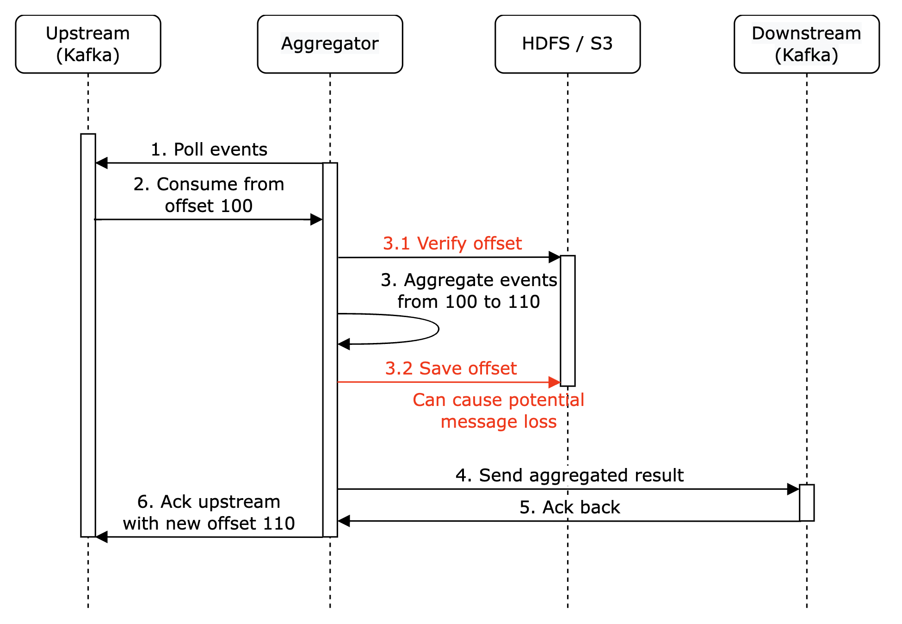

Finally, we can store the offset while interacting with downstream atomically. To achieve this, we need to implement a distributed transaction:

**Personal side-note**: Alternatively, if the downstream system handles the aggregation result idempotently, there is no need for a distributed transaction.

## Scale the system
Let's discuss how we scale the system as it grows.

We have three independent components - message queue, aggregation service and database.
Since they are decoupled, we can scale them independently.

How do we scale the message queue:
 * We don't put a limit on producers, so they can be scaled easily
 * Consumers can be scaled by assigning them to consumer groups and increasing the number of consumers.
 * For this to work, we also need to ensure there are enough partitions created preemptively
 * Also, consumer rebalancing can take a while when there are thousands of consumers so it is recommended to do it off peak hours
 * We could also consider partitioning the topic by geography, eg `topic_na`, `topic_eu`, etc.
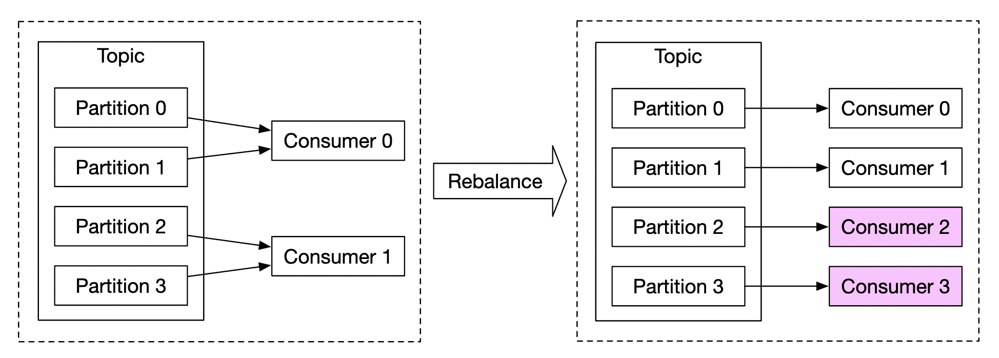

How do we scale the aggregation service:

 * The map-reduce nodes can easily be scaled by adding more nodes
 * The throughput of the aggregation service can be scaled by by utilising multi-threading
 * Alternatively, we can leverage resource providers such as Apache YARN to utilize multi-processing
 * Option 1 is easier, but option 2 is more widely used in practice as it's more scalable
 * Here's the multi-threading example:

How do we scale the database:
 * If we use Cassandra, it natively supports horizontal scaling utilizing consistent hashing
 * If a new node is added to the cluster, data automatically gets rebalanced across all (virtual) nodes
 * With this approach, no manual (re)sharding is required
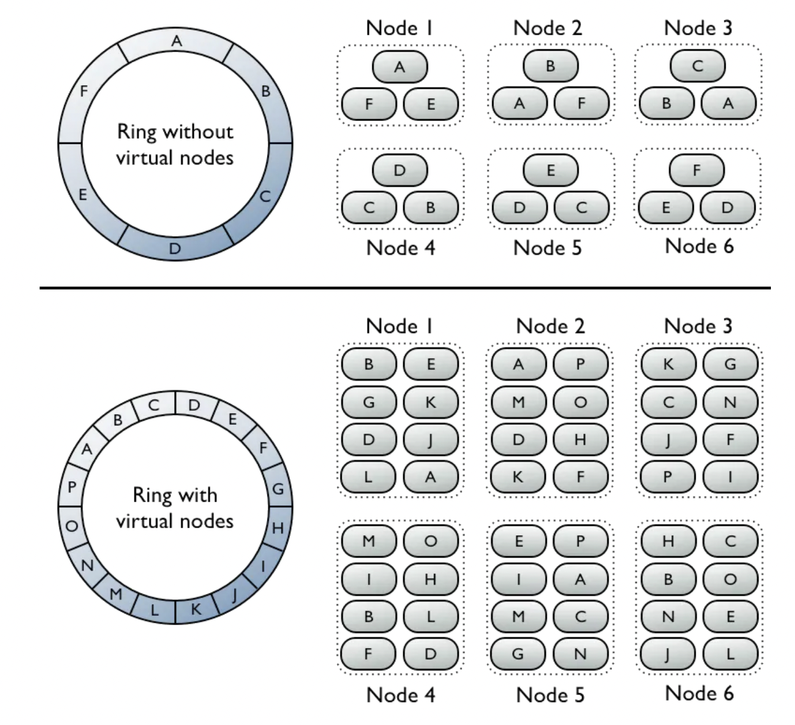

Another scalability issue to consider is the hotspot issue - what if an ad is more popular and gets more attention than others?

 * In the above example, aggregation service nodes can apply for extra resources via the resource manager
 * The resource manager allocates more resources, so the original node isn't overloaded
 * The original node splits the events into 3 groups and each of the aggregation nodes handles 100 events
 * Result is written back to the original aggregation node

Alternative, more sophisticated ways to handle the hotspot problem:
 * Global-Local Aggregation
 * Split Distinct Aggregation

## Fault Tolerance
Within the aggregation nodes, we are processing data in-memory. If a node goes down, the processed data is lost.

We can leverage consumer offsets in kafka to continue from where we left off once another node picks up the slack.
However, there is additional intermediary state we need to maintain, as we're aggregating the top N ads in M minutes.

We can make snapshots at a particular minute for the on-going aggregation:

If a node goes down, the new node can read the latest committed consumer offset, as well as the latest snapshot to continue the job:

## Data monitoring and correctness
As the data we're aggregating is critical as it's used for billing, it is very important to have rigorous monitoring in place in order to ensure correctness.

Some metrics we might want to monitor:
 * Latency - Timestamps of different events can be tracked in order to understand the e2e latency of the system
 * Message queue size - If there is a sudden increase in queue size, we need to add more aggregation nodes. As Kafka is implemented via a distributed commit log, we need to keep track of records-lag metrics instead.
 * System resources on aggregation nodes - CPU, disk, JVM, etc.

We also need to implement a reconciliation flow which is a batch job, running at the end of the day. 
It calculates the aggregated results from the raw data and compares them against the actual data stored in the aggregation database:

## Alternative design
In a generalist system design interview, you are not expected to know the internals of specialized software used in big data processing.

Explaining the thought process and discussing trade-offs is more important than knowing specific tools, which is why the chapter covers a generic solution.

An alternative design, which leverages off-the-shelf tooling, is to store ad click data in Hive with an ElasticSearch layer on top built for faster queries.

Aggregation is typically done in OLAP databases such as ClickHouse or Druid.

# Step 4 - Wrap up
Things we covered:
 * Data model and API Design
 * Using MapReduce to aggregate ad click events
 * Scaling the message queue, aggregation service and database
 * Mitigating the hotspot issue
 * Monitoring the system continuously
 * Using reconciliation to ensure correctness
 * Fault tolerance

The ad click event aggregation is a typical big data processing system.

It would be easier to understand and design it if you have prior knowledge of related technologies:
 * Apache Kafka
 * Apache Spark
 * Apache Flink
