# Hotel Reservation System

In this chapter, we design a hotel reservation system for a hotel chain such as Marriott International. The design and techniques used in this chapter are also applicable to other popular booking-related interview topics:

 * Design Airbnb

 * Design a flight reservation system

 * Design a movie ticket booking system

## Step 1 - Understand the Problem and Establish Design Scope

The hotel reservation system is complicated and its components vary based on business use cases. Before diving into the design, you should ask the interviewer clarification questions to narrow down the scope.

<p><b>Candidate</b>: What is the scale of the system?</p>
<p><b>Interviewer</b>: Let’s assume we are building a website for a hotel chain that has 5,000 hotels and 1 million rooms in total.</p>

<p><b>Candidate</b>: Do customers pay when they make reservations or when they arrive at the hotel?</p>
<p><b>Interviewer</b>: For simplicity, they pay in full when they make reservations.</p>

<p><b>Candidate</b>: Do customers book hotel rooms through the hotel’s website only? Do we need to support other reservation options such as phone calls?</p>
<p><b>Interviewer</b>: Let’s assume people could book a hotel room through the hotel website or app.</p>

<p><b>Candidate</b>: Can customers cancel their reservations?</p>
<p><b>Interviewer</b>: Yes.</p>

<p><b>Candidate</b>: Are there any other things we need to consider?</p>
<p><b>Interviewer</b>: Yes, we allow 10% overbooking. In case you do not know, overbooking means the hotel will sell more rooms than they actually have. Hotels do this in anticipation that some customers will cancel their reservations.</p>

<p><b>Candidate</b>: Since we have limited time, I assume the hotel room search is not within the scope. We focus on the following features.</p>

 * Show the hotel-related page.

 * Show the hotel room-related detail page.

 * Reserve a room.

Admin panel to add/remove/update hotel or room info.

Support the overbooking feature.

<p><b>Interviewer</b>: Sounds good.</p>

<p><b>Interviewer</b>: One more thing, hotel prices change dynamically. The price of a hotel room depends on how full the hotel is expected to be on a given day. For this interview, we can assume the price could be different each day.</p>
<p><b>Candidate</b>: I’ll keep this in mind.</p>

Next, you might want to talk about the most important non-functional requirements.

### Non-functional requirements

 * Support high concurrency. During peak season or big events, some popular hotels may have a lot of customers trying to book the same room.

 * Moderate latency. It’s ideal to have a fast response time when a user makes the reservation, but it’s acceptable if the system takes a few seconds to process a reservation request.
 
### Back-of-the-envelope estimation

 * 5000 hotels and 1 million rooms in total.

 * Assume 70% of the rooms are occupied and the average stay duration is 3 days.

 * Estimated daily reservations: (1 million * 0.7) / 3 = 233,333 (rounding up to ~240,000)

 * Reservations per second = 240,000 / 10^5 seconds in a day = ~3. As we can see, the average reservation transaction per second (TPS) is not high.

Next, let’s do a rough calculation of the QPS of all pages in the system. There are three steps in a typical customer flow:

 1. View hotel/room detail page. Users browse this page (query).

 2. View the booking page. Users can confirm the booking details, such as dates, number of guests, payment information before booking (query).

 3. Reserve a room. Users click on the “book” button to book the room and the room is reserved (transaction).

Let’s assume around 10% of users reach the next step and 90% of users drop off the flow before reaching the final step. We can also assume that no prefetching feature (prefetching the content before the user reaches the next step) is implemented. Figure 1 shows a rough estimation of what the QPS looks like for different steps. We know the final reservation TPS is 3 so we can work backwards along the funnel. The QPS of the order confirmation page is 30 and the QPS for the detail page is 300.

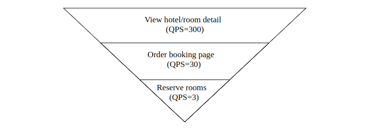

	Figure 1 QPS distribution

## Step 2 - Propose High-Level Design and Get Buy-In

In this section, we’ll discuss:

 * API design

 * Data models

 * High-level design

### API Design

We explore the API design for the hotel reservation system. The most important APIs are listed below using the RESTful conventions.

Note that this chapter focuses on the design of a hotel reservation system. For a complete hotel website, the design needs to provide intuitive features for customers to search for rooms based on a large array of criteria. The APIs for these search features, while important, are not technically challenging. They are out of scope for this chapter.


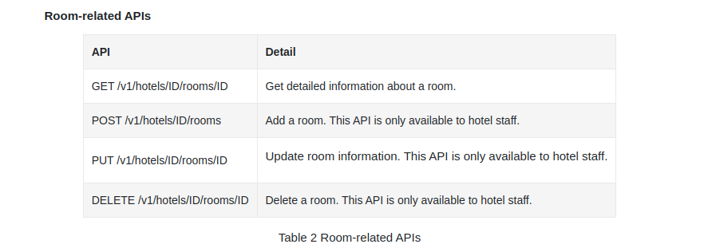

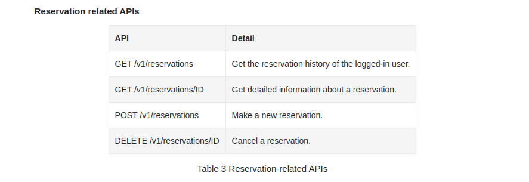

Making a new reservation is a very important feature. The request parameters of making a new reservation (POST /v1/reservations) could look like this.

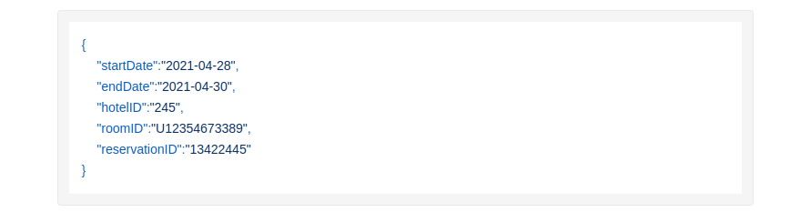

Please note reservationID is used as the idempotency key to prevent double booking. Double booking means multiple reservations are made for the same room on the same day. The details are explained in “Concurrency issue” in the ‘Deep Dive’ section.

### Data model

Before we decide which database to use, let’s take a close look at the data access patterns. For the hotel reservation system, we need to support the following queries:

Query 1: View detailed information about a hotel.

Query 2: Find available types of rooms given a date range.

Query 3: Record a reservation.

Query 4: Look up a reservation or past history of reservations.

From the back-of-the-envelope estimation, we know the scale of the system is not large but we need to prepare for traffic surges during big events. With these requirements in mind, we choose a relational database because:

 * A relational database works well with read-heavy and write less frequently workflows. This is because the number of users who visit the hotel website/apps is a few orders of magnitude higher than those who actually make reservations. NoSQL databases are generally optimized for writes and the relational database works well enough for read-heavy workflow.

 * A relational database provides ACID (atomicity, consistency, isolation, durability) guarantees. ACID properties are important for a reservation system. Without those properties, it’s not easy to prevent problems such as negative balance, double charge, double reservations, etc. ACID properties make application code a lot simpler and make the whole system easier to reason about. A relational database usually provides these guarantees.

 * A relational database can easily model the data. The structure of the business data is very clear and the relationship between different entities (hotel, room, room_type, etc) is stable. This kind of data model is easily modeled by a relational database.

Now that we have chosen the relational database as our data store, let’s explore the schema design. Figure 2 shows a straightforward schema design and it is the most natural way for many candidates to model the hotel reservation system.

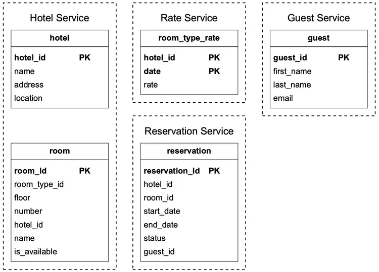

	Figure 2 Database schema
	
Most attributes are self-explanatory and we will only explain the status field in the reservation table. The status field can be in one of these states: pending, paid, refunded, canceled, rejected. The state machine is shown in Figure 3.

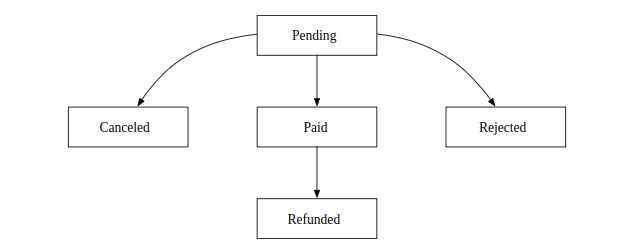

	Figure 3 Reservation status
	
This schema design has a major issue. This data model works for companies like Airbnb as room_id (might be called listing_id) is given when users make reservations. However, this isn’t the case for hotels. A user actually reserves <b>a type of room</b> in a given hotel instead of a specific room. For instance, a room type can be a standard room, king-size room, queen-size room with two queen beds, etc. Room numbers are given when the guest checks in and not at the time of the reservation. We need to update our data model to reflect this new requirement. See “Improved data model” in the ‘Deep Dive’ section for more details.

### High-level Design

We use the microservice architecture for this hotel reservation system. Over the past few years, microservice architecture has gained great popularity. Companies that use microservice include Amazon, Netflix, Uber, Airbnb, Twitter, etc. If you want to learn more about the benefits of a microservice architecture, you can check out some good resources [1] [2].

Our design is modeled with the microservice architecture and the high-level design diagram is shown in Figure 4.

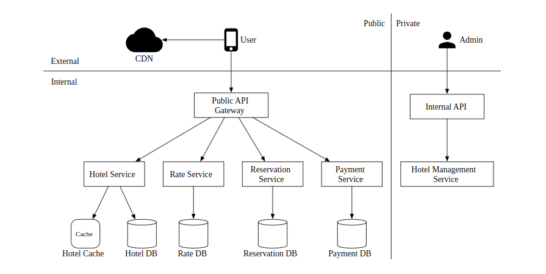

	Figure 4 High-level design

We will briefly go over each component of the system from top to bottom.

 * User: a user books a hotel room on their mobile phone or computer.

 * Admin (hotel staff): authorized hotel staff perform administrative operations such as refunding a customer, canceling a reservation, updating room information, etc.

 * CDN (content delivery network): for better load time, CDN is used to cache all static assets, including JavaScript bundles, images, videos, HTML, etc.

 * Public API Gateway: this is a fully managed service that supports rate limiting, authentication, etc. The API gateway is configured to direct requests to specific services based on the endpoints. For example, requests to load the hotel homepage are directed to the hotel service and requests to book a hotel room are routed to the reservation service.

 * Internal APIs: those APIs are only available to authorized hotel staff. They are accessible through internal software or websites. They are usually further protected by a VPN (virtual private network).

 * Hotel Service: this provides detailed information on hotels and rooms. Hotel and room data are generally static, so can be easily cached.

 * Rate Service: this provides room rates for different future dates. An interesting fact about the hotel industry is that the price of a room depends on how full the hotel is expected to be on a given day.

 * Reservation Service: receives reservation requests and reserves the hotel rooms. This service also tracks room inventory as rooms are reserved or reservations are canceled.

 * Payment Service: executes payment from a customer and updates the reservation status to “paid” once a payment transaction succeeds, or “rejected” if the transaction fails.

 * Hotel Management Service: only available to authorized hotel staff. Hotel staff are eligible to use the following features: view the record of an upcoming reservation, reserve a room for a customer, cancel a reservation, etc.

For clarity, Figure 4 omits many arrows of interactions between microservices. For example, as shown in Figure 5, there should be an arrow between Reservation service and Rate service. Reservation service queries Rate service for room rates. This is used to compute the total room charge for a reservation. Another example is that there should be many arrows connecting the Hotel Management Service with most of the other services. When an admin makes changes via Hotel Management Service, the requests are forwarded to the actual service owning the data, to handle the changes.

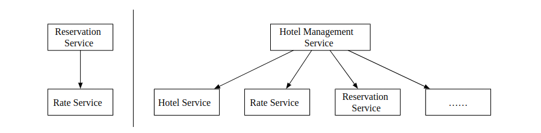

	Figure 5 Connections between services

For production systems, inter-service communication often employs a modern and high-performance remote procedure call (RPC) framework like gPRC. There are many benefits to using such frameworks. To learn more about gPRC in particular, check out [3].

# Step 3 - Design Deep Dive
Let's dive deeper into:
 * Improved data model
 * Concurrency issues
 * Scalability
 * Resolving data inconsistency in microservices

## Improved data model
As mentioned in a previous section, we need to amend our API and schema to enable reserving a type of room vs. a particular one.

For the reservation API, we no longer reserve a `roomID`, but we reserve a `roomTypeID`:
```
POST /v1/reservations
{
  "startDate":"2021-04-28",
  "endDate":"2021-04-30",
  "hotelID":"245",
  "roomTypeID":"12354673389",
  "roomCount":"3",
  "reservationID":"13422445"
}
```

Here's the updated schema:

 * room - contains information about a room
 * room_type_rate - contains information about prices for a given room type
 * reservation - records guest reservation data
 * room_type_inventory - stores inventory data about hotel rooms. 

Let's take a look at the `room_type_inventory` columns as that table is more interesting:
 * hotel_id - id of hotel
 * room_type_id - id of a room type
 * date - a single date
 * total_inventory - total number of rooms minus those that are temporarily taken off the inventory.
 * total_reserved - total number of rooms booked for given (hotel_id, room_type_id, date)

There are alternative ways to design this table, but having one room per (hotel_id, room_type_id, date) enables easy 
reservation management and easier queries.

The rows in the table are pre-populated using a daily CRON job.

Sample data:
| hotel_id | room_type_id | date       | total_inventory | total_reserved |
|----------|--------------|------------|-----------------|----------------|
| 211      | 1001         | 2021-06-01 | 100             | 80             |
| 211      | 1001         | 2021-06-02 | 100             | 82             |
| 211      | 1001         | 2021-06-03 | 100             | 86             |
| 211      | 1001         | ...        | ...             |                |
| 211      | 1001         | 2023-05-31 | 100             | 0              |
| 211      | 1002         | 2021-06-01 | 200             | 16             |
| 2210     | 101          | 2021-06-01 | 30              | 23             |
| 2210     | 101          | 2021-06-02 | 30              | 25             |

Sample SQL query to check the availability of a type of room:
```
SELECT date, total_inventory, total_reserved
FROM room_type_inventory
WHERE room_type_id = ${roomTypeId} AND hotel_id = ${hotelId}
AND date between ${startDate} and ${endDate}
```

How to check availability for a specified number of rooms using that data (note that we support overbooking):
```
if (total_reserved + ${numberOfRoomsToReserve}) <= 110% * total_inventory
```

Now let's do some estimation about the storage volume.
 * We have 5000 hotels.
 * Each hotel has 20 types of rooms.
 * 5000 * 20 * 2 (years) * 365 (days) = 73mil rows

73 million rows is not a lot of data and a single database server can handle it.
It makes sense, however, to setup read replication (potentially across different zones) to enable high availability.

Follow-up question - if reservation data is too large for a single database, what would you do?
 * Store only current and future reservation data. Reservation history can be moved to cold storage.
 * Database sharding - we can shard our data by `hash(hotel_id) % servers_cnt` as we always select the `hotel_id` in our queries.

## Concurrency issues
Another important problem to address is double booking.

There are two issues to address:
 * Same user clicks on "book" twice
 * Multiple users try to book a room at the same time

Here's a visualization of the first problem:
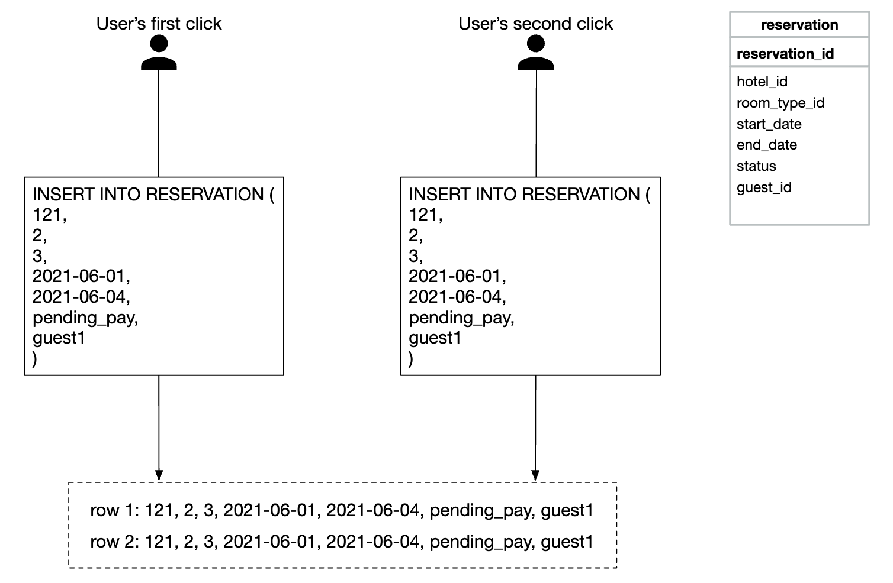

There are two approaches to solving this problem:
 * Client-side handling - front-end can disable the book button once clicked. If a user disabled javascript, however, they won't see the button becoming grayed out.
 * Idemptent API - Add an idempotency key to the API, which enables a user to execute an action once, regardless of how many times the endpoint is invoked:


Here's how this flow works:
 * A reservation order is generated once you're in the process of filling in your details and making a booking. The reservation order is generated using a globally unique identifier.
 * Submit reservation 1 using the `reservation_id` generated in the previous step.
 * If "complete booking" is clicked a second time, the same `reservation_id` is sent and the backend detects that this is a duplicate reservation.
 * The duplication is avoided by making the `reservation_id` column have a unique constraint, preventing multiple records with that id being stored in the DB.
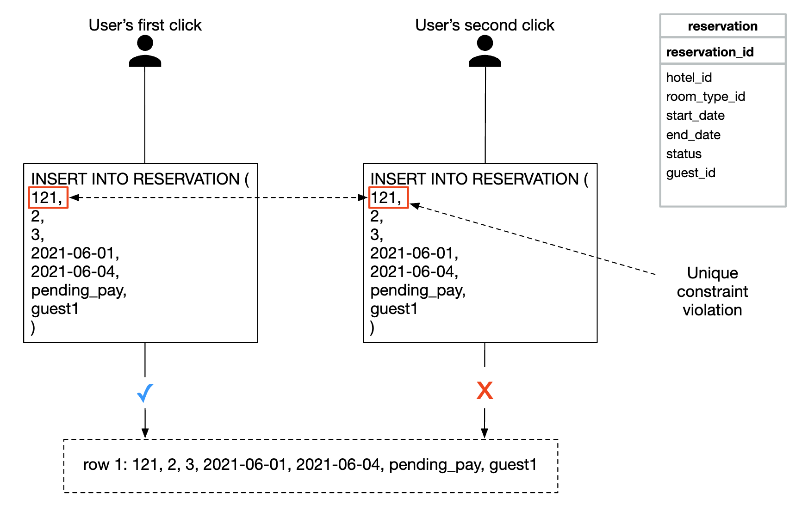

What if there are multiple users making the same reservation?
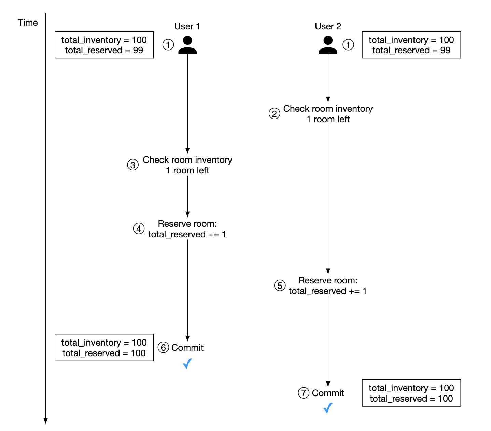
 * Let's assume the transaction isolation level is not serializable
 * User 1 and 2 attempt to book the same room at the same time.
 * Transaction 1 checks if there are enough rooms - there are
 * Transaction 2 check if there are enough rooms - there are
 * Transaction 2 reserves the room and updates the inventory
 * Transaction 1 also reserves the room as it still sees there are 99 `total_reserved` rooms out of 100.
 * Both transactions successfully commit the changes

This problem can be solved using some form of locking mechanism:
 * Pessimistic locking
 * Optimistic locking
 * Database constraints

Here's the SQL we use to reserve a room:
```sql
# step 1: check room inventory
SELECT date, total_inventory, total_reserved
FROM room_type_inventory
WHERE room_type_id = ${roomTypeId} AND hotel_id = ${hotelId}
AND date between ${startDate} and ${endDate}

# For every entry returned from step 1
if((total_reserved + ${numberOfRoomsToReserve}) > 110% * total_inventory) {
  Rollback
}

# step 2: reserve rooms
UPDATE room_type_inventory
SET total_reserved = total_reserved + ${numberOfRoomsToReserve}
WHERE room_type_id = ${roomTypeId}
AND date between ${startDate} and ${endDate}

Commit
```

### Option 1: Pessimistic locking
Pessimistic locking prevents simultaneous updates by putting a lock on a record while it's being updated.

This can be done in MySQL by using the `SELECT... FOR UPDATE` query, which locks the rows selected by the query until the transaction is committed.


Pros:
 * Prevents applications from updating data that is being changed
 * Easy to implement and avoids conflict by serializing updates. Useful when there is heavy data contention.

Cons:
 * Deadlocks may occur when multiple resources are locked.
 * This approach is not scalable - if transaction is locked for too long, this has impact on all other transactions trying to access the resource.
 * The impact is severe when the query selects a lot of resources and the transaction is long-lived.

The author doesn't recommend this approach due to its scalability issues.

### Option 2: Optimistic locking
Optimistic locking allows multiple users to attempt to update a record at the same time.

There are two common ways to implement it - version numbers and timestamps. Version numbers are recommended as server clocks can be inaccurate.

 * A new `version` column is added to the database table
 * Before a user modifies a database row, the version number is read
 * When the user updates the row, the version number is increased by 1 and written back to the database
 * Database validation prevents the insert if the new version number doesn't exceed the previous one

Optimistic locking is usually faster than pessimistic locking as we're not locking the database. 
Its performance tends to degrade when concurrency is high, however, as that leads to a lot of rollbacks.

Pros:
 * It prevents applications from editing stale data
 * We don't need to acquire a lock in the database
 * Preferred option when data contention is low, ie rarely are there update conflicts

Cons:
 * Performance is poor when data contention is high

Optimistic locking is a good option for our system as reservation QPS is not extremely high.

### Option 3: Database constraints
This approach is very similar to optimistic locking, but the guardrails are implemented using a database constraint:
```
CONSTRAINT `check_room_count` CHECK((`total_inventory - total_reserved` >= 0))
```
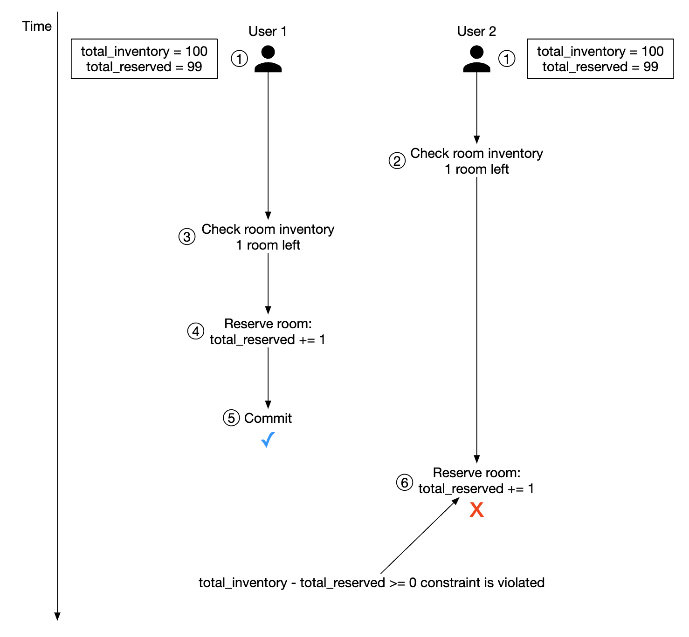

Pros:
 * Easy to implement
 * Works well when data contention is small

Cons:
 * Similar to optimistic locking, performs poorly when data contention is high
 * Database constraints cannot be easily version-controlled like application code
 * Not all databases support constraints

This is another good option for a hotel reservation system due to its ease of implementation.

## Scalability
Usually, the load of a hotel reservation system is not high. 

However, the interviewer might ask you how you'd handle a situation where the system gets adopted for a larger, popular travel site such as booking.com
In that case, QPS can be 1000 times larger.

When there is such a situation, it is important to understand where our bottlenecks are. All the services are stateless, so they can be easily scaled via replication.

The database, however, is stateful and it's not as obvious how it can get scaled.

One way to scale it is by implementing database sharding - we can split the data across multiple databases, where each of them contain a portion of the data.

We can shard based on `hotel_id` as all queries filter based on it. 
Assuming, QPS is 30,000, after sharding the database in 16 shards, each shard handles 1875 QPS, which is within a single MySQL cluster's load capacity.


We can also utilize caching for room inventory and reservations via Redis. We can set TTL so that old data can expire for days which are past.


The way we store an inventory is based on the `hotel_id`, `room_type_id` and `date`:
```
key: hotelID_roomTypeID_{date}
value: the number of available rooms for the given hotel ID, room type ID and date.
```

Data consistency happens async and is managed by using a CDC streaming mechanism - database changes are read and applied to a separate system.
Debezium is a popular option for synchronizing database changes with Redis.

Using such a mechanism, there is a possibility that the cache and database are inconsistent for some time.
This is fine in our case because the database will prevent us from making an invalid reservation.

This will cause some issue on the UI as a user would have to refresh the page to see that "there are no more rooms left", 
but that is something which can happen regardless of this issue if eg a person hesitates a lot before making a reservation.

Caching pros:
 * Reduced database load
 * High performance, as Redis manages data in-memory

Caching cons:
 * Maintaining data consistency between cache and DB is hard. We need to consider how the inconsistency impacts user experience.

## Data consistency among services
A monolithic application enables us to use a shared relational database for ensuring data consistency.

In our microservice design, we chose a hybrid approach where some services are separate, 
but the reservation and inventory APIs are handled by the same servicefor the reservation and inventory APIs.

This is done because we want to leverage the relational database's ACID guarantees to ensure consistency.

However, the interviewer might challenge this approach as it's not a pure microservice architecture, where each service has a dedicated database:
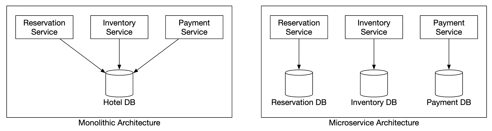

This can lead to consistency issues. In a monolithic server, we can leverage a relational DBs transaction capabilities to implement atomic operations:


It's more challenging, however, to guarantee this atomicity when the operation spans across multiple services:
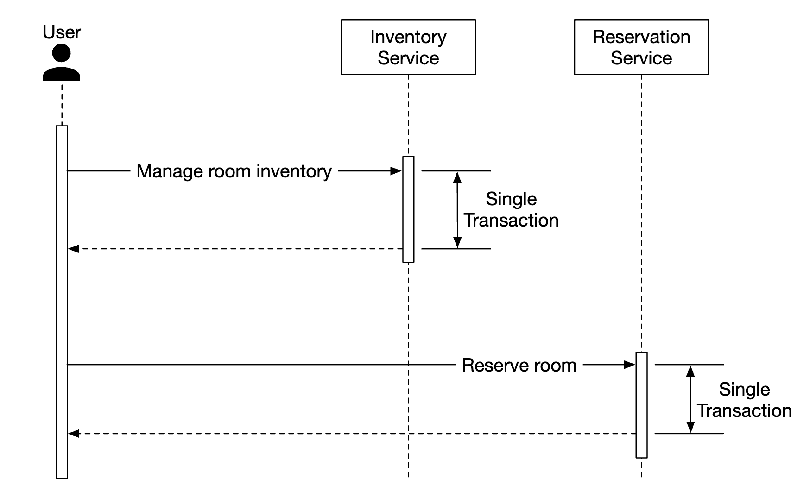

There are some well-known techniques to handle these data inconsistencies:
 * Two-phase commit - a database protocol which guarantees atomic transaction commit across multiple nodes. 
   It's not performant, though, since a single node lag leads to all nodes blocking the operation.
 * Saga - a sequence of local transactions, where compensating transactions are triggered if any of the steps in a workflow fail. This is an eventually consistent approach.

It's worth noting that addressing data inconsistencies across microservices is a challenging problem, which raise the system complexity.
It is good to consider whether the cost is worth it, given our more pragmatic approach of encapsulating dependent operations within the same relational database.

# Step 4 - Wrap Up
We presented a design for a hotel reservation system.

These are the steps we went through:
 * Gathering requirements and doing back-of-the-envelope calculations to understand the system's scale
 * We presented the API Design, Data Model and system architecture in the high-level design
 * In the deep dive, we explored alternative database schema designs as requirements changed
 * We discussed race conditions and proposed solutions - pessimistic/optimistic locking, database constraints
 * Ways to scale the system via database sharding and caching
 * Finally we addressed how to handle data consistency issues across multiple microservices

