# Digital Wallet

Payment platforms usually provide a digital wallet service to clients, so they can store money in the wallet and spend it later. For example, you can add money to your digital wallet from your bank card and when you buy products online, you are given the option to pay using the money in your wallet. Figure 1 shows this process.

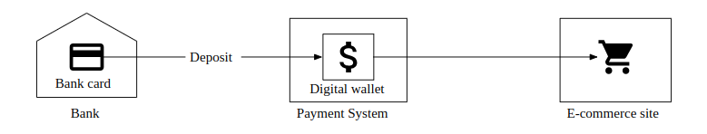

	Figure 1 Digital wallet

Spending money is not the only feature that the digital wallet provides. For a payment platform like PayPal, we can directly transfer money to somebody else’s wallet on the same payment platform. Compared with the bank-to-bank transfer, direct transfer between digital wallets is faster, and most importantly, it usually does not charge an extra fee. Figure 2 shows a cross-wallet balance transfer operation.

	Figure 2 Cross-wallet balance transfer

Suppose we are asked to design the backend of a digital wallet application that supports the cross-wallet balance transfer operation. At the beginning of the interview, we will ask clarification questions to nail down the requirements.

## Step 1 - Understand the Problem and Establish Design Scope

<b>Candidate</b>: Should we only focus on balance transfer operations between two digital wallets? Do we need to worry about other features?

<b>Interviewer</b>: Let’s focus on balance transfer operations only.

<b>Candidate</b>: How many transactions per second (TPS) does the system need to support?

<b>Interviewer</b>: Let’s assume 1,000,000 TPS.

<b>Candidate</b>: A digital wallet has strict requirements for correctness. Can we assume transactional guarantees [1] are sufficient?

<b>Interviewer</b>: That sounds good.

<b>Candidate</b>: Do we need to prove correctness?

<b>Interviewer</b>: This is a good question. Correctness is usually only verifiable after a transaction is complete. One way to verify is to compare our internal records with statements from banks. The limitation of reconciliation is that it only shows discrepancies and cannot tell how a difference was generated. Therefore, we would like to design a system with reproducibility, meaning we could always reconstruct historical balance by replaying the data from the very beginning.

<b>Candidate</b>: Can we assume the availability requirement is 99.99%

<b>Interviewer</b>: Sounds good.

<b>Candidate</b>: Do we need to take foreign exchange into consideration?

<b>Interviewer</b>: No, it’s out of scope.

In summary, our digital wallet needs to support the following:

 * Support balance transfer operation between two digital wallets.

 * Support 1,000,000 TPS.

 * Reliability is at least 99.99%.

 * Support transactions.

 * Support reproducibility.

## Back-of-the-envelope estimation

When we talk about TPS, we imply a transactional database will be used. Today, a relational database running on a typical data center node can support a few thousand transactions per second. For example, reference [2] contains the performance benchmark of some of the popular transactional database servers. Let’s assume a database node can support 1,000 TPS. In order to reach 1 million TPS, we need 1,000 database nodes.

However, this calculation is slightly inaccurate. Each transfer command requires two operations: deducting money from one account and depositing money to the other account. To support 1 million transfers per second, the system actually needs to handle up to 2 million TPS, which means we need 2,000 nodes.

Table 1 shows the total number of nodes required when the “per-node TPS” (the TPS a single node can handle) changes. Assuming hardware remains the same, the more transactions a single node can handle per second, the lower the total number of nodes required, indicating lower hardware cost. So one of our design goals is to increase the number of transactions a single node can handle.

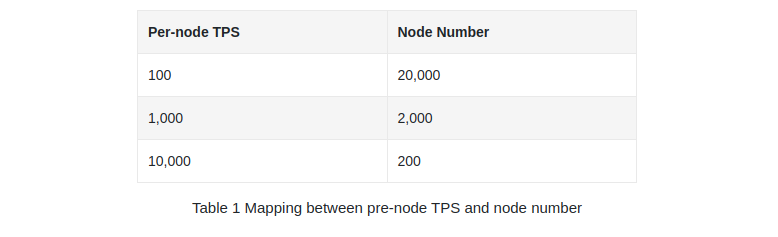

## Step 2 - Propose High-Level Design and Get Buy-In

In this section, we will discuss the following:

 * API design

 * Three high-level designs

	* Simple in-memory solution

	* Database-based distributed transaction solution

	* Event sourcing solution with reproducibility

### API Design

We will use the RESTful API convention. For this interview, we only need to support one API:

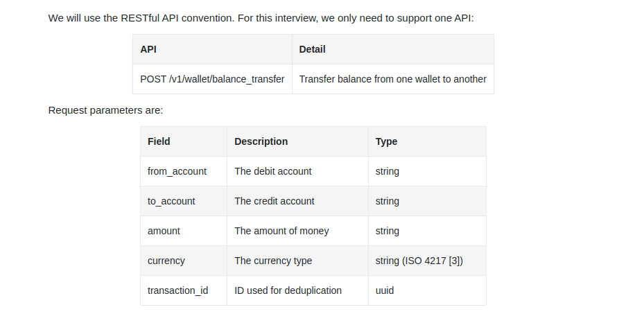

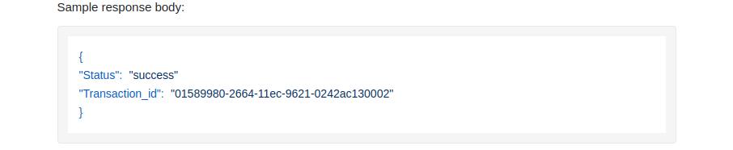

One thing worth mentioning is that the data type of the “amount” field is “string,” rather than “double”. We explained the reasoning in the Payment System chapter.

In practice, many people still choose float or double representation of numbers because it is supported by almost every programming language and database. It is a proper choice as long as we understand the potential risk of losing precision.

### In-memory sharding solution

The wallet application maintains an account balance for every user account. A good data structure to represent this <user,balance> relationship is a map, which is also called a hash table (map) or key-value store.

For in-memory stores, one popular choice is Redis. One Redis node is not enough to handle 1 million TPS. We need to set up a cluster of Redis nodes and evenly distribute user accounts among them. This process is called partitioning or sharding.

To distribute the key-value data among N partitions, we could calculate the hash value of the key and divide it by N. The remainder is the destination of the partition. The pseudocode below shows the sharding process:

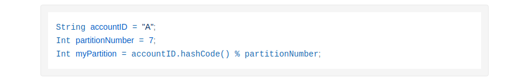

The number of partitions and addresses of all Redis nodes can be stored in a centralized place. We could use Zookeeper [4] as a highly-available configuration storage solution.

The final component of this solution is a service that handles the transfer commands. We call it the wallet service and it has several key responsibilities.

 1. Receives the transfer command

 2. Validates the transfer command

 3. If the command is valid, it updates the account balances for the two users involved in the transfer. In a cluster, the account balances are likely to be in different Redis nodes

The wallet service is stateless. It is easy to scale horizontally. Figure 3 shows the in-memory solution.

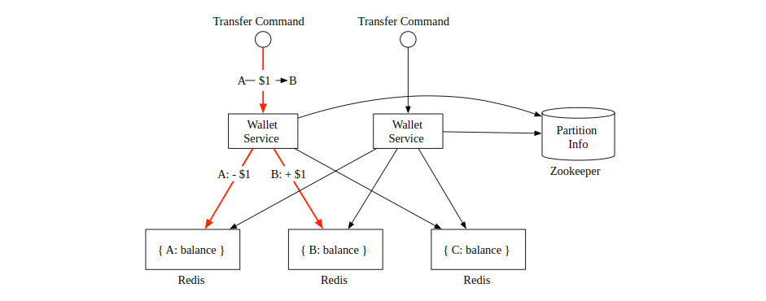

In this example, we have 3 Redis nodes. There are three clients, A, B, and C. Their account balances are evenly spread across these three Redis nodes. There are two wallet service nodes in this example that handle the balance transfer requests. When one of the wallet service nodes receives the transfer command which is to move <i>1fromclientAtoclientB,itissuestwocommandstotwoRedisnodes.FortheRedisnodethatcontainsclientA’saccount,thewalletservicededucts1</i> from the account. For client B, the wallet service adds $1 to the account.

<b>Candidate</b>: In this design, account balances are spread across multiple Redis nodes. Zookeeper is used to maintain the sharding information. The stateless wallet service uses the sharding information to locate the Redis nodes for the clients and updates the account balances accordingly.

<b>Interviewer</b>: This design works, but it does not meet our correctness requirement. The wallet service updates two Redis nodes for each transfer. There is no guarantee that both updates would succeed. If, for example, the wallet service node crashes after the first update has gone through but before the second update is done, it would result in an incomplete transfer. The two updates need to be in a single atomic transaction.

### Distributed transactions

#### Database sharding

How do we make the updates to two different storage nodes atomic? The first step is to replace each Redis node with a transactional relational database node. Figure 4 shows the architecture. This time, clients A, B, and C are partitioned into 3 relational databases, rather than in 3 Redis nodes.

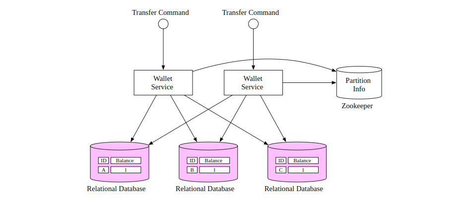

	Figure 4 Relational database
	
Using transactional databases only solves part of the problem. As mentioned in the last section, it is very likely that one transfer command will need to update two accounts in two different databases. There is no guarantee that two update operations will be handled at exactly the same time. If the wallet service restarted right after it updated the first account balance, how can we make sure the second account will be updated as well?

#### Distributed transaction: two-phase commit

In a distributed system, a transaction may involve multiple processes on multiple nodes. To make a transaction atomic, the distributed transaction might be the answer. There are two ways to implement a distributed transaction: a low-level solution and a high-level solution. We will examine each of them.

The low-level solution relies on the database itself. The most commonly used algorithm is called two-phase commit (2PC). As the name implies, it has two phases, as in Figure 5.

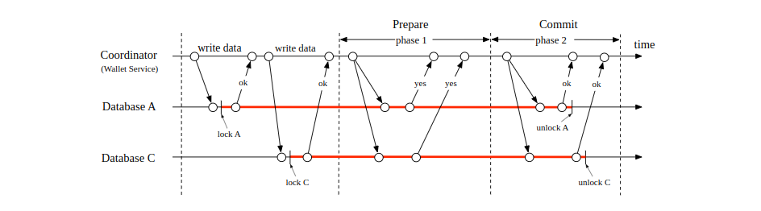

	Figure 5 Two-phase commit (source [5])
	
 1. The coordinator, which in our case is the wallet service, performs read and write operations on multiple databases as normal. As shown in Figure 5, both databases A and C are locked.

 2. When the application is about to commit the transaction, the coordinator asks all databases to prepare the transaction.

 3. In the second phase, the coordinator collects replies from all databases and performs the following:

	* If all databases reply with a “yes”, the coordinator asks all databases to commit the transaction they have received.

	* If any database replies with a “no”, the coordinator asks all databases to abort the transaction.

It is a low-level solution because the prepare step requires a special modification to the database transaction. For example, there is an X/Open XA [6] standard that coordinates heterogeneous databases to achieve 2PC. The biggest problem with 2PC is that it’s not performant, as locks can be held for a very long time while waiting for a message from the other nodes. Another issue with 2PC is that the coordinator can be a single point of failure, as shown in Figure 6.

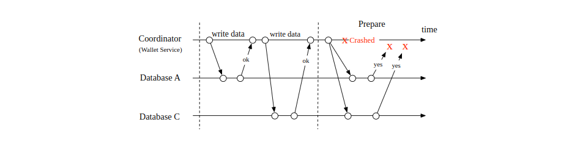

	Figure 6 Coordinator crashes

#### Distributed transaction: Try-Confirm/Cancel (TC/C)

TC/C is a type of compensating transaction [7] that has two steps:

 1. In the first phase, the coordinator asks all databases to reserve resources for the transaction.

 2. In the second phase, the coordinator collects replies from all databases:

	* If all databases reply with “yes”, the coordinator asks all databases to confirm the operation, which is the Try-Confirm process.

	* If any database replies with “no”, the coordinator asks all databases to cancel the operation, which is the Try-Cancel process.

It’s important to note that the two phases in 2PC are wrapped in the same transaction, but in TC/C each phase is a separate transaction.

<b>TC/C example</b>

It would be much easier to explain how TC/C works with a real-world example. Suppose we want to transfer $1 from account A to account C. Table 2 gives a summary of how TC/C is executed in each phase.

Let’s assume the wallet service is the coordinator of the TC/C. At the beginning of the distributed transaction, account A has <i>1initsbalance,andaccountChas0</i>.

<b>First phase: Try</b>

In the Try phase, the wallet service, which acts as the coordinator, sends two transaction commands to two databases:

 1. For the database that contains account A, the coordinator starts a local transaction that reduces the balance of A by $1.

 2. For the database that contains account C, the coordinator gives it a NOP (no operation.) To make the example adaptable for other scenarios, let’s assume the coordinator sends to this database a NOP command. The database does nothing for NOP commands and always replies to the coordinator with a success message.

The Try phase is shown in Figure 7. The thick line indicates that a lock is held by the transaction.

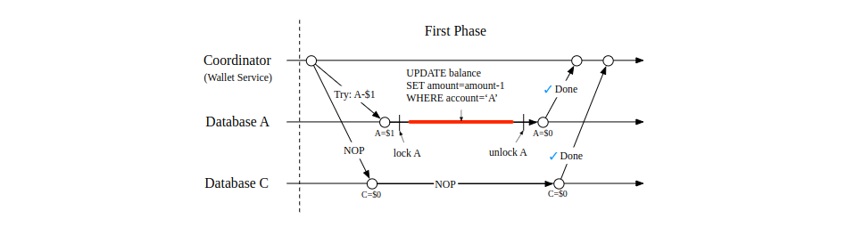

	Figure 7 Try phase
	
<b>Second phase: Confirm</b>

If both databases reply “yes”, the wallet service starts the next Confirm phase.

Account A’s balance has already been updated in the first phase. The wallet service does not need to change its balance. However, account C has not yet received its <i>1fromaccountAinthefirstphase.IntheConfirmphase,thewalletservicehastoadd1</i> to account C’s balance.

The Confirm process is shown in Figure 8.

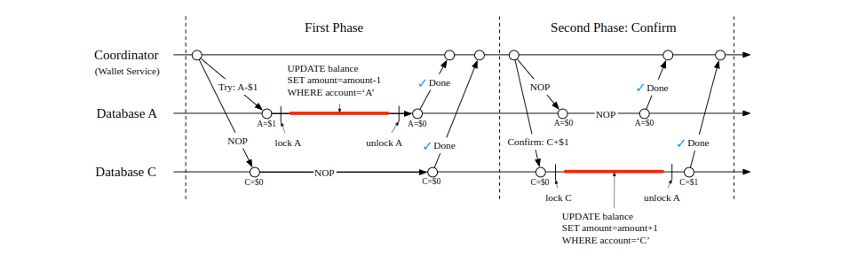

	Figure 8 Confirm phase
	
<b>Second phase: Cancel</b>

What if the first Try phase fails? In the example above we have assumed the NOP operation on account C always succeeds, although in practice it may fail. For example, account C might be an illegal account, and the regulator has mandated that no money can flow into or out of this account. In this case, the distributed transaction must be canceled and we have to clean up.

Because the balance of account A has already been updated in the transaction in the Try phase, it is impossible for the wallet service to cancel a completed transaction. What it can do is to start another transaction that reverts the effect of the transaction in the Try phase, which is to add $1 back to account A.

Because account C was not updated in the Try phase, the wallet service just needs to send a NOP operation to account C’s database.

The Cancel process is shown in Figure 9.

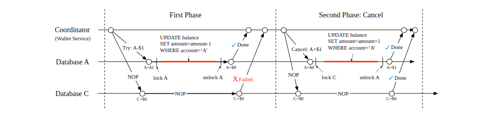

	Figure 9 Cancel phase
	
<b>Comparison between 2PC and TC/C</b>

Table 3 shows that there are many similarities between 2PC and TC/C, but there are also differences. In 2PC, all local transactions are not done (still locked) when the second phase starts, while in TC/C, all local transactions are done (unlocked) when the second phase starts. In other words, the second phase of 2PC is about completing an unfinished transaction, such as an abort or commit, while in TC/C, the second phase is about using a reverse operation to offset the previous transaction result when an error occurs. The following table summarizes their differences.

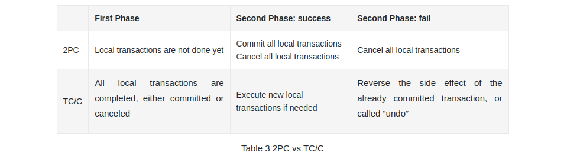

TC/C is also called a distributed transaction by compensation. It is a high-level solution because the compensation, also called the “undo,” is implemented in the business logic. The advantage of this approach is that it is database-agnostic. As long as a database supports transactions, TC/C will work. The disadvantage is that we have to manage the details and handle the complexity of the distributed transactions in the business logic at the application layer.

<b>Phase status table</b>

We still have not yet answered the question asked earlier; what if the wallet service restarts in the middle of TC/C? When it restarts, all previous operation history might be lost, and the system may not know how to recover.

The solution is simple. We can store the progress of a TC/C as phase status in a transactional database. The phase status includes at least the following information.

 * The ID and content of a distributed transaction.

 * The status of the Try phase for each database. The status could be “not sent yet”, “has been sent”, and “response received”.

 * The name of the second phase. It could be “Confirm” or “Cancel.” It could be calculated using the result of the Try phase.

 * The status of the second phase.

 * An out-of-order flag (explained soon in the section “Out-of-Order Execution”).

Where should we put the phase status tables? Usually, we store the phase status in the database that contains the wallet account from which money is deducted. The updated architecture diagram is shown in Figure 10.

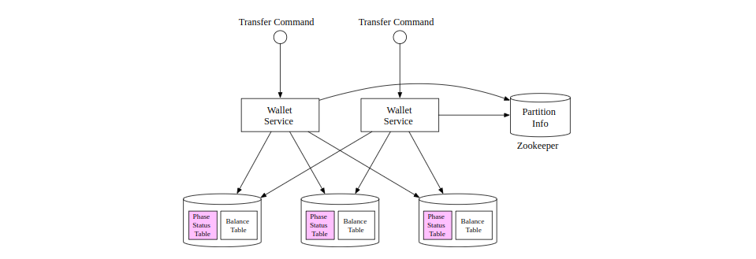

	Figure 10 Phase status table

<b>Unbalanced state</b>

Have you noticed that by the end of the Try phase, $1 is missing (Figure 11)?

Assuming everything goes well, by the end of the Try phase <i>1isdeductedfromaccountAandaccountCremainsunchanged.ThesumofaccountbalancesinAandCwillbe0</i>, which is less than at the beginning of the TC/C. It violates a fundamental rule of accounting that the sum should remain the same after a transaction.

The good news is that the transactional guarantee is still maintained by TC/C. TC/C comprises several independent local transactions. Because TC/C is driven by application, the application itself is able to see the intermediate result between these local transactions. On the other hand, the database transaction or 2PC version of the distributed transaction was maintained by databases that are invisible to high-level applications.

There are always data discrepancies during the execution of distributed transactions. The discrepancies might be transparent to us because lower-level systems such as databases already fixed the discrepancies. If not, we have to handle it ourselves (for example, TC/C).

The unbalanced state is shown in Figure 11.

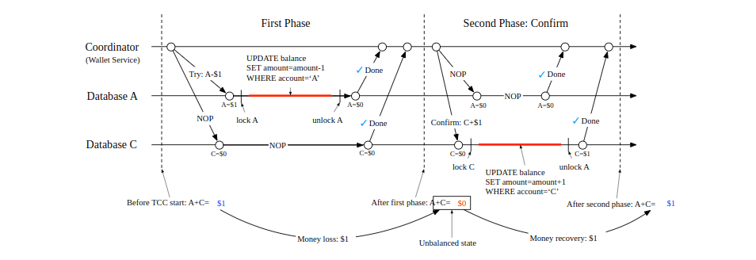

	Figure 11 Unbalanced state
	
<b>Valid operation orders</b>

There are three choices for the Try phase:

All three choices look plausible, but some are not valid.

For choice 2, if the Try phase on account C is successful, but has failed on account A (NOP), the wallet service needs to enter the Cancel phase. There is a chance that somebody else may jump in and move the <i>1awayfromaccountC.Laterwhenthewalletservicetriestodeduct1</i> from account C, it finds nothing is left, which violates the transactional guarantee of a distributed transaction.

For choice 3, if <i>1isdeductedfromaccountAandaddedtoaccountCconcurrently,itintroduceslotsofcomplications.Forexample</i>,1 is added to account C, but it fails to deduct the money from account A. What should we do in this case?

Therefore, choice 2 and choice 3 are flawed choices and only choice 1 is valid.

<b>Out-of-order execution</b>

One side effect of TC/C is the out-of-order execution. It will be much easier to explain using an example.

We reuse the above example which transfers $1 from account A to account C. As Figure 12 shows, in the Try phase, the operation against account A fails and it returns a failure to the wallet service, which then enters the Cancel phase and sends the cancel operation to both account A and account C.

Let’s assume that the database that handles account C has some network issues and it receives the Cancel instruction before the Try instruction. In this case, there is nothing to cancel.

The out-of-order execution is shown in Figure 12.

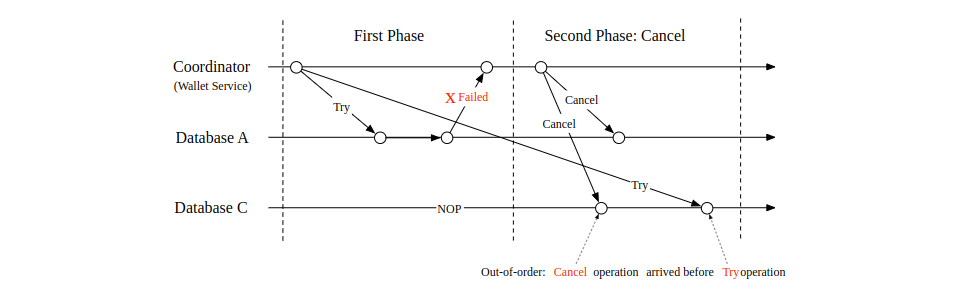

	Figure 12 Out-of-order execution
	
To handle out-of-order operations, each node is allowed to Cancel a TC/C without receiving a Try instruction, by enhancing the existing logic with the following updates:

 * The out-of-order Cancel operation leaves a flag in the database indicating that it has seen a Cancel operation, but it has not seen a Try operation yet.

 * The Try operation is enhanced so it always checks whether there is an out-of-order flag, and it returns a failure if there is.

This is why we added an out-of-order flag to the phase status table in the “Phase Status Table” section.

#### Distributed transaction: Saga

<b>Linear order execution</b>

There is another popular distributed transaction solution called Saga [8]. Saga is the de-facto standard in a microservice architecture. The idea of Saga is simple:

 1. All operations are ordered in a sequence. Each operation is an independent transaction on its own database.

 2. Operations are executed from the first to the last. When one operation has finished, the next operation is triggered.

 3. When an operation has failed, the entire process starts to roll back from the current operation to the first operation in reverse order, using compensating transactions. So if a distributed transaction has n operations, we need to prepare 2n operations: n for the normal case and another n for the compensating transaction during rollback.

It is easier to understand this by using an example. Figure 13 shows the Saga workflow to transfer $1 from account A to account C. The top horizontal line shows the normal order of execution. The two vertical lines show what the system should do when there is an error. When it encounters an error, the transfer operations are rolled back and the client receives an error message. As we mentioned in the “Valid operation orders” section, we have to put the deduction operation before the addition operation.

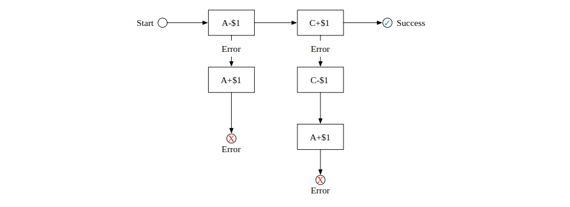

	Figure 13 Saga workflow
	
How do we coordinate the operations? There are two ways to do it:

 * Choreography. In a microservice architecture, all the services involved in the Saga distributed transaction do their jobs by subscribing to other services’ events. So it is fully decentralized coordination.

 * Orchestration. A single coordinator instructs all services to do their jobs in the correct order.

The choice of which coordination model to use is determined by the business needs and goals. The challenge of the choreography solution is that services communicate in a fully asynchronous way, so each service has to maintain an internal state machine in order to understand what to do when other services emit an event. It can become hard to manage when there are many services. The orchestration solution handles complexity well, so it is usually the preferred solution in a digital wallet system.

<b>Comparison between TC/C and Saga</b>

TC/C and Saga are both application-level distributed transactions. Table 5 summarizes their similarities and differences.

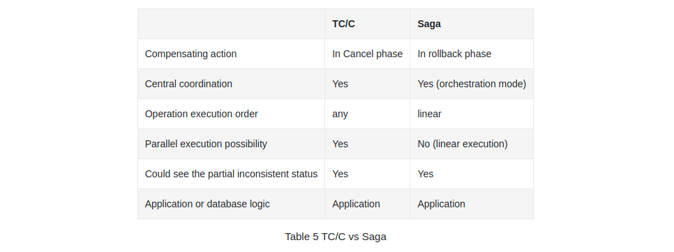

Which one should we use in practice? The answer depends on the latency requirement. As Table 5 shows, operations in Saga have to be executed in linear order, but it is possible to execute them in parallel in TC/C. So the decision depends on a few factors:

 1. If there is no latency requirement, or there are very few services, such as our money transfer example, we can choose either of them. If we want to go with the trend in microservice architecture, choose Saga.

 2. If the system is latency-sensitive and contains many services/operations, TC/C might be a better option.

<b>Candidate</b>: To make the balance transfer transactional, we replace Redis with a relational database, and use TC/C or Saga to implement distributed transactions.

<b>Interviewer</b>: Great work! The distributed transaction solution works, but there might be cases where it doesn’t work well. For example, users might enter the wrong operations at the application level. In this case, the money we specified might be incorrect. We need a way to trace back the root cause of the issue and audit all account operations. How can we do this?

### Event sourcing

#### Background

In real life, a digital wallet provider may be audited. These external auditors might ask some challenging questions, for example:

 1. Do we know the account balance at any given time?

 2. How do we know the historical and current account balances are correct?

 3. How do we prove that the system logic is correct after a code change?

One design philosophy that systematically answers those questions is event sourcing, which is a technique developed in Domain-Driven Design (DDD) [9].

#### Definition

There are four important terms in event sourcing.

 1. Command

 2. Event

 3. State

 4. State machine

<b>Command</b>

A command is the intended action from the outside world. For example, if we want to transfer $1 from client A to client C, this money transfer request is a command.

In event sourcing, it is very important that everything has an order. So commands are usually put into a FIFO (first in, first out) queue.

<b>Event</b>

Command is an intention and not a fact because some commands may be invalid and cannot be fulfilled. For example, the transfer operation will fail if the account balance becomes negative after the transfer.

A command must be validated before we do anything about it. Once the command passes the validation, it is valid and must be fulfilled. The result of the fulfillment is called an event.

There are two major differences between command and event.

 1. Events must be executed because they represent a validated fact. In practice, we usually use the past tense for an event. If the command is “transfer 1fromAtoC”,thecorrespondingeventwouldbe“transferr∗∗ed∗∗1 from A to C”.

 2. Commands may contain randomness or I/O, but events must be deterministic. Events represent historical facts.

There are two important properties of the event generation process.

 1. One command may generate any number of events. It could generate zero or more events.

 2. Event generation may contain randomness, meaning it is not guaranteed that a command always generates the same event(s). The event generation may contain external I/O or random numbers. We will revisit this property in more detail near the end of the chapter.

The order of events must follow the order of commands. So events are stored in a FIFO queue, as well.

<b>State</b>

State is what will be changed when an event is applied. In the wallet system, state is the balances of all client accounts, which can be represented with a map data structure. The key is the account name or ID, and the value is the account balance. Key-value stores are usually used to store the map data structure. The relational database can also be viewed as a key-value store, where keys are primary keys and values are table rows.

<b>State machine</b>

A state machine drives the event sourcing process. It has two major functions.

 1. Validate commands and generate events.

 2. Apply event to update state.

Event sourcing requires the behavior of the state machine to be deterministic. Therefore, the state machine itself should never contain any randomness. For example, it should never read anything random from the outside using I/O, or use any random numbers. When it applies an event to a state, it should always generate the same result.

Figure 14 shows the static view of event sourcing architecture. The state machine is responsible for converting the command to an event and for applying the event. Because state machine has two primary functions, we usually draw two state machines, one for validating commands and the other for applying events.

	Figure 14 Static view of event sourcing
	
If we add the time dimension, Figure 15 shows the dynamic view of event sourcing. The system keeps receiving commands and processing them, one by one.

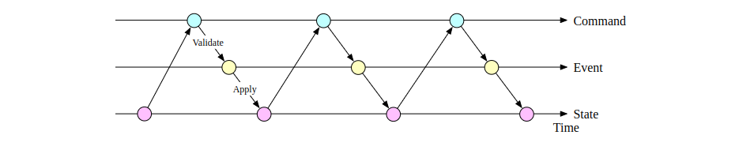

	Figure 15 Dynamic view of event sourcing
	
#### Wallet service example

For the wallet service, the commands are balance transfer requests. These commands are put into a FIFO queue. One popular choice for the command queue is Kafka [10]. The command queue is shown in Figure 16.

Figure 16 Command queue
Let us assume the state (the account balance) is stored in a relational database. The state machine examines each command one by one in FIFO order. For each command, it checks whether the account has a sufficient balance. If yes, the state machine generates an event for each account. For example, if the command is <i>“A->1−C”,thestatemachinegeneratestwoevents:“A:−1” and “C:+$1”</i>.

Figure 17 shows how the state machine works in 5 steps.

 1. Read commands from the command queue.

 2. Read balance state from the database.

 3. Validate the command. If it is valid, generate two events for each of the accounts.

 4. Read the next Event.

 5. Apply the Event by updating the balance in the database.

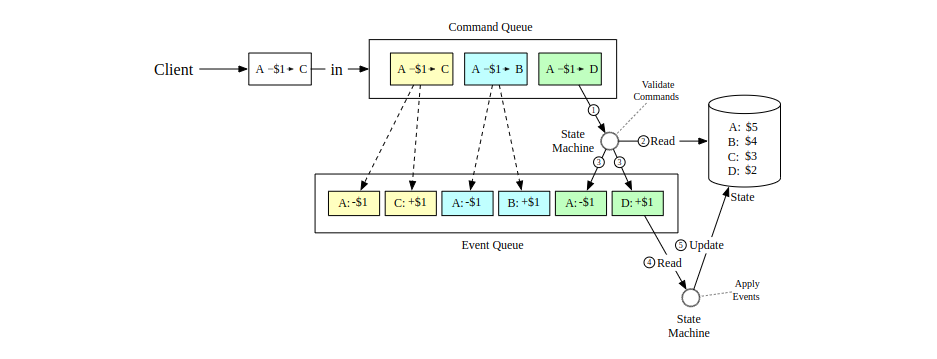

	Figure 17 How state machine works
	
#### Reproducibility

The most important advantage that event sourcing has over other architectures is reproducibility.

In the distributed transaction solutions mentioned earlier, a wallet service saves the updated account balance (the state) into the database. It is difficult to know why the account balance was changed. Meanwhile, historical balance information is lost during the update operation. In the event sourcing design, all changes are saved first as immutable history. The database is only used as an updated view of what balance looks like at any given point in time.

We could always reconstruct historical balance states by replaying the events from the very beginning. Because the event list is immutable and the state machine logic is deterministic, it is guaranteed that the historical states generated from each replay are the same.

Figure 18 shows how to reproduce the states of the wallet service by replaying the events.

	Figure 18 Reproduce states
	
Reproducibility helps us answer the difficult questions that the auditors ask at the beginning of the section. We repeat the questions here.

 1. Do we know the account balance at any given time?

 2. How do we know the historical and current account balances are correct?

 3. How do we prove the system logic is correct after a code change?

For the first question, we could answer it by replaying events from the start, up to the point in time where we would like to know the account balance.

For the second question, we could verify the correctness of the account balance by recalculating it from the event list.

For the third question, we can run different versions of the code against the events and verify that their results are identical.

Because of the audit capability, event sourcing is often chosen as the de facto solution for the wallet service.

#### Command-query responsibility segregation (CQRS)

So far, we have designed the wallet service to move money from one account to another efficiently. However, the client still does not know what the account balance is. There needs to be a way to publish state (balance information) so the client, which is outside of the event sourcing framework, can know what the state is.

Intuitively, we can create a read-only copy of the database (historical state) and share it with the outside world. Event sourcing answers this question in a slightly different way.

Rather than publishing the state (balance information), event sourcing publishes all the events. The external world could rebuild any customized state itself. This design philosophy is called CQRS [11].

In CQRS, there is one state machine responsible for the write part of the state, but there can be many read-only state machines, which are responsible for building views of the states. Those views could be used for queries.

These read-only state machines can derive different state representations from the event queue. For example, clients may want to know their balances and a read-only state machine could save state in a database to serve the balance query. Another state machine could build state for a specific time period to help investigate issues like possible double charges. The state information is an audit trail that could help to reconcile the financial records.

The read-only state machines lag behind to some extent, but will always catch up. The architecture design is eventually consistent.

Figure 19 shows a classic CQRS architecture.

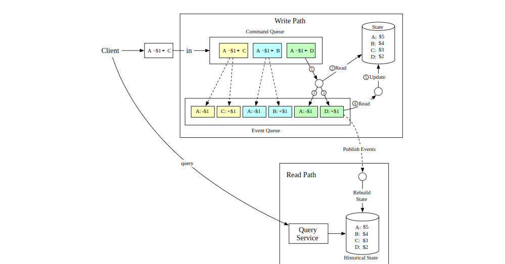

	Figure 19 CQRS architecture
	
<b>Candidate</b>: In this design, we use event sourcing architecture to make the whole system reproducible. All valid business records are saved in an immutable Event queue which could be used for correctness verification.

<b>Interviewer</b>: That’s great. But the event sourcing architecture you proposed only handles one event at a time and it needs to communicate with several external systems. Can we make it faster?

# Step 3 - Design Deep Dive
In this section we'll explore some performance optimizations as we're still required to scale to 1mil TPS.

## High-performance event sourcing
The first optimization we'll explore is to save commands and events into local disk store instead of an external store such as Kafka.

This avoids the network latency and also, since we're only doing appends, that operation is generally fast for HDDs.

The next optimization is to cache recent commands and events in-memory in order to save the time of loading them back from disk.

At a low-level, we can achieve the aforementioned optimizations by leveraging a command called mmap, which stores data in local disk as well as cache it in-memory:
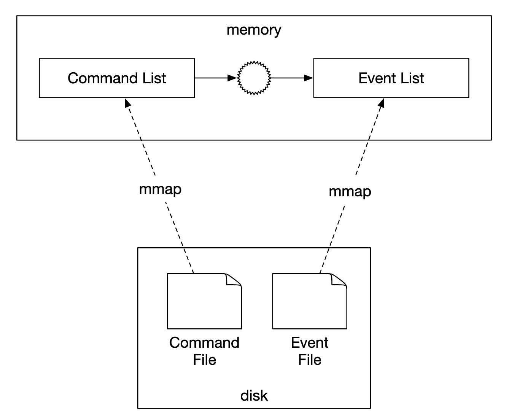

The next optimization we can do is also store state in the local file system using SQLite - a file-based local relational database. RocksDB is also another good option.

For our purposes, we'll choose RocksDB because it uses a log-structured merge-tree (LSM), which is optimized for write operations.
Read performance is optimized via caching.
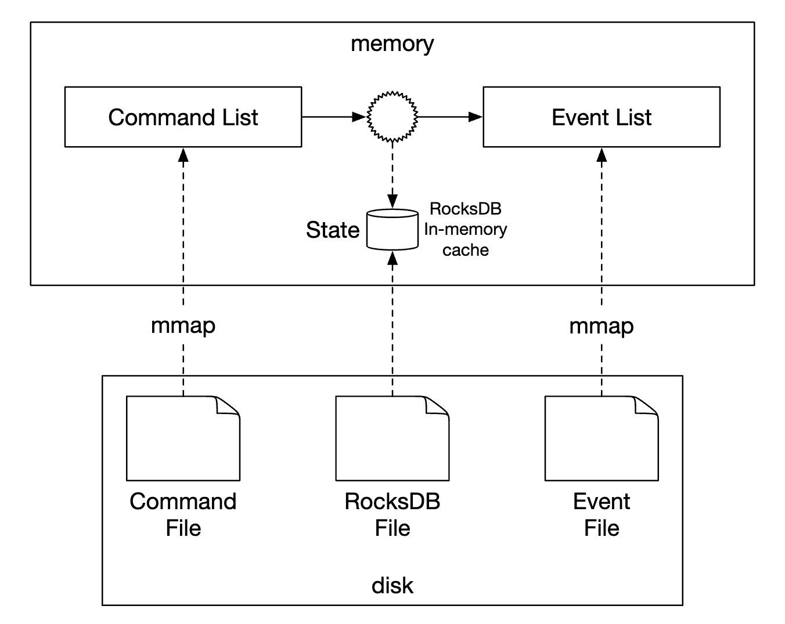

To optimize the reproducibility, we can periodically save snapshots to disk so that we don't have to reproduce a given state from the very beginning every time. We could store snapshots as large binary files in distributed file storage, eg HDFS:
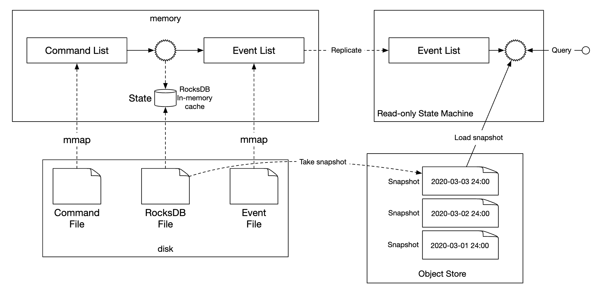

## Reliable high-performance event sourcing
All the optimizations done so far are great, but they make our service stateful. We need to introduce some form of replication for reliability purposes.

Before we do that, we should analyze what kind of data needs high reliability in our system:
 * state and snapshot can always be regenerated by reproducing them from the events list. Hence, we only need to guarantee the event list reliability.
 * one might think we can always regenerate the events list from the command list, but that is not true, since commands are non-deterministic.
 * conclusion is that we need to ensure high reliability for the events list only

In order to achieve high reliability for events, we need to replicate the list across multiple nodes. We need to guarantee:
 * that there is no data loss
 * the relative order of data within a log file remains the same across replicas

To achieve this, we can employ a consensus algorithm, such as Raft.

With Raft, there is a leader who is active and there are followers who are passive. If a leader dies, one of the followers picks up. 
As long as more than half of the nodes are up, the system continues running.
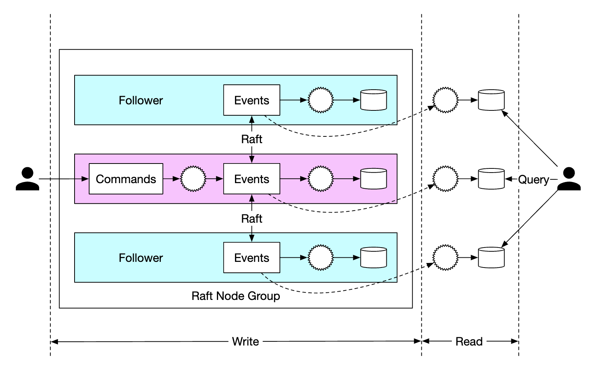

With this approach, all nodes update the state, based on the events list. Raft ensures leader and followers have the same events list.

## Distributed event sourcing
So far, we've managed to design a system which has high single-node performance and is reliable.

Some limitations we have to tackle:
 * The capacity of a single raft group is limited. At some point, we need to shard the data and implement distributed transactions
 * In the CQRS architecture, the request/response flow is slow. A client would need to periodically poll the system to learn when their wallet has been updated

Polling is not real-time, hence, it can take a while for a user to learn about an update in their balance. Also, it can overload the query services if the polling frequency is too high:
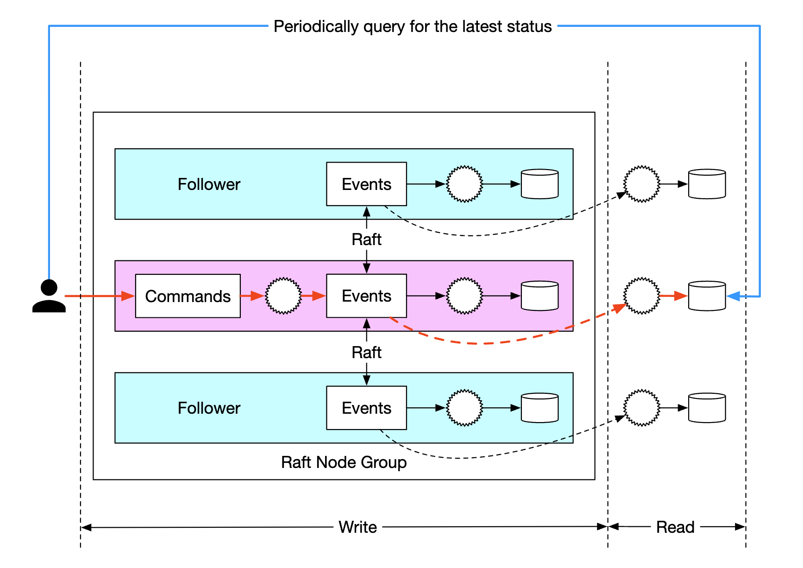

To mitigate the system load, we can introduce a reverse proxy, which sends commands on behalf of the user and polls for response on their behalf:
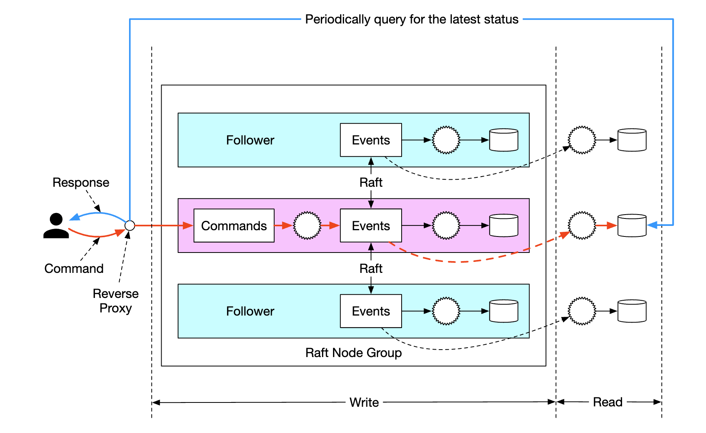

This alleviates the system load as we could fetch data for multiple users using a single request, but it still doesn't solve the real-time receipt requirement.

One final change we could do is make the read-only state machines push responses back to the reverse proxy once it's available. This can give the user the sense that updates happen real-time:
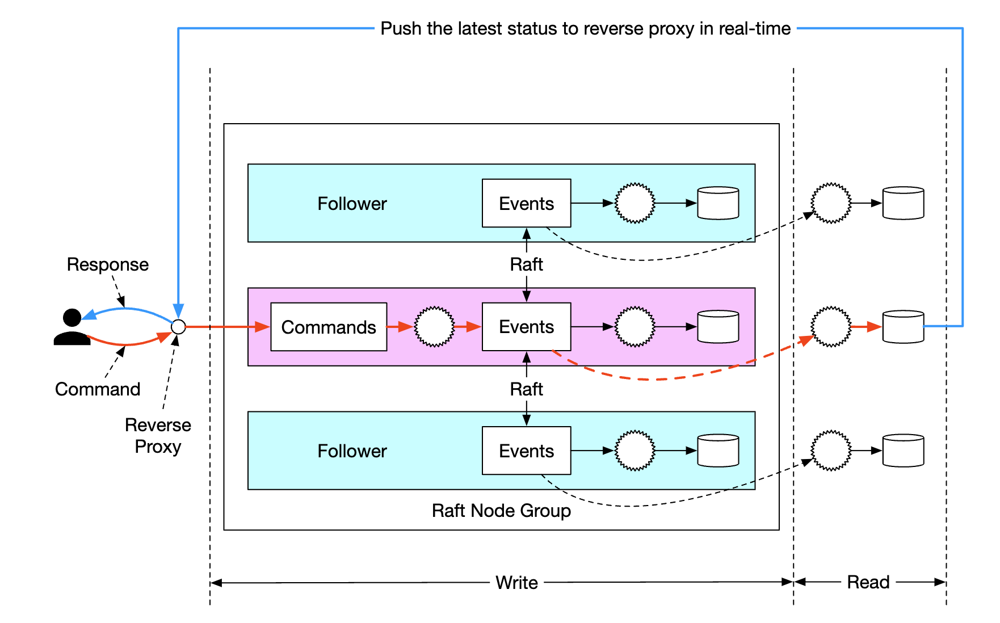

Finally, to scale the system even further, we can shard the system into multiple raft groups, where we implement distributed transactions on top of them using an orchestrator either via TC/C or Sagas:
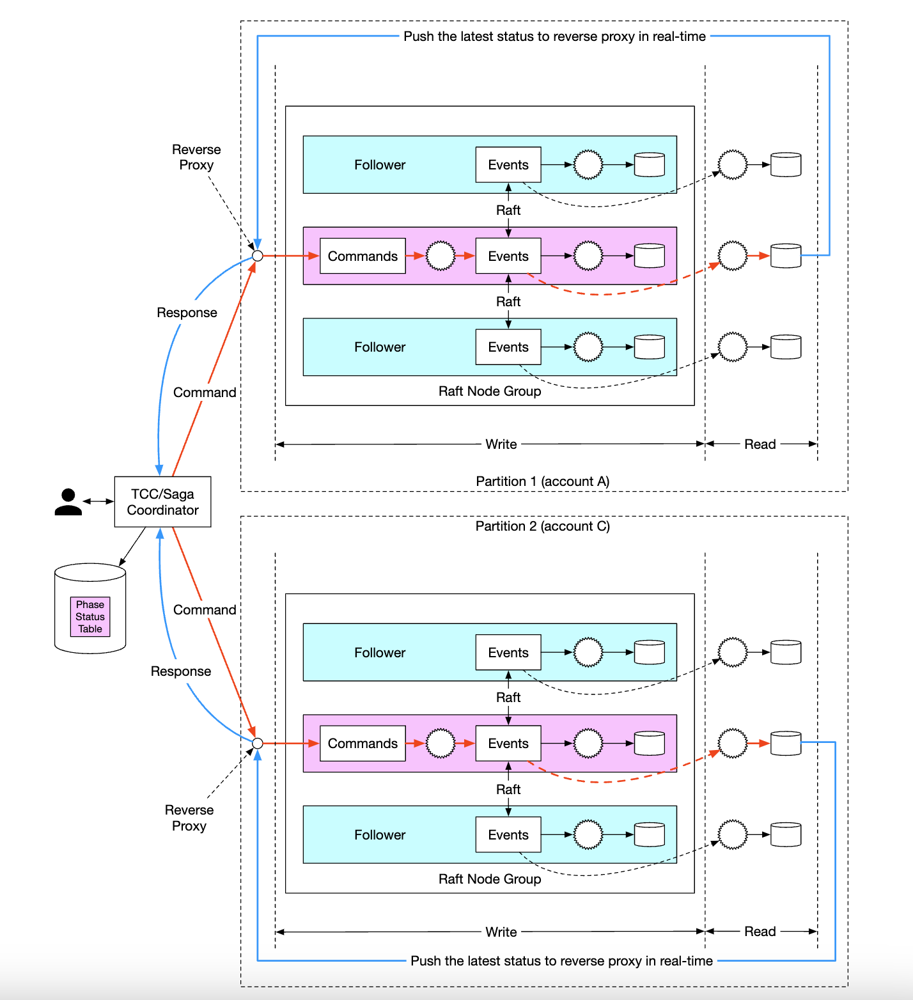

Here's an example lifecycle of a balance transfer request in our final system:
 * User A sends a distributed transaction to the Saga coordinator with two operations - `A-1` and `C+1`.
 * Saga coordinator creates a record in the phase status table to trace the status of the transaction
 * Coordinator determines which partitions it needs to send commands to.
 * Partition 1's raft leader receives the `A-1` command, validates it, converts it to an event and replicates it across other nodes in the raft group
 * Event result is synchronized to the read state machine, which pushes a response back to the coordinator
 * Coordinator creates a record indicating that the operation was successful and proceeds with the next operation - `C+1`
 * Next operation is executed similarly to the first one - partition is determined, command is sent, executed, read state machine pushes back a response
 * Coordinator creates a record indicating operation 2 was also successful and finally informs the client of the result

# Step 4 - Wrap Up
Here's the evolution of our design:
 * We started from a solution using an in-memory Redis. The problem with this approach is that it is not durable storage.
 * We moved on to using relational databases, on top of which we execute distributed transactions using 2PC, TC/C or distributed saga.
 * Next, we introduced event sourcing in order to make all the operations auditable
 * We started by storing the data into external storage using external database and queue, but that's not performant
 * We proceeded to store data in local file storage, leveraging the performance of append-only operations. We also used caching to optimize the read path
 * The previous approach, although performant, wasn't durable. Hence, we introduced Raft consensus with replication to avoid single points of failure
 * We also adopted CQRS with a reverse proxy to manage a transaction's lifecycle on behalf of our users
 * Finally, we partitioned our data across multiple raft groups, which are orchestrated using a distributed transaction mechanism - TC/C or distributed saga
