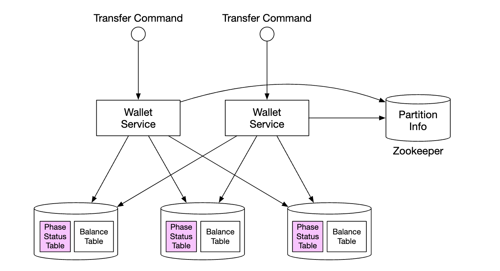
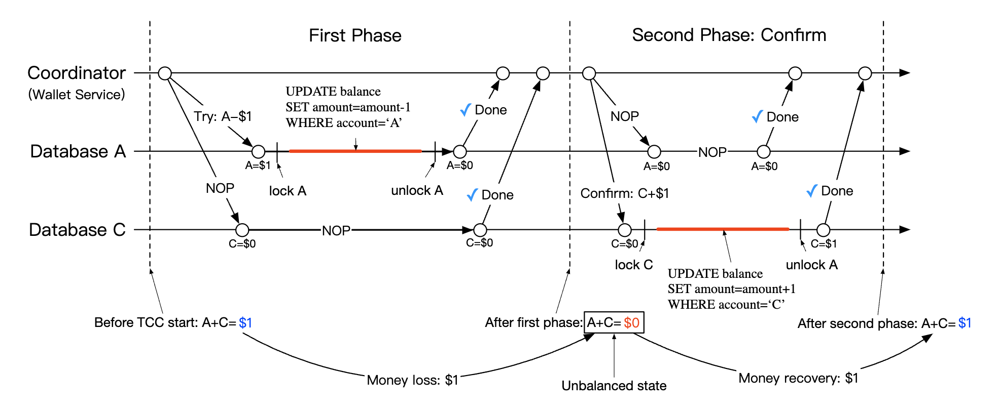
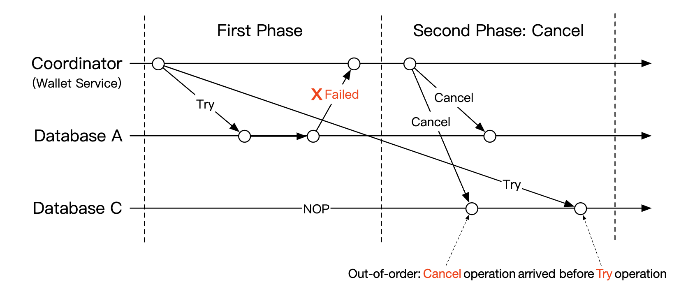
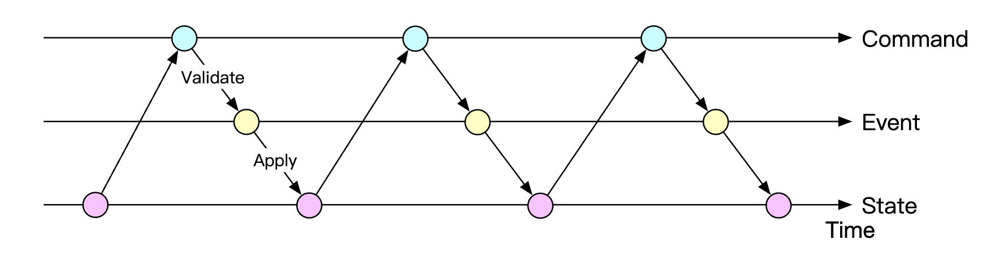
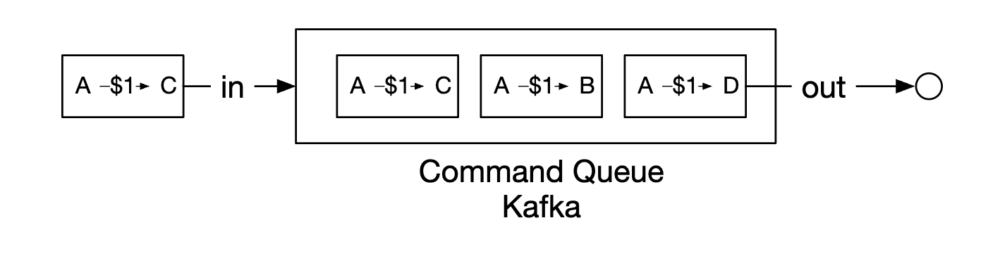
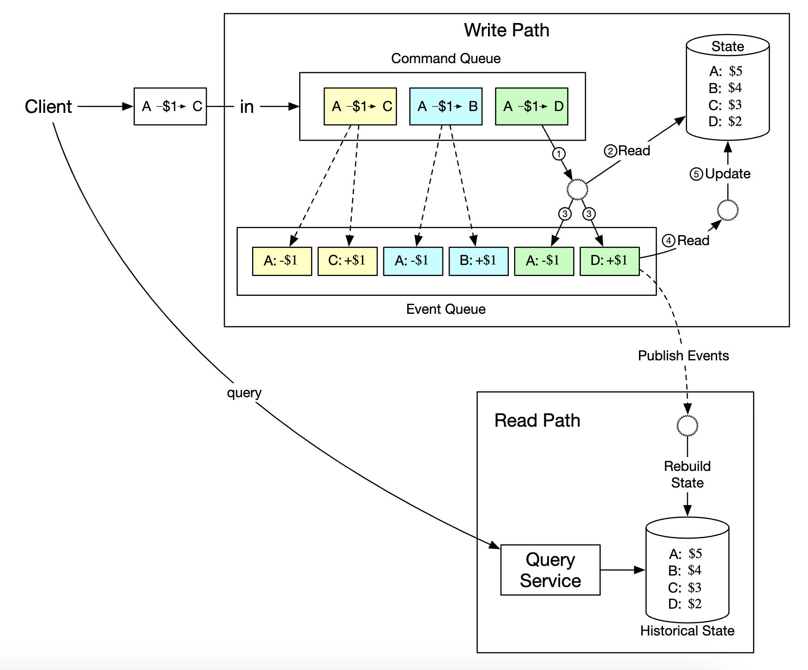

# Digital Wallet

Payment platforms usually provide a digital wallet service to clients, so they can store money in the wallet and spend it later. For example, you can add money to your digital wallet from your bank card and when you buy products online, you are given the option to pay using the money in your wallet. Figure 1 shows this process.

	Figure 1 Digital wallet

Spending money is not the only feature that the digital wallet provides. For a payment platform like PayPal, we can directly transfer money to somebody else’s wallet on the same payment platform. Compared with the bank-to-bank transfer, direct transfer between digital wallets is faster, and most importantly, it usually does not charge an extra fee. Figure 2 shows a cross-wallet balance transfer operation.

	Figure 2 Cross-wallet balance transfer

Suppose we are asked to design the backend of a digital wallet application that supports the cross-wallet balance transfer operation. At the beginning of the interview, we will ask clarification questions to nail down the requirements.

## Step 1 - Understand the Problem and Establish Design Scope

<b>Candidate</b>: Should we only focus on balance transfer operations between two digital wallets? Do we need to worry about other features?

<b>Interviewer</b>: Let’s focus on balance transfer operations only.

<b>Candidate</b>: How many transactions per second (TPS) does the system need to support?

<b>Interviewer</b>: Let’s assume 1,000,000 TPS.

<b>Candidate</b>: A digital wallet has strict requirements for correctness. Can we assume transactional guarantees [1] are sufficient?

<b>Interviewer</b>: That sounds good.

<b>Candidate</b>: Do we need to prove correctness?

<b>Interviewer</b>: This is a good question. Correctness is usually only verifiable after a transaction is complete. One way to verify is to compare our internal records with statements from banks. The limitation of reconciliation is that it only shows discrepancies and cannot tell how a difference was generated. Therefore, we would like to design a system with reproducibility, meaning we could always reconstruct historical balance by replaying the data from the very beginning.

<b>Candidate</b>: Can we assume the availability requirement is 99.99%

<b>Interviewer</b>: Sounds good.

<b>Candidate</b>: Do we need to take foreign exchange into consideration?

<b>Interviewer</b>: No, it’s out of scope.

In summary, our digital wallet needs to support the following:

 * Support balance transfer operation between two digital wallets.

 * Support 1,000,000 TPS.

 * Reliability is at least 99.99%.

 * Support transactions.

 * Support reproducibility.

## Back-of-the-envelope estimation

When we talk about TPS, we imply a transactional database will be used. Today, a relational database running on a typical data center node can support a few thousand transactions per second. For example, reference [2] contains the performance benchmark of some of the popular transactional database servers. Let’s assume a database node can support 1,000 TPS. In order to reach 1 million TPS, we need 1,000 database nodes.

However, this calculation is slightly inaccurate. Each transfer command requires two operations: deducting money from one account and depositing money to the other account. To support 1 million transfers per second, the system actually needs to handle up to 2 million TPS, which means we need 2,000 nodes.

Table 1 shows the total number of nodes required when the “per-node TPS” (the TPS a single node can handle) changes. Assuming hardware remains the same, the more transactions a single node can handle per second, the lower the total number of nodes required, indicating lower hardware cost. So one of our design goals is to increase the number of transactions a single node can handle.

## Step 2 - Propose High-Level Design and Get Buy-In

In this section, we will discuss the following:

 * API design

 * Three high-level designs

	* Simple in-memory solution

	* Database-based distributed transaction solution

	* Event sourcing solution with reproducibility

### API Design

We will use the RESTful API convention. For this interview, we only need to support one API:

One thing worth mentioning is that the data type of the “amount” field is “string,” rather than “double”. We explained the reasoning in the Payment System chapter.

In practice, many people still choose float or double representation of numbers because it is supported by almost every programming language and database. It is a proper choice as long as we understand the potential risk of losing precision.

### In-memory sharding solution

The wallet application maintains an account balance for every user account. A good data structure to represent this <user,balance> relationship is a map, which is also called a hash table (map) or key-value store.

For in-memory stores, one popular choice is Redis. One Redis node is not enough to handle 1 million TPS. We need to set up a cluster of Redis nodes and evenly distribute user accounts among them. This process is called partitioning or sharding.

To distribute the key-value data among N partitions, we could calculate the hash value of the key and divide it by N. The remainder is the destination of the partition. The pseudocode below shows the sharding process:

The number of partitions and addresses of all Redis nodes can be stored in a centralized place. We could use Zookeeper [4] as a highly-available configuration storage solution.

The final component of this solution is a service that handles the transfer commands. We call it the wallet service and it has several key responsibilities.

1. Receives the transfer command

2. Validates the transfer command

3. If the command is valid, it updates the account balances for the two users involved in the transfer. In a cluster, the account balances are likely to be in different Redis nodes

The wallet service is stateless. It is easy to scale horizontally. Figure 3 shows the in-memory solution.

In this example, we have 3 Redis nodes. There are three clients, A, B, and C. Their account balances are evenly spread across these three Redis nodes. There are two wallet service nodes in this example that handle the balance transfer requests. When one of the wallet service nodes receives the transfer command which is to move <i>1fromclientAtoclientB,itissuestwocommandstotwoRedisnodes.FortheRedisnodethatcontainsclientA’saccount,thewalletservicededucts1</i> from the account. For client B, the wallet service adds $1 to the account.

<b>Candidate</b>: In this design, account balances are spread across multiple Redis nodes. Zookeeper is used to maintain the sharding information. The stateless wallet service uses the sharding information to locate the Redis nodes for the clients and updates the account balances accordingly.

<b>Interviewer</b>: This design works, but it does not meet our correctness requirement. The wallet service updates two Redis nodes for each transfer. There is no guarantee that both updates would succeed. If, for example, the wallet service node crashes after the first update has gone through but before the second update is done, it would result in an incomplete transfer. The two updates need to be in a single atomic transaction.

### Distributed transactions

#### Database sharding

How do we make the updates to two different storage nodes atomic? The first step is to replace each Redis node with a transactional relational database node. Figure 4 shows the architecture. This time, clients A, B, and C are partitioned into 3 relational databases, rather than in 3 Redis nodes.

	Figure 4 Relational database
	
Using transactional databases only solves part of the problem. As mentioned in the last section, it is very likely that one transfer command will need to update two accounts in two different databases. There is no guarantee that two update operations will be handled at exactly the same time. If the wallet service restarted right after it updated the first account balance, how can we make sure the second account will be updated as well?

#### Distributed transaction: two-phase commit

In a distributed system, a transaction may involve multiple processes on multiple nodes. To make a transaction atomic, the distributed transaction might be the answer. There are two ways to implement a distributed transaction: a low-level solution and a high-level solution. We will examine each of them.

The low-level solution relies on the database itself. The most commonly used algorithm is called two-phase commit (2PC). As the name implies, it has two phases, as in Figure 5.

	Figure 5 Two-phase commit (source [5])
	
1. The coordinator, which in our case is the wallet service, performs read and write operations on multiple databases as normal. As shown in Figure 5, both databases A and C are locked.

2. When the application is about to commit the transaction, the coordinator asks all databases to prepare the transaction.

3. In the second phase, the coordinator collects replies from all databases and performs the following:

	* If all databases reply with a “yes”, the coordinator asks all databases to commit the transaction they have received.

	* If any database replies with a “no”, the coordinator asks all databases to abort the transaction.

It is a low-level solution because the prepare step requires a special modification to the database transaction. For example, there is an X/Open XA [6] standard that coordinates heterogeneous databases to achieve 2PC. The biggest problem with 2PC is that it’s not performant, as locks can be held for a very long time while waiting for a message from the other nodes. Another issue with 2PC is that the coordinator can be a single point of failure, as shown in Figure 6.

	Figure 6 Coordinator crashes

#### Distributed transaction: Try-Confirm/Cancel (TC/C)

## TC/C Failure modes
If the coordinator dies mid-flight, it needs to recover its intermediary state. 
That can be done by maintaining phase status tables, atomically updated within the database shards:

What does that table contain:
 * ID and content of distributed transaction
 * status of try phase - not sent, has been sent, response received
 * second phase name - confirm or cancel
 * status of second phase
 * out-of-order flag (explained later)

One caveat when using TC/C is that there is a brief moment where the account states are inconsistent with each other while a distributed transaction is in-flight:

This is fine as long as we always recover from this state and that users cannot use the intermediary state to eg spend it. 
This is guaranteed by always executing deductions prior to additions.
| Try phase choices  | Account A | Account C |
|--------------------|-----------|-----------|
| Choice 1           | -$1       | NOP       |
| Choice 2 (invalid) | NOP       | +$1       |
| Choice 3 (invalid) | -$1       | +$1       |

Note that choice 3 from table above is invalid because we cannot guarantee atomic execution of transactions across different databases without relying on 2PC.

One edge-case to address is out of order execution:

It is possible that a database receives a cancel operation, before receiving a try. This edge case can be handled by adding an out of order flag in our phase status table.
When we receive a try operation, we first check if the out of order flag is set and if so, a failure is returned.

## Distributed transaction using Saga
Another popular approach is using Sagas - a standard for implementing distributed transactions with microservice architectures.

Here's how it works:
 * all operations are ordered in a sequence. All operations are independent in their own databases.
 * operations are executed from first to last
 * when an operation fails, the entire process starts to roll back until the beginning with compensating operations

How do we coordinate the workflow? There are two approaches we can take:
 * Choreography - all services involved in a saga subscribe to the related events and do their part in the saga
 * Orchestration - a single coordinator instructs all services to do their jobs in the correct order

The challenge of using choreography is that business logic is split across multiple service, which communicate asynchronously.
The orchestration approach handles complexity well, so it is typically the preferred approach in a digital wallet system.

Here's a comparison between TC/C and Saga:
|                                           | TC/C            | Saga                     |
|-------------------------------------------|-----------------|--------------------------|
| Compensating action                       | In Cancel phase | In rollback phase        |
| Central coordination                      | Yes             | Yes (orchestration mode) |
| Operation execution order                 | any             | linear                   |
| Parallel execution possibility            | Yes             | No (linear execution)    |
| Could see the partial inconsistent status | Yes             | Yes                      |
| Application or database logic             | Application     | Application              |

The main difference is that TC/C is parallelizable, so our decision is based on the latency requirement - if we need to achieve low latency, we should go for the TC/C approach.

Regardless of the approach we take, we still need to support auditing and replaying history to recover from failed states.

## Event sourcing
In real-life, a digital wallet application might be audited and we have to answer certain questions:
 * Do we know the account balance at any given time?
 * How do we know the historical and current balances are correct?
 * How do we prove the system logic is correct after a code change?

Event sourcing is a technique which helps us answer these questions.

It consists of four concepts:
 * command - intended action from the real world, eg transfer 1$ from account A to B. Need to have a global order, due to which they're put into a FIFO queue.
   * commands, unlike events, can fail and have some randomness due to eg IO or invalid state.
   * commands can produce zero or more events
   * event generation can contain randomness such as external IO. This will be revisited later
 * event - historical facts about events which occured in the system, eg "transferred 1$ from A to B".
   * unlike commands, events are facts that have happened within our system
   * similar to commands, they need to be ordered, hence, they're enqueued in a FIFO queue
 * state - what has changed as a result of an event. Eg a key-value store between account and their balances.
 * state machine - drives the event sourcing process. It mainly validates commands and applies events to update the system state.
   * the state machine should be deterministic, hence, it shouldn't read external IO or rely on randomness. 

Here's a dynamic view of event sourcing:

For our wallet service, the commands are balance transfer requests. We can put them in a FIFO queue, such as Kafka:

Here's the full picture:

 * state machine reads commands from the command queue
 * balance state is read from the database
 * command is validated. If valid, two events for each of the accounts is generated
 * next event is read and applied by updating the balance (state) in the database

The main advantage of using event sourcing is its reproducibility. In this design, all state update operations are saved as immutable history of all balance changes.

Historical balances can always be reconstructed by replaying events from the beginning. 
Because the event list is immutable and the state machine is deterministic, we are guaranteed to succeed in replaying any of the intermediary states.

All audit-related questions asked in the beginning of the section can be addressed by relying on event sourcing:
 * Do we know the account balance at any given time? - events can be replayed from the start until the point which we are interested in
 * How do we know the historical and current balances are correct? - correctness can be verified by recalculating all events from the start
 * How do we prove the system logic is correct after a code change? - we can run different versions of the code against the events and verify their results are identical

Answering client queries about their balance can be addressed using the CQRS architecture - there can be multiple read-only state machines which are responsible for querying the historical state, based on the immutable events list:

# Step 3 - Design Deep Dive
In this section we'll explore some performance optimizations as we're still required to scale to 1mil TPS.

## High-performance event sourcing
The first optimization we'll explore is to save commands and events into local disk store instead of an external store such as Kafka.

This avoids the network latency and also, since we're only doing appends, that operation is generally fast for HDDs.

The next optimization is to cache recent commands and events in-memory in order to save the time of loading them back from disk.

At a low-level, we can achieve the aforementioned optimizations by leveraging a command called mmap, which stores data in local disk as well as cache it in-memory:

The next optimization we can do is also store state in the local file system using SQLite - a file-based local relational database. RocksDB is also another good option.

For our purposes, we'll choose RocksDB because it uses a log-structured merge-tree (LSM), which is optimized for write operations.
Read performance is optimized via caching.

To optimize the reproducibility, we can periodically save snapshots to disk so that we don't have to reproduce a given state from the very beginning every time. We could store snapshots as large binary files in distributed file storage, eg HDFS:

## Reliable high-performance event sourcing
All the optimizations done so far are great, but they make our service stateful. We need to introduce some form of replication for reliability purposes.

Before we do that, we should analyze what kind of data needs high reliability in our system:
 * state and snapshot can always be regenerated by reproducing them from the events list. Hence, we only need to guarantee the event list reliability.
 * one might think we can always regenerate the events list from the command list, but that is not true, since commands are non-deterministic.
 * conclusion is that we need to ensure high reliability for the events list only

In order to achieve high reliability for events, we need to replicate the list across multiple nodes. We need to guarantee:
 * that there is no data loss
 * the relative order of data within a log file remains the same across replicas

To achieve this, we can employ a consensus algorithm, such as Raft.

With Raft, there is a leader who is active and there are followers who are passive. If a leader dies, one of the followers picks up. 
As long as more than half of the nodes are up, the system continues running.

With this approach, all nodes update the state, based on the events list. Raft ensures leader and followers have the same events list.

## Distributed event sourcing
So far, we've managed to design a system which has high single-node performance and is reliable.

Some limitations we have to tackle:
 * The capacity of a single raft group is limited. At some point, we need to shard the data and implement distributed transactions
 * In the CQRS architecture, the request/response flow is slow. A client would need to periodically poll the system to learn when their wallet has been updated

Polling is not real-time, hence, it can take a while for a user to learn about an update in their balance. Also, it can overload the query services if the polling frequency is too high:

To mitigate the system load, we can introduce a reverse proxy, which sends commands on behalf of the user and polls for response on their behalf:

This alleviates the system load as we could fetch data for multiple users using a single request, but it still doesn't solve the real-time receipt requirement.

One final change we could do is make the read-only state machines push responses back to the reverse proxy once it's available. This can give the user the sense that updates happen real-time:

Finally, to scale the system even further, we can shard the system into multiple raft groups, where we implement distributed transactions on top of them using an orchestrator either via TC/C or Sagas:

Here's an example lifecycle of a balance transfer request in our final system:
 * User A sends a distributed transaction to the Saga coordinator with two operations - `A-1` and `C+1`.
 * Saga coordinator creates a record in the phase status table to trace the status of the transaction
 * Coordinator determines which partitions it needs to send commands to.
 * Partition 1's raft leader receives the `A-1` command, validates it, converts it to an event and replicates it across other nodes in the raft group
 * Event result is synchronized to the read state machine, which pushes a response back to the coordinator
 * Coordinator creates a record indicating that the operation was successful and proceeds with the next operation - `C+1`
 * Next operation is executed similarly to the first one - partition is determined, command is sent, executed, read state machine pushes back a response
 * Coordinator creates a record indicating operation 2 was also successful and finally informs the client of the result

# Step 4 - Wrap Up
Here's the evolution of our design:
 * We started from a solution using an in-memory Redis. The problem with this approach is that it is not durable storage.
 * We moved on to using relational databases, on top of which we execute distributed transactions using 2PC, TC/C or distributed saga.
 * Next, we introduced event sourcing in order to make all the operations auditable
 * We started by storing the data into external storage using external database and queue, but that's not performant
 * We proceeded to store data in local file storage, leveraging the performance of append-only operations. We also used caching to optimize the read path
 * The previous approach, although performant, wasn't durable. Hence, we introduced Raft consensus with replication to avoid single points of failure
 * We also adopted CQRS with a reverse proxy to manage a transaction's lifecycle on behalf of our users
 * Finally, we partitioned our data across multiple raft groups, which are orchestrated using a distributed transaction mechanism - TC/C or distributed saga
