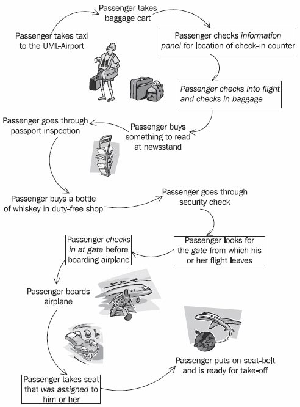
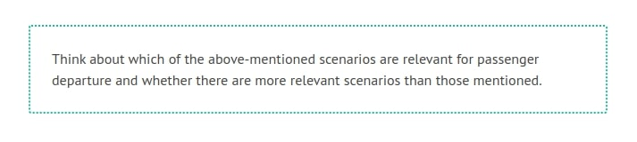
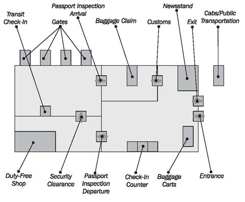

# Introduction to the Case Study

For our case study we have chosen an airport—the UML Airport. Anyone who has ever been on a flight will have no problems understanding our example.

We will restrict our example to those areas of the airport that passengers are in contact with during departure, meaning we will take a closer look at passenger check-in and boarding. Figure 2.1 illustrates how passenger services can be distinguished from other areas of the airport. It shows the various stages that passengers go through until they are seated in the airplane, buckled up, and the plane is ready to take off. Not all stages passengers go through are related to passenger services. The stages that belong to passenger services are framed and printed in italic font.

A sequence of steps like this is called a scenario. However, the depicted scenario is only one of many possible scenarios. The following exceptions are possible for passenger check-in and boarding:

 * The passenger only has carry-on luggage.
 * The passenger doesn’t buy anything at the newsstand.
 * The passenger is running late and now has to check in as quickly as possible.
 * The passenger loses his or her boarding pass.
 * The passenger arrived by plane and merely has to change planes, meaning that he or she doesn’t leave the transit area.
 * The passenger checks in, but falls asleep on an uncomfortable chair in the waiting area, and misses the departure of his or her flight, despite being called repeatedly.
	* The passenger doesn’t get through passport inspection because his or her passport has expired.
	

	Figure 2.1 Case Study: “Passenger takes plane to go on vacation”
	

	

	Figure 2.2 Schematic illustration of the UML Airport

The schematic illustration of the UML Airport in Figure 2.2 should help you to understand the events of the case study better. Many areas around the main passenger services are related in one or more ways to passenger services. Some examples are:

 * Ticket sales
 * Newsstand
 * Duty-free shop
 * Passport inspection/immigration
 * Flight control
 * Information desk
 * Baggage check-in and transportation

Passenger services have to exchange data with some of these areas. They also have to communicate with other areas of the airport. We will introduce those areas when we discuss business models and models of system integration. Therefore, the case study will be expanded further in the following chapters.

UML Airport is a small airport and the case study has been purposely kept simple. Anyone who has ever been on a flight should be able to understand the examples.

The purpose of the case study is to provide a coherent example throughout the chapters of this book. A few details of the case study require further explanation:

The plane ticket consists of the actual ticket and up to four additional sections. The ticket is the little booklet that has a separate coupon for every part of the trip. For example, a ticket could contain a coupon for the flight from Zurich to Frankfurt, one for the flight from Frankfurt to London, and one for the return flight from London to Zurich. Each time at check-in the appropriate coupon will be exchanged for a boarding pass. The ticket always stays with the passenger.

We distinguish between a flight and a flight number. For instance, a flight number could be LH435 or LX016. It stands for a regular flight that occurs at a certain time from the departure airport to the destination airport. A flight, on the other hand, would be, for example, LH435 on 26th August, 2000. It is, so to speak, an execution of a flight number. A flight could be canceled due to bad weather. A flight number is used as long as the airline offers a certain flight regularly.

We differentiate between three options for check-in:

 * <b>Normal check-in</b> with luggage at a normal check-in counter
 * <b>Expres scheck-in</b> without luggage at a special check-in counter
 * <b>Automated check-in</b> without luggage at a machine

