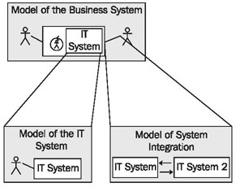

# The Models of our Case Study

In our case study we construct three models of different systems:

1. The model of the business system describes passenger services, meaning the business surroundings of the IT system. It deals with business processes, passengers, business partners, employees, etc. We discuss this model in Modeling Business Systems.

2. The model of the IT system explains the IT system that was built for passenger services. The model of the passenger service business system serves as the foundation for the model of the IT system. We discuss this model in Modeling IT Systems.

3. The model of system integration describes integration into the environment, especially gateways to the outside world. Here also, the model of the passenger service business system serves as the foundation. This model is discussed in Modeling for System Integration.

