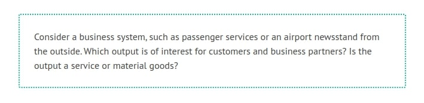
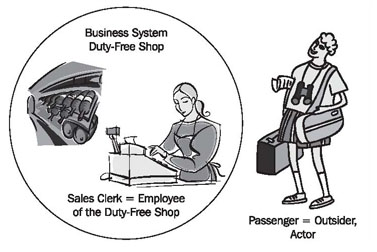
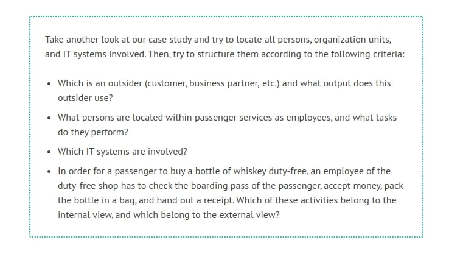

# What Benefit does a Business System Provide?

As a customer or business partner of an organization, you don’t care if transactions within an organization take place manually or are IT-based. You are also not interested in how many forms employees of the organization have to fill out, whether it is 2 or 20. Customers and business partners are merely interested in what kind of goods and services can be offered, and how they can make use of them. The customer view describes the interactions with external parties, such as customers and partners, and presents the business system as a black box.

From the business administrative view, the goal of a business system is (profitable) output. Output can generally be divided into goods and services. The production of goods could be, for example, the production of boxes of the finest Swiss chocolates.

But how do we distinguish services? Services are intangible goods, such as reserving a seat or loading luggage into an airplane. Unlike material goods, services can’t be rendered unless suppliers and customers make contact. However, a service can involve material goods. If a box of Swiss chocolates is sold at our newsstand, this transaction is a service. We can see from this example that the transaction of material goods is treated as a service because it involves a customer.

Consequently, the supply of material goods and services is relevant for the external view. The external view does not describe how employees and IT systems provide goods and services, and how business processes are transacted within the business system. In the external view, only those activities that involve outsiders are of concern.

In our case study, it is important for a passenger to know that he or she can check in with a valid ticket at the check-in counter, and that he or she will subsequently receive a boarding pass. What employees and IT systems actually have to do in order for him or her to receive a boarding pass remains hidden from the passenger—and in most cases he or she does not want to know, anyway.

In practice, we have observed that the external view is difficult to represent, if the employees of an organization, who are located within the business system, develop the model. It is difficult for a person within a business system, who knows all the internal transactions, to reconstruct the view of the customer, which does not consider internal transactions at all. If external and internal views are mixed, they inhibit the clear view from the outside of a business system and its business processes. (Thus, user-unfriendly systems are created!) Therefore, consult unbiased staff members, who can put themselves in the outsider’s place more easily, for instance, employees of other divisions or external consultants.

## Business Use Cases

Before we converge to the <b>business usecases</b>, we would like to take a look at the general definition of a use case in UML. A use case is the specification of a set of actions performed by a system, which yields an observable result that is typically of value for one or more actors or other stakeholders of the system (OMG: Unified Modeling Language: Superstructure, Version 2.0, Revised Final Adopted Specification, October 2004).

What is an observable, valuable result in a business system? This question—how to find use cases—has preoccupied analysts and designers since the first day the term was used. The use cases of our business system are the services of a business system that are offered to customers, business partners, or other business systems. In contrast to this, the functionality that exists within a business system, which is neither visible nor accessible to outsiders, represents an internal activity, meaning an internal business process.

On the level of the business model we use the term business use case instead of use case. The reason behind this differentiation is a clear separation and the elimination of mix-ups in the transition from the business system model to the IT system model. The business use case is reserved to the business system model. Beyond this, there are no differences between a business use case and a use case.

Business processes can be performed manually or be IT-assisted. Nowadays, entire business processes can be initiated and conducted completely without human help. Corresponding to this reality, business use cases can comprise manual tasks, as well as IT-assisted activities.

If we look at our Hanseatic merchant’s trading office, we find exclusively business use cases that are conducted manually. If a customer of the trading office orders Russian fur, the clerk uses pen and ink to enter the order into the order book. Thus, business use cases already existed in medieval times.

In our case study, manually conducted passenger services as well IT-assisted activities are performed. For example, the IT system of passenger services performs seat reservations for passengers, while an employee conducts the verification of the ticket manually.

A passenger who checks in at a machine does not even encounter a human being. The check-in machine performs the entire business use case.

## Actors

Outside of the business system are, for instance, customers or business partners, who use the output of the business system under consideration. It’s not necessary that these <b>outsiders</b> know in detail how a business case is conducted. For our passengers, it is important to know that they can buy a bottle of whiskey in the duty-free shop. The bottle of whiskey is a material good that the duty-free shop provides; selling the bottle to the customer, on the other hand, is a service. The passenger does not care how the duty-free shop employee conducts the sale. These outsiders are called <b>actors</b> (see Figure 3.5):

	Figure 3.5 Outsiders and staff members
	
A business use case is always initiated by an actor, meaning that a customer or business partner utilizes a service. Our passenger, who strolls through the duty-free shop, considers a Scottish Malt Whisky a cheap bargain, and decides to buy a bottle. This makes him the initiator of the sale. During the transaction of a business use case, actors are able to interact with the humans and IT systems within the business system that are responsible for the transaction. For example, our passenger has to hand over a certain amount of money, in order to receive the bottle of whiskey.

Activities that are initiated by employees or IT system within the business system are not business use cases of the external view, but are activities of the internal view and will be represented in the activity diagram or sequence diagram of the internal view.

As you can see, the actors of business systems can be humans, organizations, or IT systems. Even if organizations are represented as actors, as in the case of baggage transportation, we ultimately find people or IT systems behind the actors that initiate and handle cases. However, what are relevant for our models are the <b>roles</b> that are played. On the level of the business system model, it is not important if it is a person, an IT system, an organization, or a division of an organization, a machine, or any other system that takes up a certain role.

