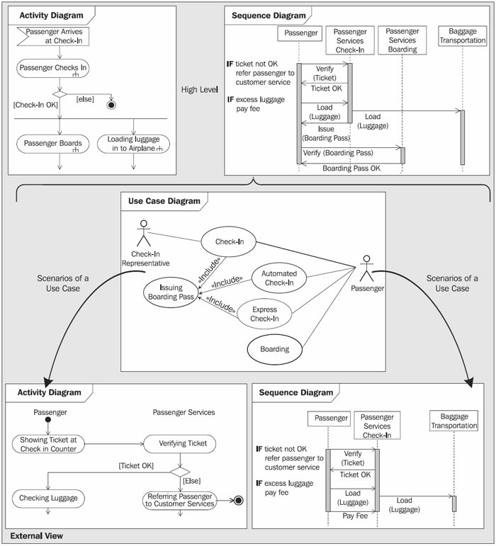

# The Elements of a View

The following types of UML diagrams represent the external view:

 * <b>Usecase diagrams</b> show actors, business use cases, and their relationships. Use case diagrams do not describe procedures. Alternative scenarios also remain hidden. These diagrams give a good overview of the functionality of a business system.

 * <b>Activity diagrams</b> describe procedures, in our case, the business processes of the business system. The subjects of these descriptions are interactions between actors and the business system, meaning the goods and services that are offered to customers and business partners. On the basis of activity diagrams, outsiders can identify how to interact with the business system. They are especially useful to illustrate sequences, alternatives, and parallel events. Activity diagrams can be created in various degrees of detail.
 
 * <b>Sequence diagrams</b> show the chronological chain of interactions. They do not depict every event with all its branches and parallelisms, but the information that is exchanged between the involved parties. These diagrams are a good basis for data and information exchange with partners and customers (Figure 3.6):
	

	Figure 3.6 The external view
	
UML diagrams for the description of business use cases can be annotated with written descriptions and illustrative figures. Not every diagram has to be used in each case. Which diagram type should be used depends on which system characteristics need to be emphasized. In any case, we recommend creating use case diagrams, because this diagram type is well suited for communicating with system partners and domain experts about the basic functionality and the context of the system. High-level activity diagrams with a low degree of detail, which can include several use cases, are also well suited for this purpose.

When refining business use cases and identifying the various scenarios, it becomes necessary to describe the various activities with activity diagrams.

Sequence diagrams show the information exchange with partners and customers (see <b>Modeling for System Integration</b>). In our practical experience, sequence diagrams meet great acceptance in the field of business-process modeling. This is because they are easy to read and require only a few graphical elements. As long as some basic knowledge exists about the technical events, sequence diagrams are often more appropriate for an overview of the interactions of a business system than activity diagrams.

