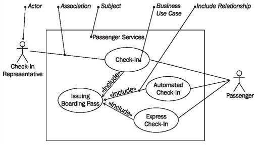
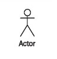
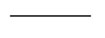
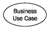
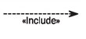
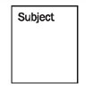
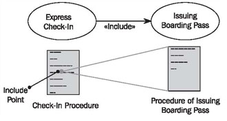

# Use Case Diagrams

Use case diagrams show business use cases, actors, and the relationships between them. The relationships between actors and business use cases state that an actor can use a certain functionality of the business system. You will not find any information about how or in what chronological sequence these services are rendered (Figure 3.7):

	Figure 3.7 The elements of the use case diagram
	
We use the following elements in use case diagrams:

## Actor

An actor represents a role that an outsider takes on when interacting with the business system. For instance, an actor can be a customer, a business partner, a supplier, or another business system.

Every actor has a name:

Instead of a stick figure, other symbols can be used as well, if they fit the characteristics of the actor and lead to practical, easy-to-read diagrams.

## Association

An association is the relationship between an actor and a business use case. It indicates that an actor can use a certain functionality of the business system—the business use case:

Unfortunately, the association does not give any information about the way in which the functionality is used. If a business use case includes several actors, it is not apparent in the use case diagram if each actor can conduct the business use case alone, or if the actors conduct the business use case together. In fact, association only means that an actor is involved in the business use case.

## Business Use Case

A business use case describes the interaction between an actor and a business system, meaning it describes the functionality of the business system that the actor utilizes:

A business use case is described from the actor’s perspective. Apart from the special use of the business use case as a use case within a business system, there is no difference between the business use case and a ‘normal’ use case.

## Include Relationship

The include relationship is a relationship between two business use cases that signifies that the business use case on the side to which the arrow points is included in the use case on the other side of the arrow. This means that for one functionality that the business system provides, another functionality of the business system is accessed.

In this way, functionalities that are accessed repeatedly can be depicted as individual business use cases, which can be used in multiple ways:

At times, the direction of the arrow can be confusing; the relationship has to be read alongside the direction of the arrow (check-in includes issuing the boarding pass).

## Subject

A subject describes a business system that has one or more business use cases attached to it. A subject is represented by a rectangle that surrounds attached business use cases and is tagged with a name:

Depicting the subject (and with it the system limits) is optional.

## Reading Use Case Diagrams

Figure 3.8 illustrates a use case diagram with the actors: the passenger (1) and the check-in representative (2), as well as the business use cases check-in (3) and express check-in (4):

	Figure 3.8 Use case diagram
	
Depending on what you are interested in, you would begin reading with an actor or with a business use case. Starting with the actor, passenger (1), we find the associations (lines) to the two business use cases, check-in (3) and express check-in (4). This means that people, who appear as passengers, can either go through check-in, or express check-in, which can be conducted without luggage.

That one of the two business use cases is below the other means nothing. A use case diagram does not document a meaningful order in which business use cases could be conducted. Of course, the order matters for the description and linking of business processes. This aspect is pictured in activity diagrams (see <b>Activity Diagrams</b>).

The actor check-in representative (2) also has an association to the business use case check-in (3). This means that not only the passenger, but also someone who represents him or her can check in. That the actor, passenger (1), also has an association to the use case check-in (3) means that the passenger and the check-in representative can both check-in. However, what the diagram does not show clearly is that it does not mean that they perform the check-in together. This fact can only be described in another diagram (see <b>Activity Diagrams</b>) or in the form of a comment that can contain informal text.

That the actor check-in representative (2) only has an association to the business use case check-in (3) means that at the UML Airport a representative of the passenger cannot perform an express check-in (4).

You can see that such a simple diagram can contain quite a lot of information. The business use case check-in (3) and the business use case express check-in (4) each have an include relationship with issuing boarding pass (5) Use case diagrams. Both use the business use case issuing boarding pass at some point in their own interaction. (Use cases cannot define when another use case is executed.) Sometime during check-in the boarding pass is issued and handed to the passenger or check-in representative. Figure 3.9 attempts to clarify this procedure once more:

	Figure 3.9 The include relationship between use cases

