# Activity Diagrams

Activity diagrams, which are related to program flow plans (flowcharts), are used to illustrate activities. In the external view, we use activity diagrams for the description of those business processes that describe the functionality of the business system.

Contrary to use case diagrams, in activity diagrams it is obvious whether actors can perform business use cases together or independently from one another.

Activity diagrams allow you to think functionally. Purists of the object-oriented approach probably dislike this fact. We, on the other hand, regard this fact as a great advantage, since users of object-oriented methods, as well as users of functional thinking patterns, find a common and familiar display format, which is a significant aid for business-process modeling.

Because it is possible to explicitly describe parallel events, the activity diagram is well suited for the illustration of business processes, since business processes rarely occur in a linear manner and often exhibit parallelisms.

Activity diagrams can be developed in various degrees of detail. They can be refined step by step. In the external view, activity diagrams, just like use case diagrams, exclusively represent business processes and activities from the outside perspective. Refining diagrams does not mean describing process details that are performed within the business system, which often leads to an unnoticed shift to the internal view (Figure 3.15):

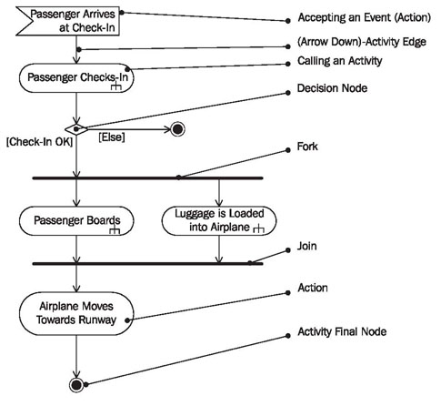	
	
	Figure 3.15 Activity diagram “Passenger Services” with a low level of detail (“High Level”)
	
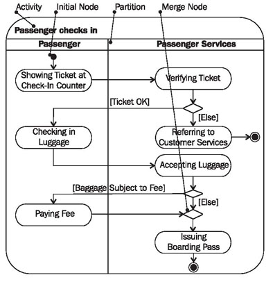		
	
	Figure 3.16 Activity diagram of the activity “Passenger checks in”
	
## Activity

An activity diagram illustrates one individual activity. In our context, an activity represents a business process (Figure 3.16). Fundamental elements of the activity are actions and control elements (decision, division, merge, initiation, end, etc.):

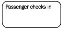

Elements are connected by so-called “activity edges” and form the “control flow”, which can also be casually called ‘flow’. The execution of an activity can contain parallel flows. A border can surround the activity, meaning the entire activity diagram.

## Action
An action is an individual step within an activity, for example, a calculation step that is not deconstructed any further. That does not necessarily mean that the action cannot be subdivided in the real world, but in this diagram will not be refined any further:

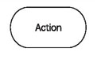

The action can possess input and output information The output of one action can be the input of a subsequent action within an activity. Specific actions are calling other actions, receiving an event, and sending signals.

## Calling an Activity (Action)

With this symbol an activity can be called from within another activity. Calling, in itself, is an action; the outcome of the call is another activity:

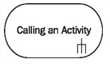

In this way, activities can be nested within each other and can be represented with different levels of detail.

## Accepting an Event (Action)

This action waits for an event to occur. After the event is accepted, the flow that comes from this action (and is defined in the activity diagram) is executed. Accepting events is an important element for business processes in activity diagrams:

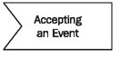

Many business processes are initiated by events, for example, processing an order by the receipt of an order, or delivery by the receipt of a payment.

## Accepting a Time Event (Action)

At a definite point in time, this action starts a flow in the activity diagram. An hourglass symbol can be used to represent the acceptance of a time event:

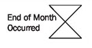

A typical example of a time event is triggering reminders after the deadline for payment has passed. We will discuss an example in <b>Modeling for System Integration</b>.

## Sending Signals (Action)

Sending a signal means that a signal is being sent to an accepting activity:

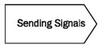

The accepting activity accepts the signal with the action “accepting an event” and can react accordingly, meaning according to the flow that originates from this node in the activity diagram.

## Edge (Control Flow)

Edges, represented by arrows, connect the individual components of activity diagrams and illustrate the control flow of the activity:

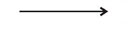

Within the control flow an incoming arrow starts a single step of an activity; after the step is completed the flow continues along the outgoing arrow. A name can be attached to an edge (close to the arrow).

## Decision Node

The diamond below represents a conditional branch point or decision node. A decision node has one input and two or more outputs:

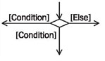

Each output has a condition attached to it, which is written in brackets. If a condition is met, the flow proceeds along the appropriate output. An ‘else’ output can be defined along which the flow can proceed if no other condition is met.

## Merge Node

The diamond below has several inputs and only one output:

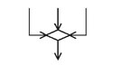

Its purpose is the merging of flows. The inputs are not synchronized; if a flow reaches such a node it proceeds at the output without waiting for the arrival of other flows.

## Fork

For the branching of flows in two or more parallel flows we use a synchronization bar, which is depicted as a thick horizontal or vertical line:

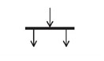

Branching allows parallel flows within activities. A fork has one input and two or more outputs.

## Join

For the consolidation of two or more parallel flows we also use a synchronization bar, which is depicted as a thick horizontal or vertical line:

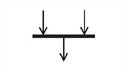

During consolidation synchronization takes place, meaning the flow proceeds only after all incoming flows have reached the consolidation point. Join has two or more inputs and one output.

## Initial Node

The initial node is the starting point of an activity. An activity can have more than one initial node; in this case several flows start at the beginning of an activity:

It is also possible that an activity has no initial node, but is initiated by an event (action: accepting an event).

## Activity Final Node

The activity final node indicates that an activity is completed. An activity diagram can have more than one exit in the form of activity final nodes:

If several parallel flows are present within an activity, all flows are stopped at the time the activity final node is reached.

## Flow Final Node

A flow final node terminates a flow. Unlike the activity final node, which ends an entire activity, reaching a flow final node has no effect on other parallel flows that are being processed within the activity at the same point in time:

In this way, parallel flows can be terminated individually and selectively.

## Activity Partition

The individual elements of an activity diagram can be divided into individual areas or ‘partitions’. Various criteria can lead to the creation of these partitions: organization entities, cost centers, locations, etc:

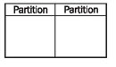

Individual steps of an activity will be assigned to these partitions. Each partition is set apart from its neighboring partition by a horizontal or vertical continuous line; from this stems the term swim lanes. Each partition receives a name. Partitions can be arranged in a two-dimensional manner; in this case the activity diagram is divided into individual cells like a grid.

## Reading Activity Diagrams

You start reading at the initial node, or in Figure 3.17 with the acceptance of the event passenger arrive at check-in (1), and continue along the arrows of the control flow (2). The subsequent action passenger checks in (3) means that at this point the activity ‘passenger checks in’ is processed. This is depicted in more detail in another activity diagram as is indicated by the ‘fork’ in the action symbol:

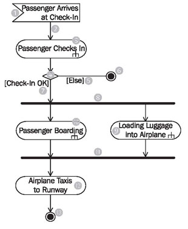

	Figure 3.17 An activity diagram
	
If you follow the control flow, next you will come to a conditional branch or decision node (4): if the check-in is OK the next step along the control flow can follow. Otherwise (5), the passenger cannot fly and the task of passenger services is completed. This can be seen at the black dot with border—the activity final node.

After successful check-in (7) you come to a black cross bar. All arrows that come from this bar (7) symbolize flows that are processed simultaneously. While the luggage is being loaded onto the airplane (9) the passenger is boarding the airplane (10). Between point (8) and point (11) the flows are independent from one another. At the second cross bar (11) the simultaneously processed flows (9 and 10) are merged, meaning that only when the passenger is on the plane (10) and the luggage has been loaded onto the plane (9), does the control flow continue below the cross bar (11). In our example, one more action (12) and subsequent to that the final state (13) follow, meaning that after the passenger is on the plane (10) and the luggage has been loaded onto the plane (9), the airplane can taxi toward the runway (12). You can see here that the last action airplane taxis toward runway (12) is only defined as a single action, even though this process is very complex and could be described in many other activity diagrams. In our context, however, it is not important to describe this step in detail.

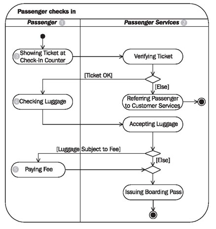

	Figure 3.18 An activity diagram with partitions
	
The activity diagram in Figure 3.18 is divided into two partitions: passenger (1) and passenger services (2). The passenger, for instance, carries out showing ticket at check-in counter (3), checking luggage (4), and paying fee (i). All other actions are located in the partition (swim lane) of passenger services (2) and are carried out by passenger services.

