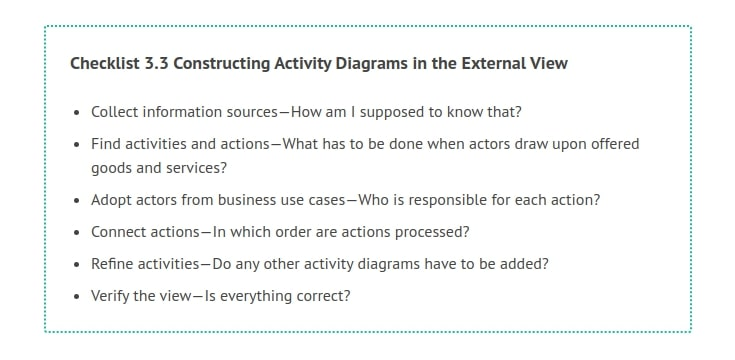
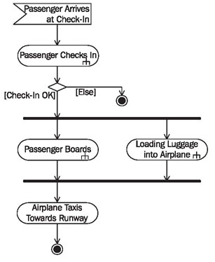
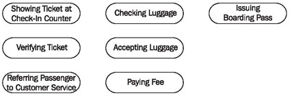
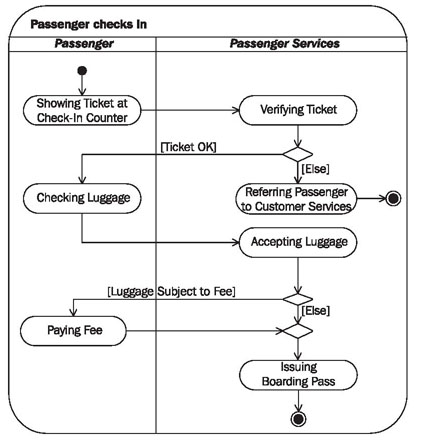
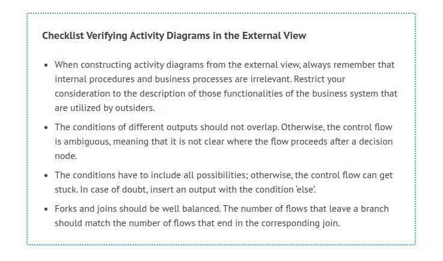

# Constructing Activity Diagrams

As always, we want to point out that the use of suitable terminology and appropriate naming of actions and activities are essential for the clarity and comprehensibility of activity diagrams. Do not despair if it takes hours to find appropriate names—in most cases the effort is worth it. We recommend starting with activity diagrams that contain a low level of detail (‘high level’), which can span several business use cases. This gives a good overview of the chain of interactions between customers and partners and the business system.

Later, in more detailed steps the scenarios of business use cases can be described with activity diagrams. If a business use case is composed of several different scenarios, each is depicted in an activity diagram.

The following checklist shows the steps necessary for constructing activity diagrams:

The order in which we present these steps was chosen deliberately. However, the order is not mandatory, since in practice the individual work steps often overlap heavily.

## Collect Information Sources—How am I Supposed to Know That?

For the construction of activity diagrams we can use information that has already been collected for the construction of use case diagrams. Otherwise, the same advice holds true as in Constructing Use Case Diagrams.

## Find Activities and Actions—What has to be Done When Actors Draw upon Offered Goods and Services?

Here too, we can start from a use case diagram. In the first step, we can derive activities from business use cases. Answering the following questions will help you find activities and actions:

 * Which work steps are required to carry out a business use case, meaning which steps are required to supply and process goods and services?
 * What do the individual actors do?
 * If several actors are involved in a business use case, which work steps are performed by each individual actor?
 * Which events initiate which work steps?
 * Which actions are so extensive that they have to be refined in another activity diagram?

In our case study, you can find the following work steps for passenger services:

 * Passenger checks in (derived from use case diagram); this entails issuing a boarding pass though passenger services.
 * Passenger boards airplane (derived from use case diagram).
 
In addition to this, there are other steps and events:

 * Passenger arrives at check-in counter and shows his or her ticket; this event initiates the check-in activity.
 * Luggage is loaded into the airplane by baggage transportation.
 
At first, just as above, activities can be described in an informal manner. We often find pre-existing documentation of processes, either informal or structured, which can be used as a basis to find activities and actions.

## Connect Actions—In Which Order are Actions Processed?

Connecting the previously mentioned actions and activities into a flow generates an initial activity diagram. This flow is called control flow. The following questions will help you develop a control flow:

 * In which order are actions processed?
 * Which conditions have to be met in order for an action to be executed?
 * Where are branches necessary?
 * Which actions occur simultaneously?
 * Is the completion of actions necessary before the flow can proceed to other actions?

Passenger checks in, passenger boards, and loading luggage into airplane are complex activities, each of which is detailed in another activity diagram. The ‘fork’ within the action symbols indicates this:

	Figure 3.19 A high-level activity diagram across several business use cases
	
## Refine Activities—Do any Other Activity Diagrams have to be Added?

As we could see in Figure 3.19, it is necessary to refine several process steps. Here, we would like to display the activity of passenger checks in in more detail.

When a passenger checks in, he or she first shows his or her ticket at the check-in counter. The ticket will be checked for its validity. If the ticket is not OK the passenger will be referred to customer service. If the ticket is OK the passenger will check his or her luggage. If the luggage has excess weight he or she will pay an additional fee. The luggage will be forwarded to baggage transportation. The passenger receives his or her boarding pass.

Determine the level of detail in activity diagrams very consciously. Test which level of detail users of the diagrams can stand and which is the least amount of detail necessary. We cannot give universally valid rules, since the level of detail essentially depends on the target group and purpose of the model.

Now, we have the following additional actions (Figure 3.20):

	Figure 3.20 Actions of an activity with a higher level of detail
	
## Adopt Actors from Business Use Cases—Who is Responsible for Each Action?

In business processes it is important to know who is responsible for each individual action and who carries it out (Figure 3.21):

	Figure 3.21 Activity diagram of a scenario of the business use case “check-in”
	
For the external view actors are adopted from the use case diagram. Each actor is responsible for a certain action and is recorded in a partition (swim lane) as the responsible party.

The individual activities are assigned to the responsible parties. The division of the activity diagram into partitions allows a clear overview of responsibilities. However, partitions can also be formed on the basis of other criteria.

An activity diagram could, for instance, be divided in such a way that manual, automated, and semi-automated actions would each make up one partition. This would be a good foundation for the conversion of flows into IT systems.

## Verify the View—Is Everything Correct?

Just like use case diagrams, activity diagrams also have to be verified in terms of correctness of content, in cooperation with knowledge carriers.

