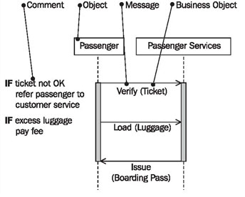
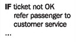
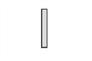
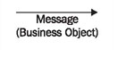
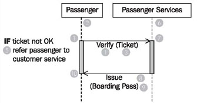

# Sequence Diagrams

UML provides two types of diagrams for the representation of interactions: the sequence diagram and the communication diagram. Both diagrams visualize the exchange of information. However, the emphasis is different: communication diagrams emphasize the relationships of individual objects and their topology; sequence diagrams emphasize the chronological course of exchanged information. In the external view, we opt for the representation through sequence diagrams and do without communication diagrams for two reasons:

 * Sequence diagrams are easier to understand for developers and readers. In our practical work in projects we have observed a much higher acceptance of sequence diagrams because of their simplicity.
 * We avoid using unnecessarily many diagram types for the same facts. Less is often more!
 
If a customer or business partner uses an offered service, partners communicate with each other. The process can be described as a series of interactions. These interactions are clearly laid out in the sequence diagram, whereas the activities of each partner and the conditions under which the interactions take place are omitted in the diagram. However, they can be described with supplementary comments.

Like the activity diagrams, sequence diagrams can be modeled spanning several use cases, as well as being used to refine business use cases. A sequence diagram illustrates the various scenarios of a business use case.

Sequence diagrams can be used as the basis for message exchange between the business system and outside parties (Figure 3.22). We will treat this topic in <b>Modeling for System Integration</b>:

	Figure 3.22 The elements of the sequence diagram
	
In a sequence diagram, we work with the following elements:

## Comment

Sequence diagrams can be annotated with comments (UML generally permits comments in all diagrams.):

For instance, activities of partners or conditions can be specified as comments.

## Object

Objects that are involved in interactions are placed on the x-axis. Objects are senders and receivers of messages in the sequence diagram:

In the business system model (external view) these objects represent the actors of the business system and the business system itself.

## Message and Business Object

The messages that objects send and receive are shown on the y-axis. Messages are inserted in increasing chronological order from top to bottom. The direction of the arrow indicates the direction in which a message is sent:

The business object is listed in parenthesis. Business objects are conveyed together with messages. Some examples of business objects are tickets, boarding passes, and luggage. These examples will be treated in more detail in <b>Package Diagram</b>.

## Reading Sequence Diagrams

Figure 3.23 shows a sequence diagram with the objects passenger and passenger services. The entire diagram documents the process of the business use case passenger check-in.

You begin reading a sequence diagram at the top (1). The starting point on the top left (1) is located on the vertical line that represents the passenger (2) as sender and receiver of messages. The flow begins when the passenger hands over his or her ticket (3) to passenger services for verification (4). The call verify (4) is the message; the ticket (3) that is handed over is the business object. The direction of the arrow indicates that the passenger is the sender of the message and passenger services the receiver (6). The receipt of the message at passenger services initiates activities, which is indicated by the gray vertical bar (7). The diagram does not show how passenger services handle the process, meaning that it does not show which activities are conducted:

	Figure 3.23 Sequence diagram “Passenger Check-In”
	
Only the comment (5) can include a clue. Comments can be inserted at the left margin of the sequence diagram. An exact description of the processing can be found in the activity diagram ‘passenger checks in’ (see Figure 3.21 above).

In a final step, passenger services issues (8) a boardingpass (9) to the passenger. With that, the interaction that is illustrated in this sequence diagram is completed for both parties. This is indicated by the end of the wide gray vertical bar (10).

In the business model we do not utilize all the options of the sequence diagram. UML provides many more possibilities for this diagram type, but our experience showed that this is sufficient to communicate the essential aspects.

