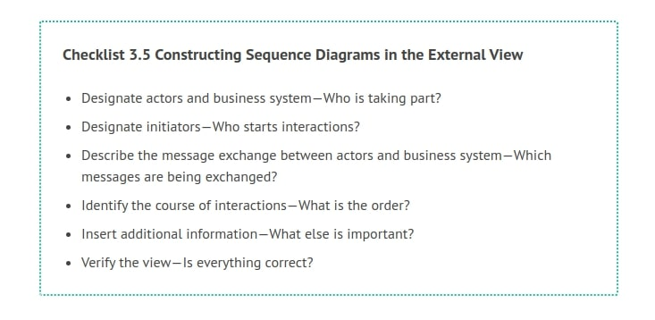
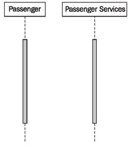
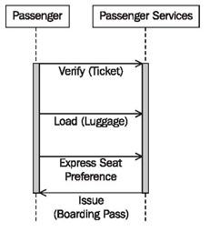
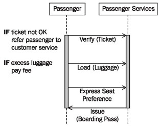
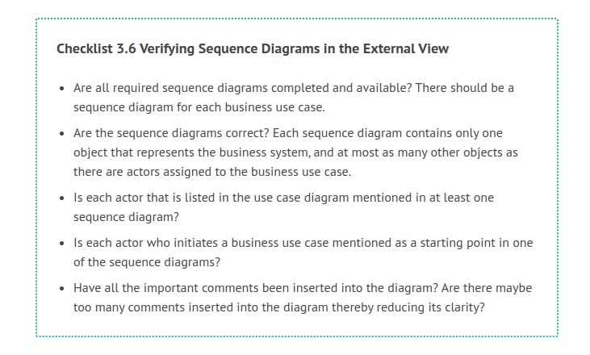

# Constructing Sequence Diagrams

The following checklist shows the necessary steps for the construction of sequence diagrams. Subsequently, we will further explain the individual steps.

## Designate Actors and Business System—Who is Taking Part?

Sequence diagrams illustrate the interactions between actors and the business system. Fundamentally we have a pool of interaction partners from the use case diagrams. Depending on the flow that is being depicted in the sequence diagram, the appropriate actors and business systems can be selected from this pool.

In our case study (see Figure 3.24), we find the interaction partners passenger and passenger services for the above sequence diagram (Figure 3.23):

	Figure 3.24 Constructing sequence diagrams
	
## Designate Initiators—Who Starts Interactions?

For every sequence of interactions the actor who starts the interaction has to be identified. This actor is called the initiator. Since in the external view of the business model each business use case is initiated by an actor, we can here also select the actor from the pool of actors in the use case diagrams.

In our sequence diagram passenger check-in, the passenger starts the interaction by utilizing the service check-in from passenger services.

## Describe the Message Exchange between Actors and the Business System—Which Messages are being Exchanged?

After the initiator has been defined, the subsequent progression of interactions has to be identified. For each communication step it has to be determined what information is exchanged. In this way the message will be defined. Messages are requests to do something directed toward a particular partner. The business objects that are exchanged with these messages also have to be defined.

## Identify the Course of Interactions—What is the Order?

All messages are exchanged in a chronological order that has to be identified. Messages are inserted along the y-axis in increasing chronological order, from top to bottom (see Figure 3.25):

	Figure 3.25 Constructing sequence diagrams
	
## Insert Additional Information—What Else is Important?

Important activities of involved actors and business systems and important conditions can be inserted into the diagram as comments. Comments are inserted at the level of the appropriate message. Restrict this to important comments that have significance so that the diagram is not overcrowded with text (see Figure 3.26):

	Figure 3.26 Constructing sequence diagrams
	
## Verify the View—Is Everything Correct?

Completed sequence diagrams can be verified with the following checklist:

