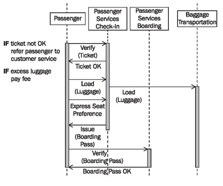

# High-Level Sequence Diagrams

We can use high-level sequence diagrams that span several business use cases to illustrate business processes at a coarse level. High-level sequence diagrams give a good overview of the interactions between customers, partners, and the business system. They serve as the basis for the electronic data transfer between the business system and customers, business partners, and suppliers (see <b>Modeling for System Integration</b>).

Figure 3.27 illustrates passenger services. The entire process spans the business use cases check-in and boarding:

	Figure 3.27 Sequence diagram “Passenger Services”
