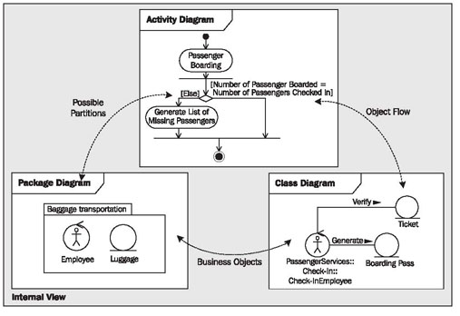

# Internal View

The internal view describes the internal processes and activities, relationships, and structures of the business system. IT systems and people within the business system are responsible for offering the goods and services of the business system. With that, we leave the environment of the business system and enter the black box. From now on, we do care about whether the processing within the business system occurs manually or is IT supported, whether employees of the organization have to fill out two or twenty forms, and whether suppliers are needed.

## The Elements of the View

The following diagrams illustrate the internal view:

 * <b>Package diagrams</b> describe the organization units in the form of packages.
 * <b>Class diagrams</b> describe the connections and relationships between co-workers and business objects.
 * <b>Activity diagrams</b> describe the business processes within the business system. The subjects of the description are the goods and services that are provided by internal business system resources (see Figure 3.29):
 

 
 	Figure 3.29 Diagram types of the internal view of the business system
