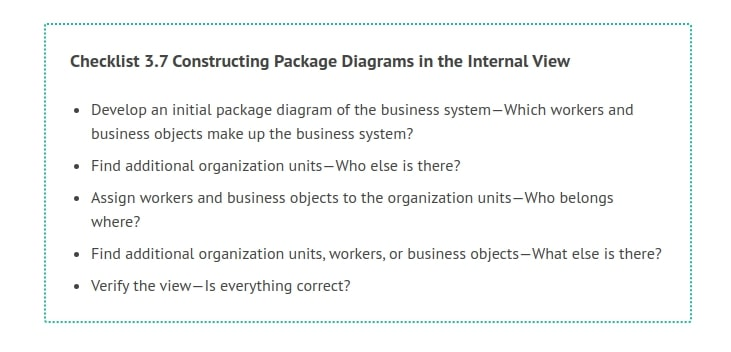
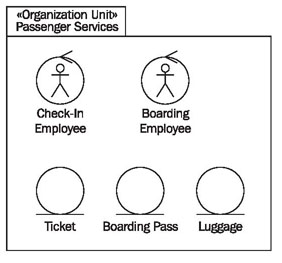
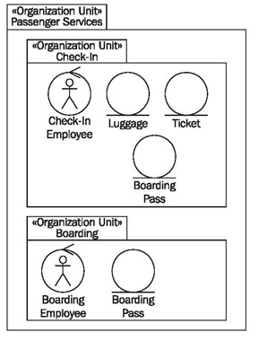
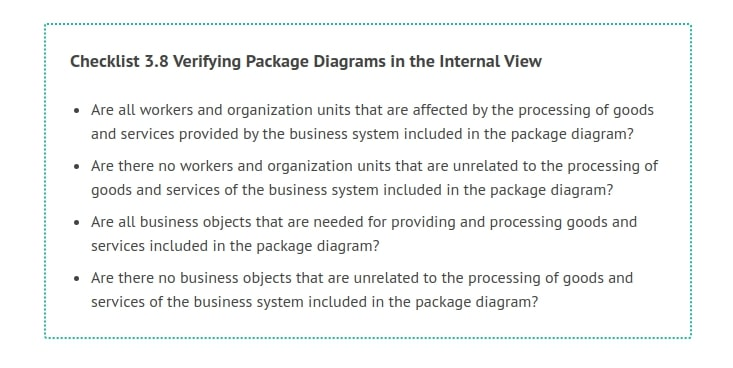

# Constructing Package Diagrams

The following checklist shows the steps that are necessary for the construction of package diagrams. Subsequently, we will further explain the individual steps.

## Develop an Initial Package Diagram of the Business System—Which Workers and Business Objects Make up the Business System?

At first, the entire business system makes up the organization unit that is supposed to be depicted. In our case, this is passenger services (see Figure 3.32). Initially, we search for relevant worker roles (jobs) and business objects for this organization unit. Existing job descriptions and organization charts can be helpful for this:

	Figure 3.32 Constructing a package diagram
	
## Find Additional Organization Units—Who Else is There?

Potentially, the organization unit can be divided into further organization units (divisions, teams, groups). You can use organization charts and job descriptions as the basis and select the organization units that are relevant for the model. Relevant organization units and jobs are those that are directly integrated into the processing of goods and services.

In our case study, we divide passenger service in further organization units: check-in and boarding. A further division is only wise if it is important for the illustration of business processes. For instance, a secretary pool is not important for the business processes under consideration.

## Assign Workers and Business Objects to the Organization Units—Who Belongs Where?

Employees and business objects have to be assigned to the additional organization units. You can see in Figure 3.33 that the business objects were divided. Because of this, structure and assignments are clearly recognizable.

## Find Additional Organization Units, Workers, or Business Objects—What Else is There?

UML package diagrams representing organization units should not be confused with organization charts. In fact, organization charts are related to package diagrams as they are shown here. However, package diagrams contain business objects in addition to employees. From organization charts we can derive hierarchical structure and the roles of the various workers, and use them as the basis for the construction of package diagrams:

	Figure 3.33 Organization unit “Passenger Services”
	
## Verify the View—Is Everything Correct?

The completed package diagram can be checked with the following checklist:

