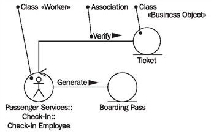
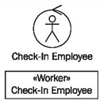
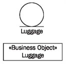
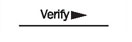
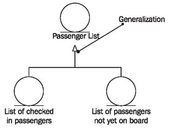
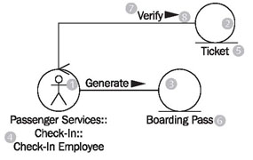

# Class Diagram

The class diagram can be used to illustrate the structural parts of a business system, meaning the relationships between individual employees, business objects, and outside parties. We significantly simplify class diagrams on the business-model level and use only very few elements. It still holds true: less is often more!

When the manifold options of class diagrams are used, these diagrams are no longer easy to read. On the business-system level we have to act on the assumption that involved parties have little or no IT expertise and know nothing about class terminology and class diagrams. The expected advantage of UML, namely easier communication between the various involved parties, would be significantly impaired. For a deeper explanation of class diagrams, refer to <b>Modeling IT Systems</b>:

	Figure 3.34 Class diagram
	
In class diagrams we work with only a few elements:

## Class «Worker»

We have already described the class worker in Package Diagram. Those are exactly the same classes as the ones we use here in the class diagram; just as in the package diagram, they can be depicted with the worker symbol or the class symbol:

As you can see in Figure 3.34, you can state the entire path name of a class to illustrate membership of a package. In our example, the entire path signifies that the class check -in employee belongs to the package check-in, and that the package check-in belongs to the package passenger services, each divided by a double colon. The class worker is used in the class diagram to illustrate relationships with other employees, actors, and business objects.

## Class «Business Object»

We have already described the class business object in Package Diagram. Those are exactly the same classes as the ones we use here in the class diagram:

Just as in the package diagram, they can be depicted with the business object symbol or the class symbol.

## Association

An association represents a relationship that has a precisely defined meaning. The association can be labeled with the name of the association. If you want to assign a direction to the association’s name, you can insert a triangle that points to the direction in which the name is supposed to be read:

In addition to the above-mentioned elements, we would like to mention the generalization. However, we do not think that the use of this element is mandatory.

## Generalization

A generalization is a specific relationship between a general and a specific element. Generalization and specialization help with hierarchical structuring. If several business objects are supposed to be combined to one comprehensive item, generalization is the right tool (see Figure 3.35):

However, for workers we recommend structuring in package diagrams:

	Figure 3.35 Class diagram with generalization
	
## Reading Class Diagrams

Figure 3.36 shows a small excerpt of a class diagram from our case study. It contains the classes check-in employee (1), ticket (2), and boarding pass (3), as well as their associations:

	Figure 3.36 Class diagram
	
You can see by the label (4) of the worker symbol (1), that the check-in employee belongs to the organization unit check-in, which is a division of passenger services.

The labels that are written in front of the label for the worker, separated by double colons, indicate the organization units that the workers belong to. You can see that passenger services and check-in are organization units from the package diagram.

The labels of the business object symbols (5 and 6) show that we have two business objects: ticket (5) and boarding pass (6).

Associations between classes should be read in the following manner:

A check-in employee (4) verifies (7) a ticket (5).
The small triangle (8) next to the name of the association (7) indicates the direction in which the name of the association is supposed to be read. All associations within class diagrams can be read in this way.

We do not use any multiplicities in class diagrams of the business-system model, meaning, for the benefit of clarity, we do not make any statements about the number of objects in classes that are involved in associations.

It is not yet important if a check-in employee issues one or several boarding passes. Important quantities can be included as comments. Quantities will be of interest later: in the IT-system model, which will be described in <b>Modeling IT Systems</b>.
