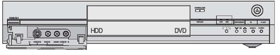
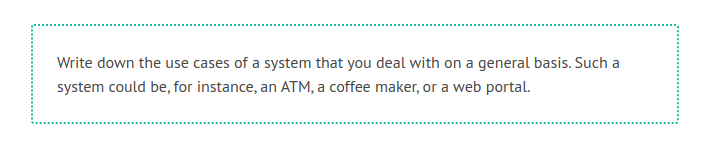
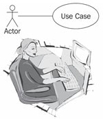
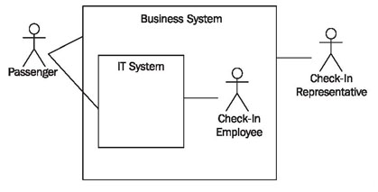
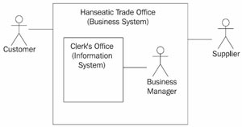

# The User View or "I don't care how it works, as long as it works."

If today someone uses a modern piece of equipment, for example a video recorder, an ATM, or a cell phone, he or she is rarely interested in how that piece of equipment looks from the inside. The average user does not care which electronic parts a machine consists of, or what software it includes. On the other hand, what the machine can be used for, or what functionalities it provides, is important to the user. For instance, the buyer of a cell phone wants to know if the device has WAP capability or how many addresses it can store. Usually, the potential buyer of a cell phone is interested in how the device can be used; he or she is not interested in how the device is built internally, as long as it has the desired functionalities.

This type of view of a system is called a black-box view, meaning the system or device is pictured as a black box—you cannot look inside. You don’t know how it works; you only know that it does work. Ideally, this is the view a user should have of an IT system. He or she uses the IT system to complete his or her work, just like a coffee maker or copier. He or she knows what can be done with the system, and usually also knows how to do it.

The external view is an essential part of the IT system model. Here, it is determined what future users expect from the IT system. The functionality that is defined in this view should ultimately be used to verify if the IT system fulfils the requirements.

The external view consists of the elements use case diagrams, use case sequence diagrams, and interface prototypes. At first sight, these elements appear strange. Some analysts may be tempted to allege that it is sufficient to record user requirements in the form of prose. But practical experience shows again and again that this is not true. Prose can be inconsistent, imprecise, and incomplete, without it becoming obvious to the future user when he or she reads it. The IT system is developed accordingly and the programmer interprets the prose as a third party, from his or her own viewpoint, and implements the system accordingly. The UML-defined diagrams that we describe and explain in this chapter are meant to help avoid misunderstandings and misinterpretations. The diagrams are tools to describe the requirements for an IT system.

	Figure 4.3 External view of a system as black box

An essential element of a system is its user interface. The user interface of an ATM, for example, consists of a small monitor, the keys, and the openings for cards, bills, and receipts, as well as the beep.

The user interface is the only access point that a user has to a system. If, for instance, the recording button of a video recorder is missing, it is impossible to record anything, even if the video recorder is equipped for this function internally.

The user interface represents a type of view of the functionality of the device. What is missing in this view is inaccessible.

However, the user interface gives a static view of the system. This view does not show how the system is supposed to be used, and which operating elements have to be used in which order to complete a certain task.

Because of this, user interfaces require instruction manuals. This means that we need a description that identifies the actions that are possible and what sequence has to be followed for the system to be used in a meaningful manner. In UML, these courses of actions are called use cases. Usecases are instruction manuals for the user interface. Only what is defined in an instruction manual is a meaningful course of action.

The following example is a meaningful course of action (flow) for the use of a phone: picking up receiver, waiting for the dial tone, typing a valid phone number, waiting for someone to answer the phone, talking, and hanging up.

Flows that are not defined in the instruction manual are not regarded as meaningful and are not supported by the system. In poorly developed systems, it can happen that flows that are not defined have unexpected consequences or even crash the system.

Sometimes, modern IT systems can solve ad hoc problems, especially queries. Because of their nature, ad hoc use cases are not included in normal descriptions. Other solutions have to be found for them, for example, the specification of an environment or of a specific system that supports ad hoc queries. Instead of a description, ad hoc use cases receive a reference to a reporting tool or query language.

For users, a system essentially consists of a user interface and use cases, even though these generally only represent the tip of the iceberg. Everything beyond that is of no interest for users. Or did you ever ponder what type of system is behind the keys of your cell phone?

	Figure 4.4 Actor who is carrying out a use case
	
The best approach to model the use cases of an IT system is precisely to imagine a user who sits in front of the keyboard and works with the IT system (see Figure 4.4). The user becomes the actor, and the use case is nothing more than an abstract description of the user’s activity.

An actor:

 * Interacts directly with a system
 * Is always located outside the system with which he or she interacts

For the IT system, this means that the actor is always the one who directly operates the IT system.

Even in higher-ranking business systems (see Modeling Business Systems) actors are located on the outside. They can be, for example, customers or partners.

The worker who operates the IT system, on the other hand, is part of the business system. Because of this, he or she cannot be an actor of the business system:

	Figure 4.5 Actors of the business system and IT system
	
This leads to the situation shown in Figure 4.5:

 * A passenger is actor of the business system, and generally deals with a check-in employee. However, he or she can also be a firsthand actor of the IT system, for example, during automated check-in at a machine.
 * A check-in employee is part of the business system. Because of this he or she is not an actor of the business system. On the other hand, as user he or she is an actor of the IT system.
 * A check-in representative, who performs check-in in place of another person, is only an actor of the business system, because he or she cannot perform automated check-in and therefore never has direct contact with the IT system.

In summary, we can say that actors and use cases are very well suited to communicate with users or domain experts about the functionality of IT systems that is visible from the outside.

In our Hanseatic merchant’s trading office, the separation between business system and IT system is somewhat difficult. However, you can consider that the clerk’s office with the clerks and secretary Hildebrand make up the functionality of an information system (without IT). A use case then, would correspond with a work process of secretary Hildebrand, such as updating payment receipts or summarizing the costs and revenues of last month. Here, the actor is the owner, Mr. Hafenstein (see Figure 4.6):

	Figure 4.6 Actors in the Hanseatic trade office
