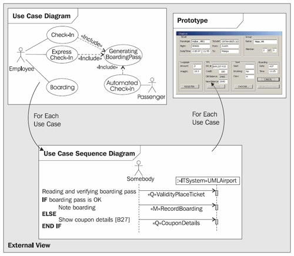

# The Elements of a View

	Figure 4.7 External view

The external view of the IT system consists of the following three elements:

 * Use case diagrams show all users of the IT system (actors) and all tasks that users can perform with the IT system (use cases). In the following, we will generally talk about a use case diagram (singular). In practice it often makes little sense to depict all use cases of an IT system in a single diagram, as the diagram would be overcrowded.
 * Use case sequence diagrams show the processes during interactions between user and IT system for individual use cases.
 * Interface prototypes show how the user interface of a use case might look.

All three elements combined give a good overview over the IT system from a user perspective. In the following pages, we will discuss the elements individually.
