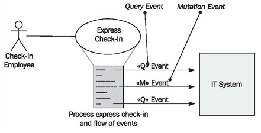

# Query Events and Mutation Events

An event in UML is the specification of an occurrence: the description of something that happens. In the context of use cases, an event is something that a user does with the IT system. Events are initiated by users through the user interface, for instance, by clicking the Search button or pushing the Enter key. This has the effect that within the IT system something is processed. For us, it has proven valuable to differentiate between two types of events:

 * <b>Query events</b> are events that have the goal of displaying information and usually don’t change anything within the IT system. Query events result in displayed information.

 * <b>Mutation events</b> are events that have the goal of storing, modifying, or deleting information in the IT system. The result of a mutation event depends on the success of the mutation: in the case of success information has been stored, modified, or deleted, which has to be conveyed to the user; in case of failure nothing has been changed, which also has to be conveyed to the user.

Since UML does not differentiate between query events and mutation events, we made use of UML extension stereotypes, which are a mechanism that allows the extension of UML with custom elements. We extended the language by creating two special cases of events:

 * The stereotype <b>«Q»</b> in front of an event name indicates the special case of a query event.
 * The stereotype <b>«M»</b> in front of an event name signifies the special case of a mutation event.
 
In this way, we can describe events in different diagram types, and make it immediately clear which type of event we are dealing with. Figure 4.12 shows query events and mutation events in a use case. The response of the IT system to the events is not depicted as a separate event. Each query and mutation event has implicit feedback: the obtained information, or a success or failure message:

	Figure 4.12 Query events «Q» and mutation events «M»
	
In the Hanseatic merchant’s trading office we can picture the events as follows:

 * Secretary Hildebrand finds out how much money the agent in Riga sent within the last six months. This is a query event «Q».
 * Secretary Hildebrand summarizes the types and amounts of furs purchased from Russia up to this point. This is a query event «Q».
 * Secretary Hildebrand notes in the books that no further transactions should be conducted with the dyeing works of master Schildknecht. This is a mutation event «M».
