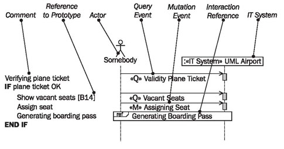
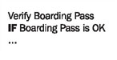
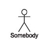
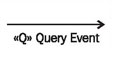
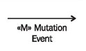
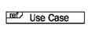
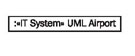
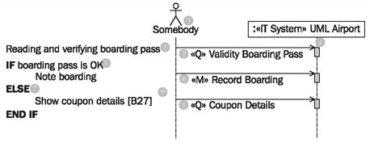

# Use Case Sequence Diagram

	Figure 4.13 Elements of the use case sequence diagram
	
The use case sequence diagram is a special use of UML sequence diagrams that we advocate (see Figure 4.13). We will discuss the sequence diagram in detail in Interaction View. In the use case sequence diagram, we work with the following elements:

## Comment

The flow of the use case is described in a combination of textual description and sequence diagram:

Comments can describe the flow of the use case in a simplistic manner; UML generally allows the placement of comments in all diagrams.

## Reference to Prototype

References to screen forms, lists, and other elements of the user interface can be placed within comments:

This creates a link between the use case sequence diagram and the prototype.

## Actor “Somebody”

Actor “somebody” represents any actor from the use case diagram. “Somebody” is the origin of all events within the use case that go to the IT system:

Because a use case can have different actors we use the actor “somebody”. This way we don’t have to specify a real actor.

## Query Event

A query event is an event that is sent to the IT system with the goal of reading information (see Query Events and Mutation Events).

## Mutation Event

A mutation event is an event that is sent to the IT system with the goal of modifying information (again, see Query Events and Mutation Events).

## Interaction Reference

An interaction reference shows that at this point the use case sequence diagram of another use case is called (see the explanation of include relationships in Use Case Diagrams).

## IT System

The IT system represents the black box with all its objects and its entire functionality:

All events in the use case go to the IT system. In the external view we do not care which individual objects within the IT system are affected by the events.

## Reading Use Case Sequence Diagrams

	Figure 4.14 Use case sequence diagram
	
Figure 4.14 shows the use case sequence diagram of the use case boarding. A use case sequence diagram always belongs to a use case, because it describes the interaction flow of a use case. The flow becomes apparent from the comment at the left border. First, the boarding pass is read and verified (1) by sending the query event «Q» validity boarding pass (2) from the actor of the use case (3) to the IT system (4). How the event is treated internally cannot be seen in this diagram, because the IT system is viewed as a black box. The validity of the boarding pass is verified, which probably means that the information on the boarding pass that is read into the IT system is compared with the stored information. On the basis of the information that the IT system returns, users are able to see if the verification was successful or not. The result does not have its own arrow, but instead flows back through the query arrow (2).

If the boarding pass is OK (5), it can be recorded in the IT system that the passenger has boarded the plane. This happens through the mutation event «M» record boarding (6), which is sent to the IT system (4). Again, we cannot see what happens within the IT system. If the boarding pass is not OK (7), the display should show information about the ticket that belongs to this boarding pass. For this, again, a query event «Q» coupon details (8) coupon details, is sent to the IT system. This query results in the desired information, as long as it exists within the IT system. The display of information can be illustrated in an interface prototype. The reference [B27] (9) corresponds to a screen form in an interface prototype. Consequently, the entire use case boarding is described as a sequence of query and mutation events.

