# Class Diagram

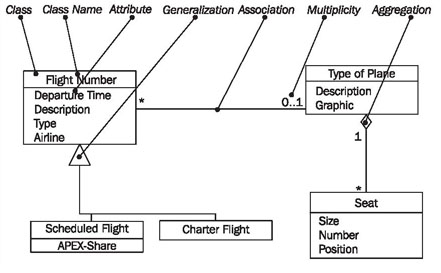

	Figure 4.30 Elements of the class diagram
	
In class diagrams, as shown in Figure 4.30, we work with the following elements:

## Class

A class represents a relevant concept from the domain, a set of persons, objects, or ideas that are depicted in the IT system:

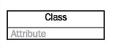

Examples of classes are passengers, planes, or tickets.

## Attribute

An attribute of a class represents a characteristic of a class that is of interest for the user of the IT system:

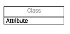

Characteristics of interest of a passenger, for example, are name and age.

## Generalization

Generalization is a relationship between two classes: a general class and a special class:

Refer to Generalization, Specialization, and Inheritance.

## Association

An association represents a relationship between two classes:

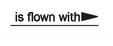

An association indicates that objects of one class have a relationship with objects of another class, in which this connection has a specifically defined meaning (for example, “is flown with”).

## Multiplicity

A multiplicity allows for statements about the number of objects that are involved in an association:

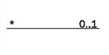

Also see Figure 4.32.

## Aggregation

An aggregation is a special case of an association (see above) meaning “consists of”:

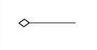

The diamond documents this meaning; a caption is unnecessary.

## Reading Class Diagrams

Figure 4.31 shows a class diagram from our case study with the classes customer, ticket, and coupon, their attributes, and their associations:

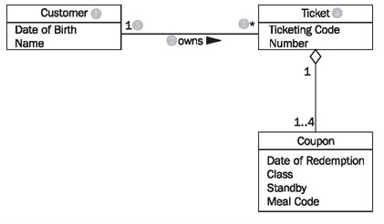

	Figure 4.31 Class diagram with associations
	
Looking at the class diagram in Figure 4.31, you can read the association between the classes customer and ticket as follows:

One (this sentence always begins with “one”) object of the first class has an association with a number of objects of the second class.
The appropriate values from the diagram have to be inserted into this first abstract formulation, which can be universally applied. The name of one class is customer (1); the name of the other class is ticket (4). The name of the association is owns (2):

A customer (1) owns (2) * (3) ticket (4).
If the asterisk is exchanged with its meaning, a regular English sentence is created:

A customer (1) owns (2) zero, one or several (3) ticket(s) (4).
Since associations usually are not directional, meaning usually go both directions, our association also has a meaning in the other direction:

A ticket (4) is owned by (2) exactly one (5) customer (1).
The small triangle next to the name of the association (2) indicates in which direction the name of the association holds true. We can read all the associations in the class diagram in this way.

The specification of the number of objects of the second class (you always start with one object of the first class) is called the multiplicity. The course of action should always be according to the same pattern:

First, a statement of the lower limit (minimum number) followed by two periods (..) and a statement of the upper limit (maximum number).

Figure 4.32 shows the most common possibilities:

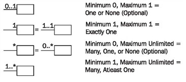
	
	Figure 4.32 Multiplicities
	
However, in UML it is also possible to insert any values as the lower and upper limits, e.g., 2 .. 4 or 6 .. *.

The association’s name is necessary for understanding the domain meaning of the association. In contrast to the association itself, which applies to both directions, the name of the association applies to only one direction, which is indicated by a black triangle. If the association is not labeled, its meaning has to be derived from the domain context, or it takes on a general meaning such as has or belongs to. In case of doubt it is better to label associations too much than too little. Many diagrams that we have encountered in our practical experience were incomprehensible because associations were not labeled.

Associations can also be viewed as the implementation of static business rules (see <b>Static and Dynamic Business Rules</b>). Statements such as “a ticket belongs to exactly one customer” are documented in the class diagram by associations.

Roles are another possible way in UML to give relationships between classes a domain meaning. In this way, we can state what role an object of one class plays for the objects of another class:

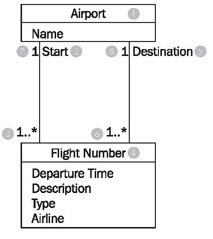

	Figure 4.33 Class diagram with roles
	
Looking at the class diagram in Figure 4.33, we can read the left association with roles between the classes flight number and airport as follows:

An airport (1) is a start (location) (2) for one or more (3) flightnumbers (4).
There is another association between the two classes flight number and airport:

An airport (1) is a destination (5) for one or more flight numbers (4).
These two associations also have inversions, even though roles are only stated for one direction:

A flight number (4) has as start (location) (2) exactly one (7) airport (1).
A flight number (4) has as destination (5) exactly one (8) airport (1).
This records that a certain flight number has a departure airport and a destination airport. An example of a flight number is LX317, a daily flight of the Swiss airline Crossair from London to Zurich.

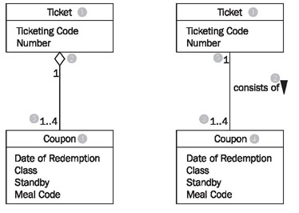

	Figure 4.34 Class diagram with Aggregation
	
Among the many domain meanings that an association can have there is one that can be signified with UML by its own symbol: the whole-part relationship or aggregation. This type of relationship is always used when objects of one class are a part of objects of another class.

In the class diagram in Figure 4.34 aggregation is used on the left side (the white diamond), which can be read as follows:

A ticket (1) consists of (2) 1 to 4 (3) coupons (4).
or the other way around:

A coupon (4) is part of (2) exactly one (5) ticket (1).
The example without a diamond, but with a name for the association, has exactly the same meaning! The last missing element of UML that we use to model class diagrams is generalization/specialization, which serves to depict the relationship between a superclass and a subclass. The generalization/specialization in Figure 4.35 can be read from top to bottom or bottom to top. If you begin at the top, you find a class Freight (1) with the attributes: Identification, Weight, and ID-number (2). This class has two specializations, Piece of Luggage (3) and Piece of Cargo (4). The class Piece of Cargo has an additional attribute: Degree of Hazardousness (5).

If you begin at the bottom you will find the classes Piece of Luggage (3) and Piece of Cargo (4). These have a superclass, the class Freight (1), which contains the shared attributes (and functions) of the subclasses.

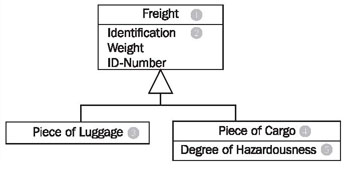

	Figure 4.35 Class diagram with generalization/specialization
