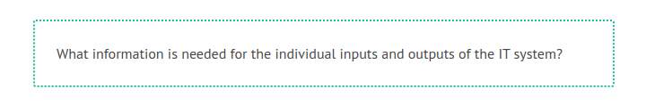
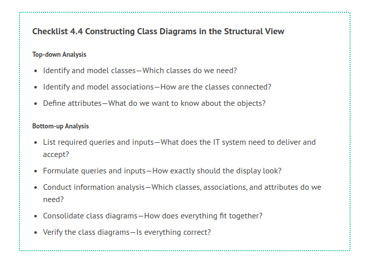
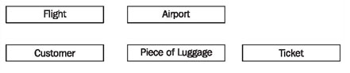
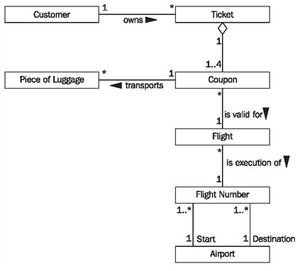
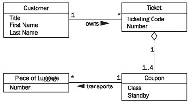
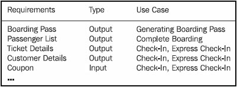
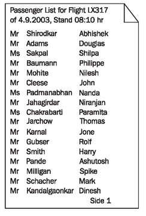
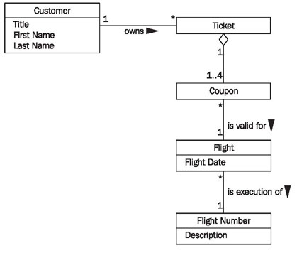
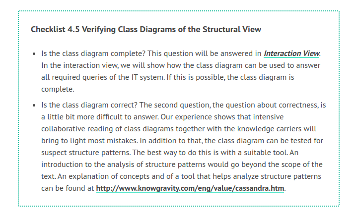

# Constructing Class Diagrams

The main problem for constructing class diagrams is finding the “right” classes. We address this problem from two perspectives and construct the class diagram in two work steps.

In top-down analysis, classes are found first on the basis of general understanding of the subject matter. Top-down analysis is about finding a basic structure of classes that the bottom-up analysis, which is more detailed, can build upon. The (simplified) question is:

Domain knowledge, verbal descriptions of the area of application, and user representatives are important sources of information. In this way, a basic structure of classes can be found for most IT systems.

In bottom-up analysis, classes are found mainly on the basis of the inputs and outputs of the IT system. The question is:

Here, the classes that were found during top-down analysis serve as the basis to find these classes. Already existing inputs and outputs, for instance, screen forms and paper forms are important sources of information.

According to our experience, these two work steps lead to good results in modeling IT systems that manage lots of information. In contrast to this, there are systems that, for example, have the function of running or controlling something, which have a complex functionality but hardly manage any data. For such systems we recommend a less data-intensive approach, for instance, responsibility-driven design. (For this approach compare Rebecca Wirfs-Brock, Brian Wilkerson, Lauren Wiener: Designing Object-Oriented Software, Prentice Hall 1998.) The following checklist shows the necessary steps for constructing class diagrams. Subsequently, we will explain the individual steps further.

The following checklist shows the necessary steps for constructing class diagrams. Subsequently, we will explain the individual steps further.

## Identify and Model Classes—Which Classes do We Need?

An analysis of the interrelationships, information needs, and actors and prototypes is conducted on the basis of general domain knowledge, discussions with experts, and documents. The questions that should be asked are:

 * What are the most important things that will be worked with in the IT system?
 * What classes can be created from this?
 
The answers to these questions provide a number of potential classes, which we model in a first draft of the class diagram. In practice, the results of this first work step vary greatly. However, we have never experienced a case in which nothing at all was found. If you are still inexperienced in identifying classes, it has proven helpful to run through top-down analysis repeatedly. With time, you will develop a sense for what is a class and what is not (Figure 4.36):

	Figure 4.36 Potential classes
	
## Identify and Model Associations—How Are the Classes Connected?

We model the interconnections between the obtained classes and business rules in class diagrams as associations with meaningful names and multiplicities, as shown in Figure 4.37. The questions are:

 * What relationships exist among objects??
 * How many objects of each class are involved in a relationship?

	Figure 4.37 Class and Associations
	
The first question has to be asked for objects of each pair of different classes, for instance, for the classes flight and customer from our case study. Here, it is important to recognize whether the relationship is direct, or if the relationship only exists indirectly through other objects. In our example it turns out that a customer owns a ticket, which in turn, consists of coupons, which are valid for a flight. The goal of the second question is to determine the multiplicity of the relationship, for instance, how many tickets a customer can have, and to how many customers a ticket belongs (Figure 4.37).

Even though at the beginning of this work step we started with previously found classes, because of the domain discussions, we generally find more classes in this work step.

## Define Attributes—What do We Want to Know about the Objects?

The required information about a class has to be identified and modeled in the form of attributes. The question for this is:

Which information about a certain class am I interested in??
This question is about finding obviously needed attributes of the individual classes (see Figure 4.38). This question cannot be answered completely without precisely analyzing inputs and queries, as takes place in bottom-up analysis. Because of this, not too much time should be spent answering this question.

	Figure 4.38 Classes and Attributes
	
## List Required Queries and Inputs—What does the IT System Need to Deliver and Accept?

In this first work step of bottom-up analysis, the individual queries and inputs of the IT system have to be identified. The queries are more important here, because answering queries is the real purpose of IT systems. The questions are:

 * What information does the IT system have to be able to provide??
 * What information does the IT system have to be able to accept?
 
When answering these questions, you can build upon the use cases already found. Which queries and mutations occur in a use case is already drafted in the use case sequence diagram. Another source of information are the business processes of the business system (see Modeling Business Systems). The result of this work step is a list of information requirements, as illustrated in Figure 4.39:

	Figure 4.39 List of information requirements
	
## Formulate Queries and Inputs—How Exactly Should the Display Look?

In order to create individual class diagrams for the individual queries and inputs, we first need to be define how they look. Complex query results or inputs are collected or drafted. Figure 4.40 shows a passenger list; further examples can be found in Figure 4.66 (display) and Figure 4.67 (boarding pass). The question is:

How precisely does the display of a query or input look??
Good sources of information are already existing forms (for example, the passenger list from Figure 4.40) and displays from the prototypes:

	Figure 4.40 Passenger list
	
## Conduct Information Analysis—Which Classes, Associations, and Attributes Do We Need?

In this work step the main part of the bottom-up analysis is performed. For each query or input a small class diagram is created on the basis of the existing classes. This is achieved by modeling the drafted inputs and outputs of the IT system. Class modeling on a small scale takes place. The questions are:

 * What data elements exist in input and output??
 * What objects hide behind these data elements?
 * What relationships exist between the objects that were found?
 * Which of the objects that have already been modeled can be used?
 
For the passenger list in Figure 4.40, the class diagram in Figure 4.41 can be constructed:

	Figure 4.41 Class diagram for the passenger list
	
Taking into consideration the classes that were already found in the top-down analysis, the class diagram in Figure 4.42 is constructed:

	Figure 4.42 Edited class diagram for passenger list
	
## Consolidate Class Diagrams—How Does Everything Fit Together?

In this last work step, if it has not been done yet, the individual class diagrams have to be consolidated into one cumulative class diagram. Here, inconsistencies have to be discovered and corrected. Applicable questions are:

 * Are there classes in the individual class diagrams that have different names, but represent the same thing?
 * Are there multiple relationships in individual class diagrams that have the same meaning?
 * Are there attributes within classes that are named differently, but that have the same meaning?
 
In fact, when all individual class diagrams are being consolidated to one cumulative diagram, these questions almost pose themselves. Once inconsistencies have been recognized, they can usually be corrected easily. If you used the classes found during top-down analysis for modeling the drafted inputs and outputs, overlaps and conflicts during the consolidation of the individual class diagrams should be limited anyway.

## Verify the Class Diagrams—Is Everything Correct?

The completed class diagram in the structural view can be verified with the following checklist:

