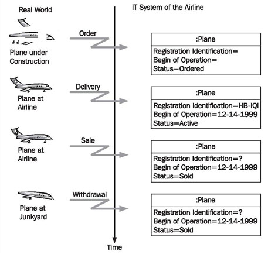
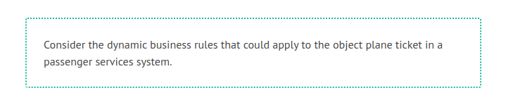
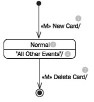
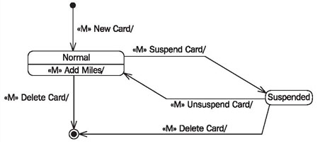
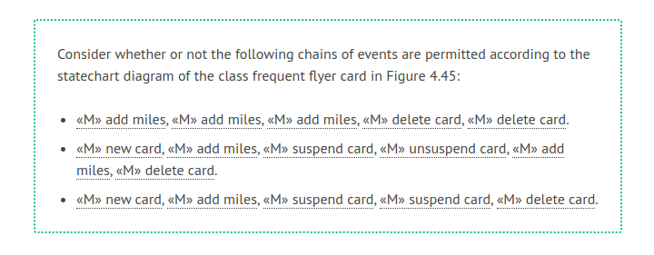

# The Life of an Object

Persons, objects, or concepts from the real world, which we model as objects in the IT system, have “lives”. Actually, they have two lives; the original in the real world has a life, and our image, the object, has a life as well. Though these two lives are related, they do not necessarily follow the same course. Usually, a life starts at birth, creation, or generation and ends with death, deletion, or destruction. In between, life follows a more or less ordered course, as illustrated in Figure 4.43:

	Figure 4.43 The life of a plane
	
To illustrate what we mentioned before we would like to take a closer look at the life of a plane. The plane that we would like to look at is an Airbus A330-223 of Swiss International Airlines with the registration number HB-IQI.

 * The birth of the Airbus A330-223 (of the original) occurs, depending on the perspective, at the start of construction or at the first flight.
 
 * The birth of the object of the Airbus A330-223 in the IT system occurs when information about the plane is recorded for the first time. This can be at the point of purchase, since the plane could be recorded in the IT system for planning purposes, or when the plane is delivered. The initiator for the birth of an object in the IT system is always a mutation event.

Because commercial airplanes are often sold long before construction begins, it is possible that the birth of the object occurs before the (physical) birth of the plane.

 * The death of the original has to do with physical destruction. In the case of our Airbus A330-233 death occurs at withdrawal or possibly in a plane crash.

 * The death of the object occurs, when the object is deleted from the IT system of Swiss Airline. The initiator for the death of an object in the IT system is always a mutation event.

Because commercial airplanes are often sold on after a certain period of time, it is possible that the (logical) death of an object in the IT system occurs before the (physical) death of the original.

Between birth and death the object is alive in the IT system, that is, it will be read and changed. It will be read as the result of a query event; it will be changed as the result of a mutation event (see <b>Query Events and Mutation Events</b>).

As long as reading and modifying objects are not subject to any restrictions, this is not especially interesting. It can be described in a simple statechart diagram (see Figure 4.44). However, as soon as rules for modification have to be observed, it becomes important to document these rules somewhere. Here, we are talking about dynamic business rules (see <b>Static and Dynamic Business Rules</b>). Dynamic business rules are rules that only apply at a certain point in time, namely when a query event or a mutation event occurs. The behavior of objects is largely determined by such dynamic business rules.

Examples of dynamic business rules are:

 * A plane cannot be assigned a flight during the time it is in maintenance.
 * A plane cannot be withdrawn as long as it is still scheduled for flights.
 
If we take a closer look at these business rules, we recognize that they refer to certain events on the one hand, and to states of the object on the other hand:

 * The mutation event assigning a flight to a plane is not permitted in the state in maintenance of the object plane.
 * The mutation event withdrawing plane is not permitted in the state flights scheduled of the object plane.
 * The mutation event starting plane is not permitted in the state in transit of the object plane.

In other words: For certain events it should be possible to determine if an event is permitted in the current state of the object, and how the object will react to the event.

In the behavioral view, one statechart diagram per class is used to document which dynamic business rules have to be followed, and which events are allowed in which states of objects. In the simplest case, all events are allowed. Figure 4.44 shows a simple statechart diagram for the class frequent flyer card:

	
	Figure 4.44 Simple statechart diagram for the frequent flyer card
	
A new object is created by the event «M» New Card (1). An object is deleted by the event «M» Delete Card (2). In between the object is in the state Normal (3), in which “all other events” (4) are allowed (in a real statechart diagram the events that are actually allowed have to be listed by name instead of the event “all other events”).

If, however, we add business rules, the statechart diagram becomes more complex. We would like to amend our statechart diagram with the following rules:

 * It has to be possible to suspend and reinstate a frequent flyer card.
 * It is not possible to add any miles to a suspended frequent flyer card.

If we amend our statechart diagram with the mentioned dynamic business rules, the diagram depicted in Figure 4.45 is created:

	Figure 4.45 More complex statechart diagram for the frequent flyer card
	
A statechart diagram, such as the one of the frequent flyer card in Figure 4.45, shows on which paths or within which boundaries the life of a frequent flyer card object can proceed. In the diagram, possible and impossible chains of events can be recognized. A possible flow is, for instance, «M» new card, «M» add miles, «M» add miles, «M» add miles, «M» suspend card, «M» delete card.

An example of a sequence that is not permitted is: «M» new card, «M» add miles, «M» add miles, «M» suspend card, «M» add miles, «M» delete card. The second to last event, «M» add miles, is not accepted. If the card were unsuspended, miles could be added to it again.

Generally, the life of an object follows such a predetermined course, meaning that the object has to follow certain rules. Thus, the behavioral view is especially important, because it is the job of the IT system to ensure that these rules are followed. It is important that rules are documented in a correct and complete manner, to avoid misunderstandings on both the user side and the developer side. In a completed IT system, it should not be possible for a user to delete or modify objects when it is not permitted by business rules.

In the Hanseatic Merchant’s trading office, an object corresponds to a book, for instance, the order book, and the clerk who is responsible for that book. The statechart diagram of the object contains the rules that the clerk has to follow when he handles the book. It is his instruction manual. It states, for example, that an order that has already been delivered, but that is not yet paid for, cannot be canceled. If you could sit next to the clerk for a while and watch him do his work, you would be able to see everything that can happen with an order in the order book. It can, for example, be recorded, modified, delivered, canceled, or paid for. The statechart diagram of the behavioral view contains the result of this object observation.

