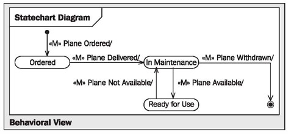

# The Elements of the View

	Figure 4.46 Behavioral view

The behavioral view, illustrated in Figure 4.46, consists of many statechart diagrams, each of which shows the behavior of an individual object. Therefore, all the statechart diagrams combined show the behavior of all the objects of the IT system. However, in practice, most often not all statechart diagrams are constructed but only those that:

 * Contain many or important business rules or
 * Describe important objects
