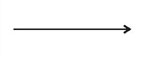
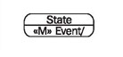
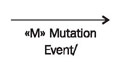
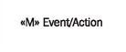
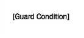
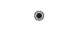
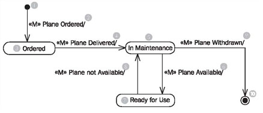
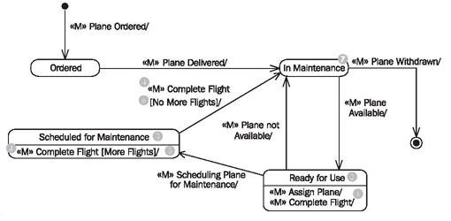
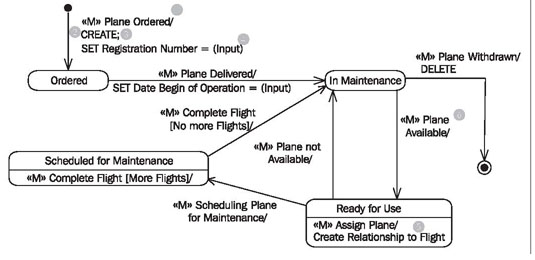
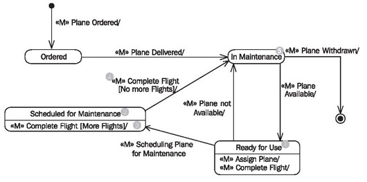

# Statechart Diagram

	Figure 4.47 Elements of the statechart diagram
	
In statechart diagrams, as shown in Figure 4.47, we work with the following elements:

## Initial State

The initial state represents the source of all objects:

It is not a normal state, because objects in this state do not yet exist.

## State

The state of an object is always determined by its attributes and associations. States in statechart diagrams represent a set of those value combinations, in which an object behaves the same in response to events:

Therefore, not every modification of an attribute leads to a new state.

## Transition

A transition represents the change from one state to another:

## Internal Transition

An internal transition is a transition from one state to itself. This means that the object handles the event without changing its state:

The events that initiate the internal transition are listed in the lower part of the state symbol. For instance, a frequent flyer card object in the state normal remains in the state normal when the event «M» add miles occurs.

## Mutation Event

A mutation event is the initiator of a transition from one state to another, or for an internal transition, where the state remains the same:

## Action

An action is the activity of an object that is initiated by an event:

An action describes what the object does in response to the event. This description can be textual or formalized

## Guard Condition

A guard condition is a condition that has to be met in order to enable the transition to which it belongs:

Guard conditions can be used to document that a certain event, depending on the condition, can lead to different transitions.

## Final State

The final state represents the end of an object’s existence:

A final state is not a real state, because objects in this state do not exist anymore.

## Reading Statechart Diagrams

	Figure 4.48 A Statechart diagram with events
	
The diagram in Figure 4.48 shows all states that the object plane can be in during the course of its life. Furthermore, it shows the possible transitions between the states and the events that initiate these transitions.

Each object of the class plane comes from nowhere (1) (initial state) and disappears (generally) again, into nothing (10) (final state). This usually holds true for all classes, meaning in most classes you will find an initial state (1) and a final state (10).Over the course of its life, an plane (please note: we are here talking about the object plane and not about a real airplane) can take up three states: ordered (3), in maintenance (5), and ready for use (7)

The event «M» plane ordered, leads to the occurrence, that from nowhere (1) a new plane object is created in the IT system (birth). Immediately after it has been created it is in the state ordered (3).

If the event «M» plane delivered (4) occurs, and the plane is the state ordered (3), it changes to the state in maintenance (5). If the plane is in any other state than ordered, nothing happens.

Through the events «M» plane available (6) and «M» plane not available (8), the plane changes any number of times between the states in maintenance (5) and ready for use (7).

At the end of its life, the airplane object disappears through the event «M» plane withdrawn (9) into nothing (10), meaning it will be deleted (death).

Figure 4.49 shows more elements that can occur in statechart diagrams:

	Figure 4.49 Statechart diagram with internal transitions and guard conditions.
	
In addition to the transitions we have already explained, there are also internal transitions. The event «M» assign plane (1), which occurs when the plane is assigned to a flight, initiates no transition to another state. Rather, the plane remains in the state ready for use (2). This constitutes an internal transition; the plane object is in the same state ready for use (2) before and after the event.

A guard condition allows acceptance or rejection of an event depending on a condition. If in the state scheduled for maintenance (3) the event «M» complete flight (4) occurs, the response of the object depends on the guard condition stated in brackets. If the condition [more flights] (5) is true (meaning there are more flights assigned to the plane) an internal transition takes place. The plane remains in the state scheduled for maintenance (3). However, if the condition [no more flights] is true (meaning no other flights are assigned to the plane) a transition to the state in maintenance (7) takes place.

	Figure 4.50 Statechart diagram
	
Actions indicate how an object responds to a mutation event. Figure 4.50 shows several types of actions. An action always follows the slash (1) after the event. The actions CREATE (2) and SET registration number = (input) (4) follow the mutation event «M» plane ordered. CREATE indicates that a new object is created; SET registration number = (input) indicates that a value, which the user entered in the use case, is assigned to the attribute registration number. Individual actions are divided by a semicolon (;) (3). In addition to these semi-formal actions, such as CREATE and SET (see <b>Constructing Statechart Diagrams</b>), actions can also be described in free text. Following the mutation event «M» assign plane is the action create relationship to flight (5), which indicates that a relationship to a flight object is created. If no action is stated for an event (6), this can either mean that the action has not yet been specified, or that the object merely transitions into another state.

Gaining a deeper understanding of our case study, you will notice that the statechart diagram in Figure 4.50 will have to be amended with further states and events.

A statechart diagram that documents all possible paths of an object cannot simply be read in a sequential manner. However, it helps the reader to answer several typical questions:

 * What happens to the object if a certain event occurs? Since the answer to this question in each case depends on the current state of the object, the question should really be:
 * How does an object in a certain state respond to a certain event?
 * Which events are relevant for the object?
 * How, meaning through which events, can a certain state be left?
 * How, meaning though which events, can a certain state be achieved?

Let’s try to answer some of these questions by looking at the statechart diagram of the class plane in Figure 4.51:

	Figure 4.51 Selective reading of a statechart diagram
	
 * How does a plane object in the state ready for use (1) react to the event «M» assign plane? In order to answer this question, we have to check first if the event «M» assign plane even exists in the state ready for use (1). The event is allowed if a transition (an arrow) to another state exists that is labeled with the event name, or if an internal transition exists (an entry in the lower part of the state symbol). In our example, a transition to another state does not exist but an internal transition does. This means: A plane object in the state ready for use (1) accepts the event «M» assign plane and remains in the state ready for use (1).

 * How does a plane object in the state scheduled for maintenance (2) react to the event «M» complete flight? In order to answer this question we check first if the event «M» complete flight even exists in the state scheduled for maintenance (2). In our example, we have a transition to another state, as well as an internal transition. Since only one transition is possible, (the plane object is supposed to be in exactly one definite state and not two) we need criteria in order to determine which transition is supposed to take place. Here, we have the help of the guard conditions [more flights] (3) and [nomore flights] (4). We have to check if there are more flights assigned to the plane. In our case we assume that no more flights are assigned to the plane. This means: A plane object in the state scheduled for maintenance (2) accepts the event «M» complete flight and transitions to the state in maintenance (5), since no more flights are assigned to it.

 * How does a plane object in the state scheduled for maintenance (2) react to the event «M» assign flight? In order to answer this question, we check first if the event «M» assign flight even exists in the state scheduled for maintenance (2). In our example, neither a transition to another state nor an internal transition exists. This means: A plane object in the state scheduled for maintenance (2) does not accept the event «M» assign plane. (The IT system should inform the user about the reason why assigning the plane did not work.)

 * Which events are relevant for a plane object? The answer is: All events that are contained in the statechart diagram of the class plane, meaning all events that are accepted in at least one state. All other events are not relevant for the plane object. This means: The only events relevant for a plane object are «M» plane ordered, «M» plane delivered, «M» plane available, «M» plane not available, «M» assign plane, «M» complete flight, «M» scheduling plane for maintenance, and «M» plane withdrawn.
 
 * Through which event can the plane object leave the state in maintenance (5)? In order to answer this question, we search all transitions (arrows) that go from the state in maintenance (5) to another state. Our example has two such transitions. This means: A plane object in the state in maintenance (5) can only leave this state through the event «M» plane available, or «M» plane withdrawn.
 
 * Through which events does a plane object reach the state ready for use (1)? In order to answer this question, we search for all transitions (arrows) that lead to the state ready for use (1). Our example has exactly one such transition. This means: A plane object can only reach the state ready for use (1) though the event «M» plane available (namely, from the state in maintenance (2)).

The questions discussed have already shown that in statechart diagrams, what is not written is just as important as what is written. Events that do not exist in a certain state are not accepted if the object is in this state. This means that an event that was not accepted cannot be successfully executed within the IT system. An appropriate error message has to be generated. Events that do not exist in any state are always ignored. The following statements can be read from the statechart diagram for the plane object:

 * If a plane is delivered it is never directly in the state ready for use, it is always first in the state in maintenance.
 * A plane ready for use cannot be withdrawn. If this is attempted anyway, the mutation event fails with an appropriate error message.

