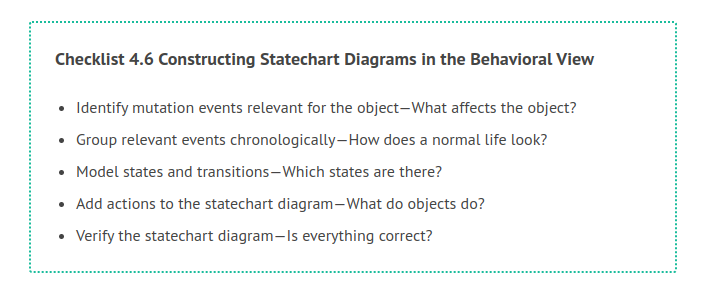
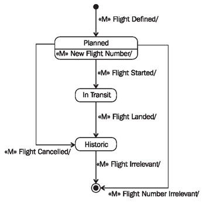
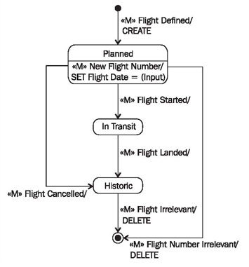
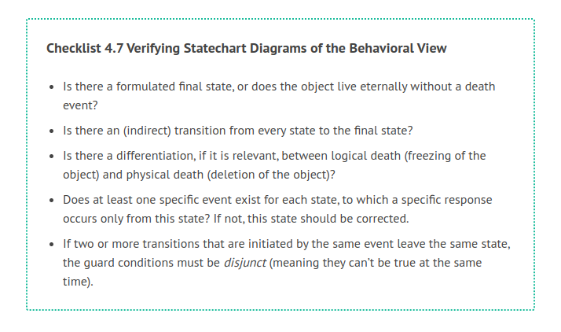

# Constructing Statechart Diagrams

The following checklist shows the necessary steps for constructing the statechart diagrams of a class. Subsequently, we will explain the individual steps further.

Identify Mutation Events Relevant for the Object—What Affects the Object?
First, we have to find out which mutation events are relevant for an object, meaning, which mutation events initiate actions, a state transition, or both for an object. The following questions will help you find relevant mutation events for objects:

 * Which mutation events lead to the creation or deletion of an object??
 * Which mutation events define or modify attribute values?
 * Which mutation events create relationships to other objects or end these relationships?
 * Which mutation events result in a state transition of the object?
 * Which mutation events from the use case sequence diagram of the external view affect the object?
 
The answers to these questions lead to a list of mutation events that are relevant for the object. Since all mutation events originate from use cases, a new use case has to be found for each new mutation event that is not already contained in the use case sequence diagram. An event that is not sent to the IT system within the scope of a use case is never sent to the IT system. This can lead to the fact that new use cases have to be modeled.

In the case study, we found the following relevant mutation events for the object flight:

«M» flight defined, «M» flight started, «M» flight landed, «M» flight canceled, «M» new flight date, «M» flight irrelevant, and «M» flight number irrelevant.

## Group Relevant Events Chronologically—How Does a Normal Life Look?

The obtained mutation events are divided into three groups: events that lead to the creation of new objects (birth), events that are important during the existence of an object (life), and events that lead to the deletion of an object (death). The question is:

To which stage of the life of an object does each mutation event belong??
The mutation events from our case study for the object flight can be grouped as follows:

 * Birth: «M» flight defined
 * Life: «M» flight started, «M» flight landed, «M» flight canceled, and «M» new flight date
 * Death: «M» flight irrelevant and «M» flight number irrelevant
 
## Model States and Transitions—Which States are There?

As a first draft, you can always construct a very simple statechart diagram, consisting of the initial state, a normal state, and the final state. Figure 4.52 shows such a diagram for the object flight:

	Figure 4.52 Simple statechart diagram
	
Starting with this simple diagram, the obtained mutation events can be added. Here, the following questions should be asked for each event:

 * Is the mutation event permitted in all cases, meaning, for all states, or are there states in which the mutation event is not permitted? The various cases that decide if a mutation event is permitted are depicted as states. Behind these cases are the dynamic business rules, which we already mentioned in Static and Dynamic Business Rules.

 * In which state is the object after the occurrence of a mutation event? The new state depends on the state of the object before the occurrence of the mutation event.
 
 * Does the transition to a new state depend on certain conditions? We can use guard conditions to document that a mutation event—depending on a condition—can lead to different new states (see Figure 4.49).

For instance, in our case study, the event «M» flight started is permitted only if the flight is not already in the state in transit. When all questions have been answered for all mutation events, a statechart diagram such as the one in Figure 4.53 has been created:

	Figure 4.53 Statechart diagram of the class “Flight”
	
## Add Actions to the Statechart Diagram—What do Objects Do?

After the mutation events of an object have been found and modeled, their consequences are specified in form of actions. The following questions have to be answered:

 * Where are actions needed for dealing with attribute values??
 * Where are actions needed for dealing with relationships?
 * Where else are actions needed (activating queries, calculations)?
 
The required actions are inserted into the statechart diagram. In the level of detail that we are using for statechart diagrams, it is not a problem to describe actions informally, in plain English. However, our practical experience has shown that a certain level of formality works better, where keywords are used for frequent actions:

 * CREATE/DELETE: Creates or deletes an object of a class (can also be omitted, since it is implied).
 * SET <attribute> := ...: Sets the value of an attribute.
 * TIE TO <object>/CUT FROM <object>: Establishes relationship to another object or breaks the relationship to another object.
 
Figure 4.54 shows the statechart diagram for the class flight from the case study with actions:

	Figure 4.54 Statechart diagram of the class “Flight” with actions
	
## Verify Statechart Diagram—Is Everything Correct?

The completed statechart diagram can be verified with the following checklist:

