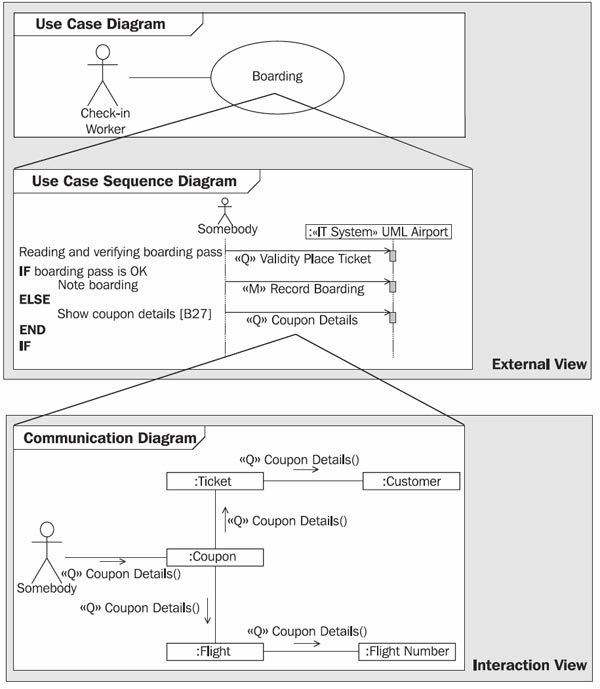
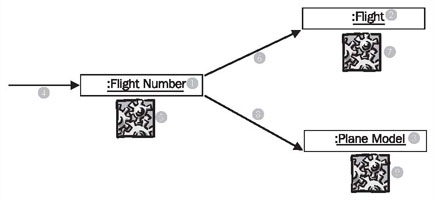
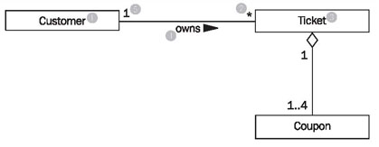

# Seeing What Happens Inside the IT System

In most cases, the mere highlighting of structures is not sufficient for understanding a system. Even with a detailed plan of an oil refinery, it is difficult to understand how oil is converted into gasoline. Only when the process (flow) of refining is explained does it become understandable. Identifying flows is a powerful tool for explaining something. This is also true for models of the IT system. The static view of classes alone is not enough to understand an IT system. For instance, what happens in the IT system when a passenger checks in? Which flows are being processed? Which objects are affected? These questions are answered by the interaction view.

Just as important is the fact that modeling the interaction view contributes much to the verification and completion of the static view. By having to deal with class diagrams from modeling queries to the level of individual attributes, it is ensured that the class diagram meets all requirements. Which aspect is important depends on how complete the class diagram is at the point of modeling the interaction view.

 * A fairly complete class diagram is verified by modeling the interaction view.
 * An incomplete class diagram is enhanced and completed by modeling the interaction view.
 
A close relationship exists between the interaction view and use cases. Use cases show the external view. The IT system is viewed as a black box. In the interaction view, this black box is opened and what occurs inside the IT system is revealed. The interaction view illustrates which objects are needed for the processing of a certain task and how objects communicate with each other. UML uses two diagram types to model the interaction view: the communication diagram and the sequence diagram. In the course of this section, we will explain these diagrams further:

	Figure 4.55 Hierarchy of diagrams
	
Figure 4.55 shows the relationship between use cases and a communication diagram of the interaction view:

 * At the top you can see a use case diagram with the use case boarding.
 * The use case boarding is described in a use case sequence diagram. Essentially, this description consists of a chain of query events and mutation events.
 * The flow of each query event is described in a communication diagram.

With mutation events the process is analogous: their flow has been described in sequence diagrams.

In order to correctly understand diagrams of the interaction view, we would like to show here how an object-oriented system works on the inside. A system functions through objects, which either perform work themselves or delegate work to other objects. This is exactly how the IT system is modeled with UML. Here, it is not important whether or not the IT system is implemented with object-oriented technology. The IT system is modeled at a high level of abstraction, which is disconnected from design and programming:

	Figure 4.56 Cooperation of objects
	
Figure 4.56 shows the cooperation of three objects in an IT system: a flight number object (1), a flight object (2), and a plane model object (3). The task is to delete a flight number (e.g. SR9011) in the IT system.

In our model, from the use case canceling flight number a mutation event (4) is sent to the flight number object (1). Now the flight number object can become active (5), for instance, it can verify if the deletion is possible. It can also forward (6) (8) the event to other objects (2) (3) that need to become active (7) (9).

Exactly this kind of cooperation between objects is documented in communication diagrams and sequence diagrams of the interaction view. Here, the focus is on involved objects and sent events. What occurs within the objects, meaning the behavior of individual objects (the modification of attribute values, calculations, deletion of objects, etc.), cannot be seen in these diagrams. The behavior of objects is defined in the behavioral view. The behavioral view shows for each object what exactly happens when a certain event reaches that object.In the Hanseatic Merchant’s trading office, the interaction view would be documented as follows: You go to secretary Hildebrand and watch him perform a task, for example, cashing a bond. Here, you record in which order he goes to the individual clerks with their books, in order to ask them something (query) or to order them to change something in the book (mutation).

The cooperation of objects shown in Figure 4.56 is based on the mechanism of sending events, meaning that objects can send each other events and therefore, initiate certain events. However, in order to send an event to a particular object, the object has to be known. If, for example, an event is supposed to be sent from a ticket object to the corresponding customer object, this is only possible if the ticket object knows what its customer object is. Exactly this information is documented in the class diagrams of the static view:

	Figure 4.57 Associations in a class diagram
	
The excerpt from the class diagram shown in Figure 4.57 states that a customer (1) owns (4) zero, one, or several (2) tickets (3), and that a ticket is owned by exactly one (5) customer (see <b>Class Diagram</b>). For the objects that are generated from the classes of this diagram this means:

 * Each customer object “knows” the ticket objects that are assigned to it.
 * Each ticket object “knows” the coupon objects that are assigned to it.
 
Objects that are connected to each other know each other. This is the prerequisite for it to be possible for events to be sent. Normally in the interaction view events are sent along associations in class diagrams. An alternative is to attach the identification of an object to which an event is supposed to be sent as an event parameter.

The UML diagrams that we use to illustrate the interaction view, sequence diagrams, and communication diagrams, are combined under the generic term interaction diagrams. Both diagrams allow for a similar view of the IT system. Both diagrams show the flow of cooperation between objects, namely their interactions. However, the two diagrams differ in the following points:

 * In sequence diagrams, a chronological sequence becomes immediately apparent. A vertical time axis indicates a clear sequence from top to bottom. Communication diagrams do not have this time axis. Possible sequences have to be documented by numbering events.

 * Communication diagrams are more similar to the static class diagram. Class names and attributes can be shown. This makes it possible that certain flows, such as reading of information, can be documented in a simple manner. In sequence diagrams, we cannot illustrate which attributes are to be read from an object.
 
 * Communication diagrams work well to show parallel paths of interactions. Although this is also possible with sequence diagrams, sequence diagrams easily become too complex.
 
These differences are the reasons behind our selection of diagram types. Communication diagrams are especially suited to the documentation of query events, in which attributes are read and where objects do not perform any further work. Sequence diagrams are better suited to the documentation of mutation events, in which objects perform substantial work, and in which sequence is rather important.

