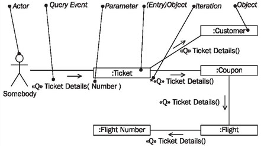
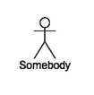
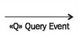
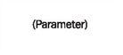
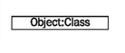
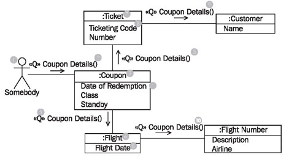
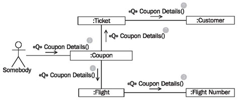
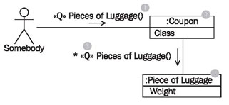

# Communication Diagram

	Figure 4.59 Elements of the communication diagram
	
In communication diagrams, as illustrated in Figure 4.59, we work with the following elements:

## Actor “Somebody”

Actor “somebody” represents any actor from a use case diagram. Since the query event that is documented in the communication diagram can be contained in several use cases, and since these use cases have different actors, we use the actor “somebody”:

In this way, we do not have to commit ourselves to a particular actor. (In communication diagrams actors can also be omitted altogether. In our experience, however, this makes the diagrams hard to understand.)

## Query Event

A query event represents a query for information:

Normally, a query event from a use case is sent to the IT system, for example, a query for detailed information about a ticket.

## Parameter

Parameters allow for attaching information to an event, e.g., the number of a ticket, so that the correct ticket can be read:

## Iteration

An iteration indicates that all objects to which an association exists receive the event, for instance, all the coupons of a ticket:

## Object and Entry Object

The object represents an object of a class in the static view, for instance, “Henry Johnson”, who is an object of the class passenger:

The entry object is the first object that receives a query event from an actor. At the entry object the interaction path begins.

## Reading Communication Diagrams

Figure 4.60 shows a communication diagram with the actor somebody and the objects ticket, customer, coupon, flight, and flight number. The diagram documents the flow of the query «Q» coupon details.

Starting on the left, the communication diagram is read as follows: Actor somebody (1) sends the query event, «Q» coupon details (2) to an object of the class coupon (3).

## Actor “Somebody”

In our IT system model, use cases are the source of events. What is documented in this communication diagram occurs in the context of a use case. It has proven to be of value to use the undefined actor somebody (1) instead of the actor of the use case. The flow of an event that is described in the communication diagram can occur in various use cases with different actors. The actor somebody (1) substitutes for the actor of the use case from which the query event «Q» coupon details (2) stems:

	Figure 4.60 Communication diagram
	
The coupon object (3) provides its attributes—date of redemption, class, and standby (4)—and forwards the query event «Q» coupon details (5) to two other objects: to the flight object (6) that belongs to the coupon, and to the ticket object (7) that belongs to the coupon.

These two objects, in turn, provide certain attributes (8) and then forward the query event «Q» coupon details (9, 10). In this way, the communication diagram can be used to document the “collection” of attributes as a reaction to a query event.

Unlike sequence diagrams, communication diagrams do not have time dimensions. Objects can be spread across the diagrams in any way. An order in which events are processed can only be partially seen from them:

	Figure 4.61 Sequence in communication diagram
	
The following statements can be made about the sequence in the diagram in Figure 4.61 (the numbers in the descriptions were intentionally assigned to avoid implying any particular order):

 * First, the event is sent from the actor somebody to the coupon (5).
 * After that a sequence is not defined:
 	* On the one hand, the event goes to the flight (1) and subsequently to the flight number (3).
	* On the other hand, the event goes to the ticket (7) and subsequently to the customer (9).
	
The event flow branches at the coupon, without noting an order. In most cases, order is unimportant anyway. However, should order be important, UML allows numbering the sequence of events in a communication diagram.

Iteration indicates that all reachable objects and not just one particular object are addressed:

	Figure 4.62 Iteration in communication diagram

We can read in Figure 4.62 that the query event «Q» pieces of luggage (1) is first sent to a coupon object (2) and from there is sent to all (3) (iteration) connected pieces of luggage (4). The iteration is documented with an asterisk (*) in front of the event name.
