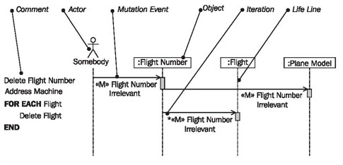
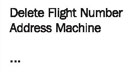
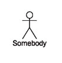
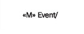
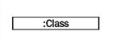
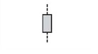
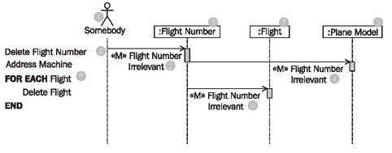
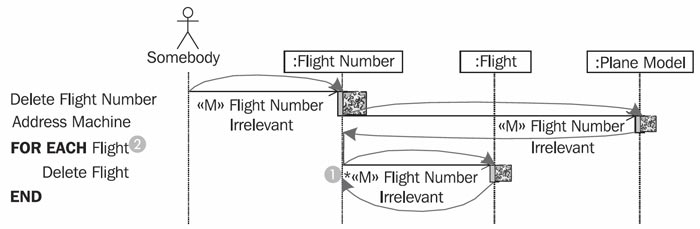

# Sequence Diagram

	Figure 4.63 The elements of sequence diagrams
	
In sequence diagrams, as shown in Figure 4.63, we work with the following elements:

## Comment

The flow of a mutation event is documented with a combination of textual description and a sequence diagram:

In comments, the flow logic is shown on the topmost level.

## Actor “Somebody”

The actor “somebody” represents any actor from the use case diagram. Since the mutation event that is documented in a sequence diagram can be contained in several use cases, and since these use cases can have different actors, we use the actor somebody:

This way, we do not have to decide on one, specific, actor.

## Mutation Event

A mutation event is an event that is sent from the use case, so normally from the user interface, to the IT system:

The goal of the event is to mutate information in the IT system, meaning to create, change, or delete something.

## Object

An object represents any object, meaning an undefined object of a class of the IT system:

## Iteration

An iteration indicates that all objects to which a relationship exists receive the event, for example all the flights of a flight number:

## Lifeline

The lifeline of an object represents a life (over the course of time). The rectangle, meaning the “thick part” of the lifeline shows when the object is active:

(The aspect of activation is not important for our use of sequence diagrams.)

## Reading Sequence Diagrams

Figure 4.64 shows a sequence diagram with objects of the classes flight number, flight, and plane model. The diagram, as a whole, documents the flow of the mutation «M» flight number irrelevant:

	Figure 4.64 A sequence diagram
	
The diagram can be read from top to bottom. The flow starts with the actor (1) sending the mutation event «M» flight number irrelevant (2) to an object of the class flight number (3).

The background to this (just like the communication diagrams), is that the use case is the source of the mutation event. In the sequence diagram, the actor (1) represents the use case.How the event is processed within the flight number object cannot be seen in the sequence diagram. Clues can only be found in the comment (8). An exact description of the processing can be found in the statechart diagram (see <b>The Behavioral View</b>) of the class flight number.

Further, it can be read in the diagram that the object of class flight number (3) forwards the mutation event «M» flight number irrelevant (4) to an object of the class plane model (5). Again, the processing of the event within the object remains invisible. The processing of the events is completed in the plane model object (5), and the control goes back to the sender of the event, so to the flight number object (3). No separate event arrow is inserted for the “reply”, after processing is completed.

Finally, the mutation event «Q» flight number irrelevant (6) is sent to the object of class flight (7). Since it is possible that a flight number objects knows many flight objects (this information can be taken from the class diagram of the static view), the mutation event is sent to all flight objects of the flight number object. The iteration asterisk * at the event (1) in the sequence diagram (Figure 4.65) marks this process. However, we recommend annotating the diagram with an additional comment in the left margin (2), in order to make the diagram easier to read:

	Figure 4.65 Control flow in the sequence diagram
	
Figure 4.65 shows the control flow in a sequence diagram. We use the sequence diagram only to document mutation events. UML provides many more possibilities for the use of this diagram type. However, our practical experience has shown that less is often more, and that we can sufficiently communicate the essential aspects of the interaction view with this restricted use of sequence diagrams.

