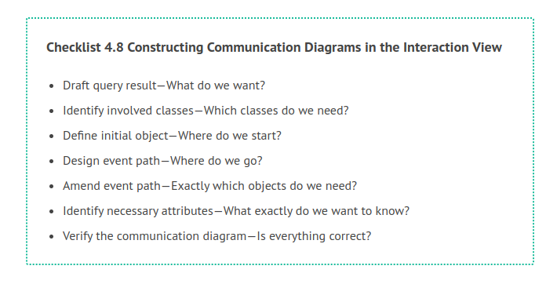
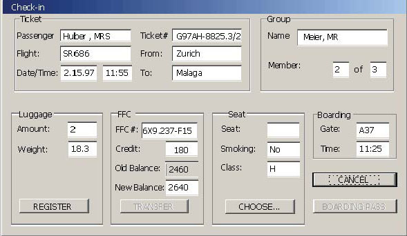
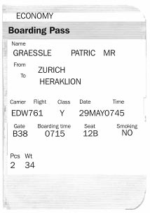
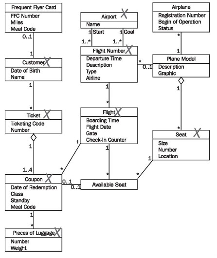
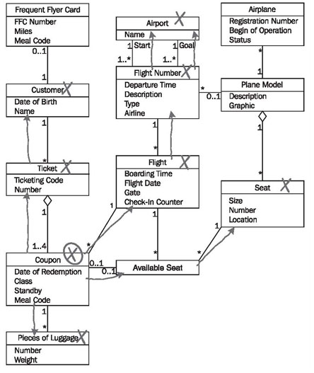
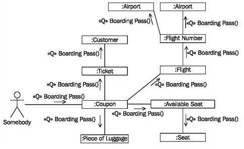
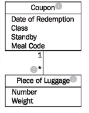
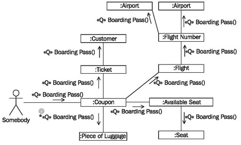
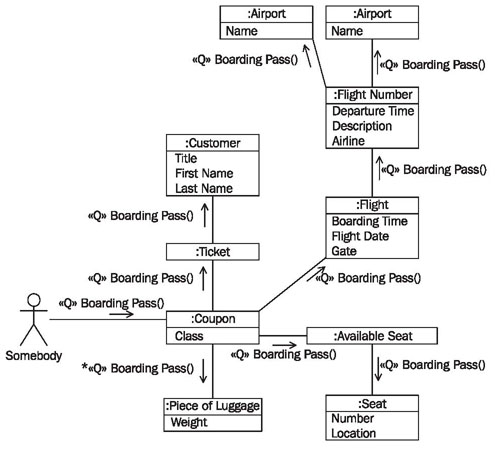
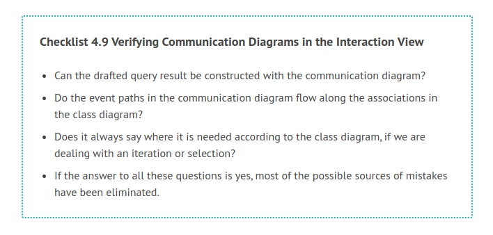

# Constructing Communication Diagrams

The following checklist shows the necessary steps for constructing a communication diagram per query event from the use cases. Subsequently, we will explain the individual steps further.

## Draft Query Result—What do We Want?

The starting point for modeling a query event is the expected result. Generally, the desired result is a display on the monitor or a printed document, for instance, a list or a receipt. Figure 4.66 shows a window from the prototype of an IT system, and Figure 4.67 a section of a boarding pass.

For each query event to be documented in a communication diagram we need to know what the result is supposed to look like. The following questions have to be asked:

 * How (exactly) is the result of a query supposed to look??
 * Which elements should the results contain; which of them are fixed texts and which of them are data elements?
 

 
	Figure 4.66: Interface prototype from the passenger check-in system
	
We recommend that you sketch the result. For each element of the sketch you should indicate whether we are dealing with information from the IT system or a fixed element, for example, a picture or field labels. In a screen form, field labels normally do not come from information in the IT system. However, if the IT system supports several languages, it is possible that the field labels are taken from information in the IT system. Another example is the boarding pass, for which a pre-printed form is used, meaning that the field labels already exist. The pass merely has to be completed with information read form the IT system. In Figure 4.67, the fields of the boarding pass that receive information from the IT system are circled.

The boarding pass from our case study contains the following data elements:

ECONOMY, GRAESSLE, PATRIC, MR,ZURICH, HERAKLION, EDW761, Y, 29MAY0745, B38, 0715, NO, 2, and 34.

The goal of the modeling of the communication diagram is to show how the values listed can be derived from the class diagram.

	Figure 4.67 Part of a boarding pass
	
## Identify Involved Classes—Which Classes Do We Need?

From the sketched result, we can determine the necessary classes from the class diagram.

	Figure 4.68 Marked (simplified) class diagram

The questions are:

 * From which classes is information supposed to be read? We need to determine from which attributes and classes each information element in the sketched result is calculated.

 * Which classes are needed for the access path? Classes are either needed on the basis of their attributes, which are necessary to generate query results, or on the basis of their relationships to other classes.

 * Which classes are missing in the class diagram? Depending on the level of completion of the class diagram, it could happen that new, additional classes have to be modeled.

In a first draft, the needed classes can simply be marked by hand on a printout of the class diagram. In Figure 4.68, the classes needed to generate the boarding pass from Figure 4.67 are marked.

## Define Initial Object—Where Do We Start?

The query begins with the initial object. The initial object can be a class (in its function as a set) or a particular object of a class. If a certain object is addressed directly, for instance, a certain customer object, or a certain ticket object, this object has to be known before the query event is sent. If a class is addressed, parameters can be attached to the query as selection parameters, so that a particular object can be chosen. All further needed classes have to be accessible from the initial object through connections. The concrete questions are:

 * Which is the first object the event is supposed to go to??
 * Which object do I know already?
 * Where do I start collecting information?

To generate a boarding pass in our case study, we begin with the coupon of the plane ticket for which we want to generate the boarding pass.

## Design Event Path—Where Do We Go?

Starting from the initial object, we determine a path through which the needed objects can be reached. The question is:

Through which path can I reach all needed objects in the class diagram??

For a first draft, this path can, in turn, be marked by hand on the printout of the class diagram. Figure 4.69 shows the completely marked class diagram for the query event generating a boarding pass:

	Figure 4.69 (Simplified) Class diagram with event path

In many cases, it is sufficient to mark the event path by hand in the class diagram. With that, you have documented that the query, in our case generating a boarding pass, is possible with the class diagram. In this case, it can be done without modeling a communication diagram. However, for complex or important queries, we recommend that you generate a communication diagram for the query, on the basis of this marked class diagram. All marked classes are transferred to this, and the query event is inserted along the event path. Figure 4.70 shows the result of this work step:

	Figure 4.70 First draft of the communication diagram

## Amend Event Path—Exactly Which Objects do We Need?

The event path has to be filled out with selections and iterations. Selections and iterations are used if along a path several objects of one class can be reached from another class, meaning, when the multiplicity of an association in the class diagram has an upper limit larger than 1 (usually *). In such cases we need to state whether all objects should be iterated, or individual objects should be selected on the basis of certain criteria. The question is:

If I encounter more than one object along my path, do I then need all of them (iteration), or do a need a particular one (selection)??

	Figure 4.71 Selection or iteration?
	
In our case study, in Figure 4.71 we might encounter several (2) pieces of luggage (3) along the event path originating at coupon (1). We need all pieces of luggage for the boarding pass, because we want to print the number and total weight on the pass. Therefore, we have to iterate.

This is documented in the communication diagram in Figure 4.72 by the inconspicuous asterisk in from of the event name (4):

	Figure 4.72 Communication diagram with iteration
	
## Identify Necessary Attributes—What Exactly Do We Want to Know?

In the last step, we document the attributes that are needed to answer the query. The questions are:

 * Which attributes are needed for the query result?
 * Which attributes are missing in the class diagram?
 
Finally, all data elements from the drafted query result must be able to be traced back to the attributes in the class diagram of the static view. In the simplest case, this can be done, again, by marking attributes on a printout of the class diagram. When the communication diagram has been modeled, attributes can be inserted (Figure 4.73):

	Figure 4.73 Communication diagram with attributes
	
## Verify the Communication Diagram—Is Everything Correct?

The completed communication diagram can be verified with the following checklist:

