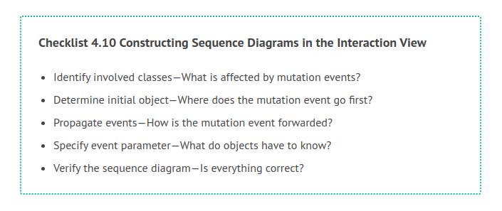
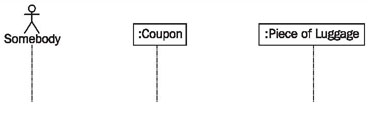
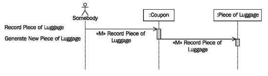
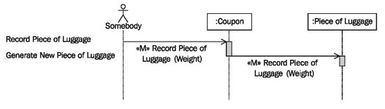
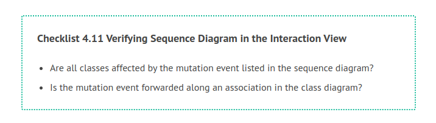

# Constructing Sequence Diagrams

The following checklist shows the necessary steps for constructing a sequence diagram per mutation event from the use cases. Subsequently, we will explain the individual steps further:

## Identify Involved Classes—What is Affected by Mutation Events?

The classes that a mutation event affects have to be identified. This occurs on the basis of statechart diagrams (see <b>The Behavioral View</b>). The questions are:

 * Which classes are already affected by a certain mutation event? To answer this question you will have to look up which statechart diagrams contain the mutation event. If the mutation event is present in a statechart diagram of a class, this class is affected by the mutation event, meaning that the mutation event has to be sent to this class.

 * Which other classes are affected by the mutation diagram? It could be that there are classes that are affected by the mutation event, but which are not yet present in statechart diagrams.
 
The first question can easily be answered. Most CASE tools can generate, for instance, a list of classes already affected. In order to find further affected classes, look at the class diagram and think whether anything has to happen with the objects of each class when the mutation event occurs. At the least, you should take another look at those classes that are located close to some of the classes already affected on the class diagram. Of course, if additional classes are found, their statechart diagrams have to be updated by inserting the mutation event. In our case study, the mutation event «M» record piece of luggage affects the classes coupon and piece of luggage, as shown in Figure 4.74:

	Figure 4.74 Affected classes in the sequence diagram
	
## Determine Initial Object—Where does the Mutation Event go First?

A mutation starts with the initial object. The initial object can be a class (in its function as a set) or a particular object of a class. If a certain object is directly addressed, for example, a certain flight object or a certain ticket object, this object has to be known before the mutation event is sent. If a class is addressed, parameters can be attached to the mutation event as selection parameters, so that a particular object can be chosen. All further needed classes have to be accessible from the initial object through connections. The concrete questions are:

 * Which is the first object the event should go to??
 * Which object do I know already?
 * Where do I start collecting information?
 
In our case study, during the mutation event «M» record piece of luggage, the coupon object is already known, since the entire check-in occurs for on a particular coupon. The new piece of luggage object that is to be recorded does not yet exist. Therefore, the initial object is the coupon object.

## Propagate Events—How is the Mutation Event Forwarded?

Starting from the initial object, a sequence is determined, in which the affected objects receive the mutation event. The question is:

In which order do I reach all affected objects in the class diagram?

Mutation events are forwarded along the relationships in the class diagram to all classes that are affected by the mutation event. In the class diagram of the case study an association exists from the coupon to a piece of luggage, along which a mutation event can be sent, as illustrated in Figure 4.75:

	Figure 4.75 Events in a sequence diagram
	
## Specify Event Parameter—What do Objects have to Know?

The information required to process the mutation event is forwarded as parameters of the event. The question is:

Which information do the objects need in order to process the mutation?

In order to generate a new piece of luggage object in our case study, we need its weight. Therefore, weight will be forwarded as an event parameter, as shown in Figure 4.76:

	Figure 4.76 Event parameter in a sequence diagram
	
## Verify the Sequence Diagram—Is Everything Correct?

The completed sequence diagram can be verified with the following checklist:

If the answer to both these questions is yes, the largest sources of mistakes have been eliminated.
