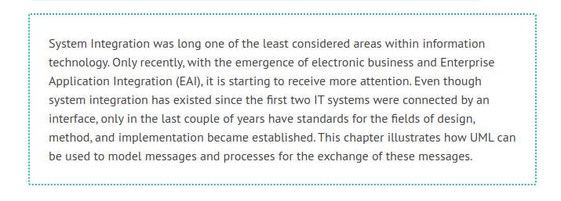

# Modeling for System Integration

We understand system integration to be the embedding of existing and new IT systems into an existing IT environment. Embedding can take place in-house, where we generate interfaces to other IT systems within the organization. Embedding can also span several organizations, where we connect the IT systems of different organizations. Whether the IT systems that need to be integrated in existing infrastructure and processes are within the organization (in-house) or external plays a minor role from a modeling perspective.

Integration of an IT system requires knowledge about the environment of the IT system and its borders. Since an IT system that needs to be integrated has to be embedded into a business environment, the surrounding business processes have to be known. The basis for this is the business system model, which we constructed and described in Modeling Business Systems. In order for an IT system to cooperate efficiently with other IT systems, interfaces have to be generated—to in-house IT systems, as well as to the IT systems of other organizations.

In this chapter, we will discuss how to model the messages that are exchanged between the various IT systems, and the processes that are necessary to exchange these messages.

# Terminology of System Integration

## Interfaces

Communication between IT systems occurs through interfaces. Therefore, an interface is the basic element of system integration. Through an interface, an IT system (the sender) sends information to another IT system (the receiver). A particular IT system can be both a sender and a receiver.

## Messages

IT systems that are connected via interfaces exchange messages. A message is sent by the sender IT system, with the expectation that receiving the message—immediately or later—initiates an activity in the receiver IT system. For the receiver IT system, each message received constitutes an event to which it responds.

For instance, if an invoice is sent in an electronic format, this event is an invoice receipt for the receiver of the invoice. After the receipt of the invoice, the receiver has a certain time frame to pay the bill. The receiver IT system has to confirm the receipt of the invoice and possibly activate another IT system, for example, an accounting system that records the balance.

Messages can be loaded with additional information that is necessary to process the activities of the receiver system. Generally, this information is structured data with defined semantics, such as invoice data or a passenger list. In UN/EDIFACT, for instance, this information is called reference data.

Furthermore, messages have assigned control and routing information, for example, sender address, receiver address, meta-information about the content of the message, or checksums. We can also describe this information as the ‘packaging’ of a message.

There are various alternatives to transform these three components: event, information, and control and reference data, into a message that can be exchanged between IT systems. Control information can, for instance, be ‘hidden’ in interface programs, or can be sent as additional data. An event can be a program call, or it can be transferred in a file that contains further message data.

In UN/EDIFACT messages, which are also referred to as business documents, all three components are contained in one single transfer unit (mainly data): event (message type), information (reference data), and control information (service segments).

Messages that are sent in XML format are also called documents in XML. They contain at least reference data and meta-information. A great advantage of XML compared to UN/EDIFACT is that each XML message carries with it a reference to its structural description. This has the advantage that everyone can read the XML message.

## Enterprise Application Integration

Enterprise Application Integration (EAI) incorporates methods, concepts, and tools for the classification, connection, and coordination of applications within organizations. The goal is integrated business processing by a network of in-house applications of different generations and architectures. This network constantly changes through upgrades or the adding of new applications, through modified technology and other influences.

One of the prerequisites for reaching this goal is the documentation of business processes, of the application network, of the individual applications, and their interfaces, which should be as unified in form and display as possible.

UML is almost perfect for this task. (OMG has created a profile UML Profile for Enterprise Activation Integration for this, which explains the technical implementation (conversion etc.) on the basis of UML.)

## Electronic Data Interchange

The term Electronic Data Interchange (EDI) is a synonym for the standardized exchange of business documents (order, delivery, invoice, shipping information, etc.) between the IT systems of organizations and institutions, such as suppliers or the customs authority. Business documents are also referred to as messages.

The generic term EDI today includes older standards such as Society for Worldwide Interbank Financial Telecommunication (SWIFT), UN/EDIFACT, and ANSI X12. With the development of the Internet, the new standard XML was created. Inter-company data exchange, however, is only one aspect of XML; the functionality of XML goes well beyond this. Because of this, XML does not clearly fall under the generic term EDI.

## UN/EDIFACT

United Nations Electronic Data Interchange for Administration, Commerce, and Transport (UN/EDIFACT) is an international standard for electronic data exchange in administration, economics, and transportation, which includes rules and message types. Within the framework of United Nations/Economic Commission for Europe (UN/ECE), the UNO aimed at supporting global commerce with electronic tools. In several places throughout this chapter, we will refer to UN/EDIFACT. There are several reasons for this:

UN/EDIFACT provides the option to depict complex hierarchical message structures. It also contains all three components of a message in one transfer unit: event, reference data, and control information. This makes UN/EDIFACT, conceptually, one of the most sophisticated standards in today’s world.
The UN/EDIFACT standard is available on the Internet and can be used free of charge. (All specifications, regulations, and message types for the UN/EDIFACT standard can be downloaded from <b>http://www.unece.org/trade/untdid/welcome.htm</b>.)

## XML

The functionality of eXtensible Markup Language (XML) largely exceeds the field of EDI. EDI is only one of many areas of application of XML and is referred to as XML/EDI. XML can be used within as well as between organizations.

The XML standard is standardized and published by World Wide Web Consortium (the <b>W3C</b>). XML includes many other standards, such as eXtensible Stylesheet Language (XSL) for the representation of data or Xlink for standardized links. (The XSL family is a collection of recommendations on how XML documents should be transformed and formatted, consisting of three parts: XSLT, Xpath, and XSL-FO: see <b>http://www.w3c.org/style/XSL?</b>. With the eXML Linking Language contents from various documents can be linked to each other. This will be an essential part of future system integration tools.) XML evolved much quicker than UN/EDIFACT did, and the use of XML as format for data exchange became accepted in a ‘bottom-up’ manner; the call for standards came much later.
