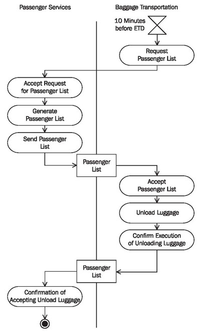
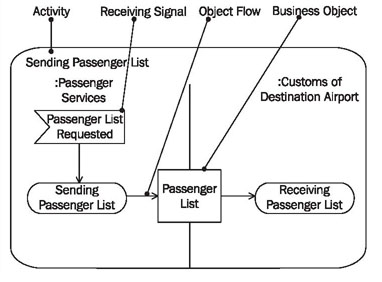
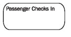
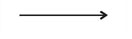
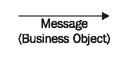
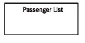
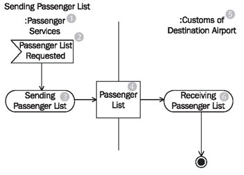

# Activity Diagrams

We explained the basic elements of activity diagrams in <b>Activity Diagrams</b>. Therefore, here we will only go into the special interpretations and supplemental uses of activity diagrams for system integration.

From the activity diagram in Figure 5.5, we can already extract some initial information for the integration of IT systems for the process no boarding. For example, we can learn which business objects are exchanged, etc.

	Figure 5.5 Activity diagram “No Boarding”
	

	Figure 5.6 Elements of the activity diagram
	
## Activity

In activity diagrams one single activity is depicted as shown in Figure 5.6. In our context, an activity represents a business process. Actions, control elements (decision, branching, merge, start, end, etc.), and objects are essential parts of an activity.

These elements are connected to each other with so-called edges. The connected actions and control elements make up the control flow, which can also be called the flow:

The object flow represents the path of objects that move through the activity. The object flow can also be omitted when constructing activity diagrams. Carrying out an activity can include several parallel flows.

## Object Flow (Edge)

Edges, which are depicted as arrows, connect the individual components of the activity diagram and represent the control flow and object flow (edge) of the activity. The control flow determines the flow within an activity. The incoming arrow starts an individual step of an activity. After this step is completed the flow continues along the outgoing arrow. The object flow describes the flow of objects and data within activities. Edges can be labeled with a name (close to the arrow):

The object flow in an activity diagram shows the path of one or more business objects between the various activities.

## Acceptinga Signal (Action)

The sending of signals means that a signal is sent to a receiving activity:

The receiving activity accepts the signal with the action accepting a signal and can respond accordingly, meaning, according to the flow that comes from this node in the activity diagram.

## Business Object

A business object consists of structured data that is exchanged between actions (see <b>Messages in UML</b>). Generally, the business object that is the output of one action is simultaneously the input of another action:

A business object that leaves its original activity partition is sent from one IT system to another IT system.

## Reading Activity Diagrams

	Figure 5.7 Activity diagram

Activity diagrams show the interaction between the various IT systems that are involved in the message exchange. Figure 5.7 shows that the IT system of passenger services (1) initiates the action sending passenger list (3) through the event passenger list requested (2), and that the business object passenger list (4) is sent to the IT system of customs at destination airport (5). The IT system of customs at the destination airport accepts the passenger list (4) with the action receiving passenger list (6).

In this diagram, we cannot see that the business object passenger list is sent as the argument of a message. In order to see this, we need to use a sequence diagram.

