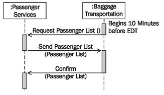
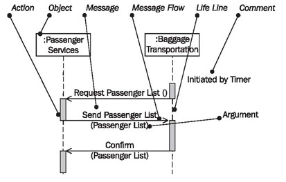
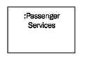
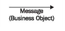
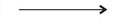
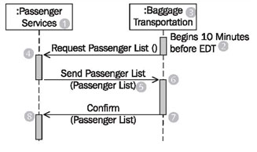

# Sequence Diagram

The focus of sequence diagrams lies in the illustration of the chronological sequence of message exchange between objects as shown in Figure 5.8. The system integration model illustrates the message exchange between IT systems:

	Figure 5.8 Sequence diagram “No Boarding”
	
	

	Figure 5.9 Elements of the sequence diagram

In sequence diagrams as shown in Figure 5.9 we work with the following elements:

## Object

Objects exchange messages with each other. In the system integration model, these objects represent the interacting IT systems:

## Message

In sequence diagrams, messages are understood as operations of events. Information is transferred as arguments:

Arguments can be business objects (see <b>Messages in UML</b>).

## Message Flow

The message flow goes from the sender of the message to the receiver. In the system integration model, the message flow of the sequence diagram corresponds to the object flow of the activity diagram:

However, the sequence diagram adds the chronological aspect.

## Argument

See Message above.

## Reading Sequence Diagrams

	Figure 5.10 Sequence diagram
	
Figure 5.10 shows that as soon as the prerequisite (2) is fulfilled, baggage transportation requests a passenger list from passenger services (1). Passenger services accepts (4) the request, generates the passenger list, and sends the passenger list back to baggage transportation (6).

On the basis of the passenger list (5), which is received (6) by baggage transportation (3), the affected pieces of luggage are unloaded. Once the luggage has been unloaded, baggage transportation sends an appropriate confirmation to passenger services, by sending a list of passengers whose luggage has been unloaded (7).

Finally, passenger services confirm (8) that the luggage has been unloaded. In the sequence diagram, we cannot see what actions are actually performed so that messages can be exchanged. This information is contained in the activity diagram (see Figure 5.11).

The individual actions can also be inserted into the sequence diagram as comments; however, this carries the risk of decreasing the readability of the sequence diagram. Unlike activity diagrams, sequence diagrams enable us to see that the business object passenger list is sent as the argument of a message.

