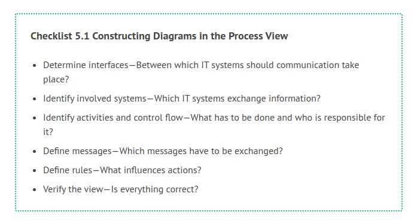
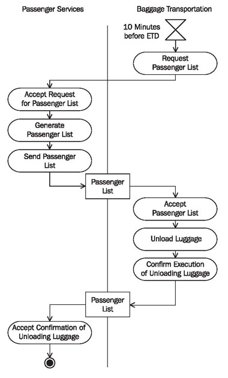
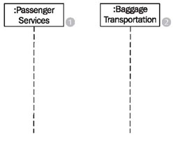
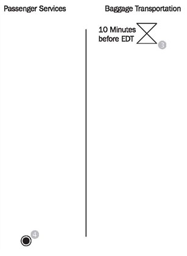
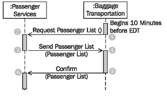
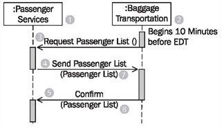
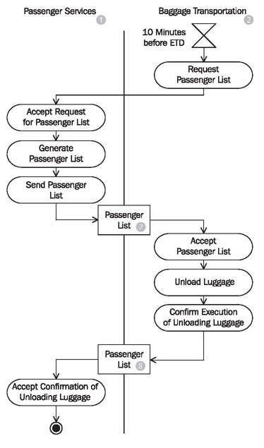
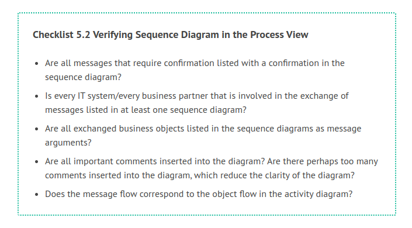
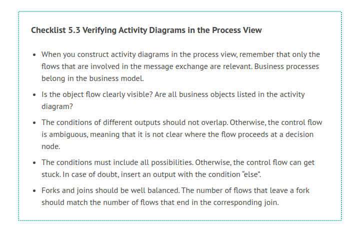

# Constructing Diagrams in the Process View

To construct diagrams in the process view, we chose the interface to baggage transportation from our case study.

The following checklist shows the necessary steps from constructing activity diagrams and sequence diagrams in the process view:

## Determine Interfaces—Between Which IT Systems Should Communication Take Place?

To carry out the activity no boarding (Figure 5.11) those business processes or business use cases that require an interaction with the IT system of passenger services in order to be processed are chosen from the <b>business system model</b>. In our case study, this applies to the use case request passenger list, which has an interface each to baggage transportation and customs at the destination airport. To illustrate the following steps, we will look at the interface to baggage transportation (see Figure 5.3).

We select the actions from the activity no boarding that are connected to the exchange of messages:

	Figure 5.11 Activity “No Boarding”
	
On the basis of Figure 5.11, we identify the following actions:

 * Request passenger list
 * Accept request for passenger list
 * Generate passenger list
 * Send passenger list
 * Accept passenger list
 * Confirm execution of unloading luggage
 * Accept confirmation of unloading luggage

From the sequence diagram of the business model in Figure 5.8, we can see that the following two messages are exchanged:

 * Send passenger list (passenger list)
 * Confirm (passenger list)

## Identify Involved Systems—Which IT Systems Exchange Information?

In order for messages to be sent and received, it has to be known which IT systems are involved and what roles they play:

Which IT systems are needed for the execution of business processes? Certainly, our passenger services IT system (1) is involved. The IT systems outside the business system can be derived from the actors of the use case diagram of the business model. This is how we found the IT system of the actor baggage transportation (2) in our case study, as shown in Figure 5.12:

	Figure 5.12 Constructing sequence diagram
	
 * Which IT system initiates the process? The process initiator is baggage transportation (2). Independently from the boarding of passenger services, a timer within baggage transportation (set to 10 minutes before EDT), requests a passenger list of passengers who have not yet boarded, so that the unloading of luggage can take place.
 
 * Which IT system is at the end of the process? In our case study, the activity no boarding is completed when passenger services (1) receive a message from baggage transportation that all luggage from passengers who are not yet on board has been unloaded from the plane.

With this information we can start constructing the activity diagram (Figure 5.13):

	Figure 5.13 Constructing activity diagram
	
## Identify Activities and Control Flow—What has to be Done and Who is Responsible for It?

The following questions will help identify actions and the control flow:

 * What needs to be done so that the IT system can exchange messages?
 * In which order are activities processed?
 * Are there actions that occur simultaneously?
 * Which conditions have to be met for the execution of actions?
 * Do all prior actions have to be completed before the next one can be completed?
 * Who is responsible for processing the actions? In which partition do the actions belong?

<b>The action ...					...is processed by actor...</b>
Request passenger list (1)			Baggage transportation
Accept request for passenger list (2)		Passenger services
Send passenger list (3)				Passenger services
Accept passenger list (4)			Baggage transportation
Confirm execution of unloading luggage (5)	Baggage transportation
Accept confirmation of unloading luggage (6)	Passenger services

This information is documented in the sequence diagram in Figure 5.14 and in the activity diagram in Figure 5.15:

	Figure 5.14 Constructing sequence diagram
	

	
	Figure 5.15 Constructing activity diagram

## Define Messages—Which Messages have to be Exchanged?

We can see in the business system model that two messages are exchanged:

 * Send passenger list (passenger list)
 * Confirm (passenger list)
 
In the first message send passenger list in Figure 5.16, a passenger list (7) is sent to the IT system of baggage transportation (2), which lists all passengers who have checked in, but have not yet boarded the airplane.

Once the affected pieces of luggage have been unloaded, passenger services (1) receive a confirmation (5). With the confirmation, the passenger list (8) is sent back to passenger services (1).

Both messages receive the passenger list (7) (8) as argument. In our case, the passenger list was forwarded from passenger services (1) to baggage transportation (2), modified there, and sent back to passenger services (1).

At the end, the passenger list is not exactly the same as it was at the beginning of the activity. However, the structure of the business object, Passenger List, remains the same:

	
	
	Figure 5.16 Constructing sequence diagram
	
You can see in Figure 5.17 that the object flow, which runs just like the control flow, hides the control flow:

	Figure 5.17 Constructing activity diagram
	
## Define Rules—What Influences Actions?

Generally, contracts exist for inter-organization message exchange, which record agreements about responsibilities, regulations, etc. International treaties and statutes further influence this kind of message exchange. On the technical as well as statutory level, standards committees regulate rules about data exchange. (As an example, we recommend the relevant specification <b>Collaboration-Protocol Profile and Agreement Specification Version 2.0</b> by ebXML.)

As another example, we want to mention International Air Transport Association (IATA), which among other things defines messages and their uses for the entire aerospace industry. Such agreements are also becoming more frequent within organizations. The question is:

Which agreements, contracts, and statutes have to be taken into consideration for the definition of data exchange?

## Verify the View—Is Everything Correct?

Completed sequence diagrams and activity diagrams can be verified with the following checklist

