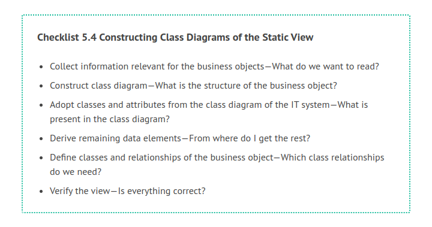
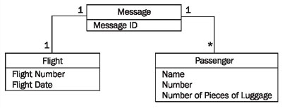
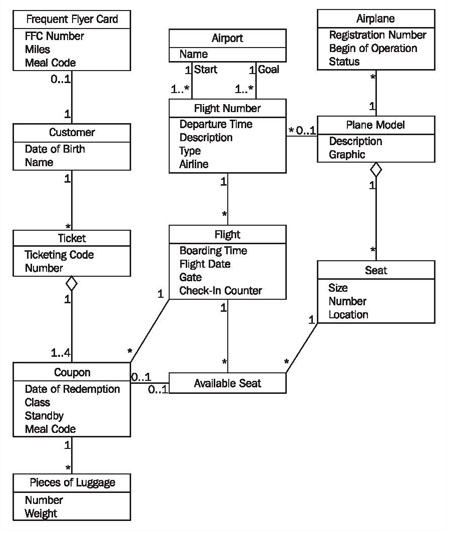
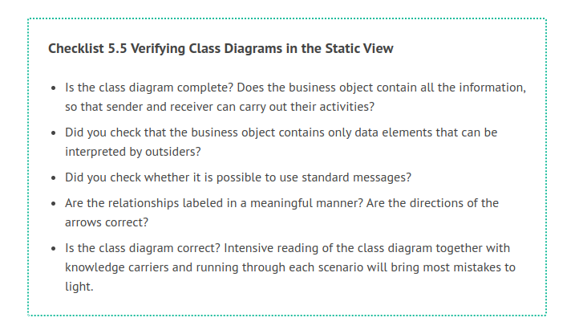

# Constructing Class Diagrams

The following checklist shows the necessary steps for constructing class diagrams of business objects. Subsequently, we will explain the individual steps further.

## Collect Information Relevant for the Business Objects—What Do We Want to Read?

In the top-down approach, business processes are the foundation for the modeling of business objects. On the basis of these business processes, we define the information that has to be exchanged in order for a business process to be executed. From this, we derive the structure and content of the business objects. The advantage of this approach is that IT system specifics do not contaminate modeling results. The modeled business objects become independent of the IT system, and therefore, reusable. However, linking them to the IT system often requires more effort.

The top-down approach creates business objects that can be used by many different types of IT systems. The standardized EDI messages of inter-enterprise data exchange are modeled according to this approach.

If an existing IT system serves as the foundation for modeling business objects, content can be derived from the classes of the IT system. It is not always possible to derive all information from the underlying IT system. Values that are important for a business object are not necessarily relevant for the underlying IT system. An example for this is the number of pieces of luggage that a passenger checks in: in the business object this information is attached as a control element, but in the IT system this information is meaningless. The class diagram of the IT system depicts the information from another perspective than the one we need for the class diagram of the business object. In turn, internal identification characteristics that serve the identification of objects within IT systems are out of place in a system-spanning business object.

Where a standard is mandatory for a business object, we use standard messages from the appropriate catalogue. (On this topic, also see <b>UN/ECE, ebXML</b> and many other industry-specific suppliers of messages.) Even when standard messages do not have to be used, taking a look at these catalogues can be worth it. The content of standard messages can make suggestions for the content of the business objects that you need to design.

The following question should be asked when designing business objects:

What is the minimum information that the receiving IT system needs in order to perform its work?
Applied to the case study the question is:

What is the minimum information that baggage transportation needs on the passenger list, in order to unload the luggage of passengers who did not board the airplane?

We can obtain this information by interviewing knowledge carriers from baggage transportation:

 * The flight number, date, and time of scheduled departure, so that the correct plane will be unloaded
 * The numbers of labels that are attached to the pieces of luggage of passengers who did not board the airplane
 
## Construct Class Diagram—What is the Structure of the Business Object?

	Figure 5.20 Class diagram message “Passenger List”

Figure 5.20 shows the class model for the message passenger list. With this model we can deliver the data that baggage transportation needs. This model serves as the goal model for the transformation of data from the IT system.

## Adopt Classes and Attributes from the Class Diagram of the IT System—What is Present in the Class Diagram?

Since the business object has to be created by the sender IT system, we first examine the class diagram of the IT system as source. The question is:

Which data elements of the business object can be created from the class diagram of the IT system?

In the case study, the answer looks like this (in order to make the attribution to classes of the IT system visible, we chose the notation classname.attribute):

 * Flight number: flightnumber.description
 * Date and time of scheduled flight: flight.flightdate
 * Number of passenger: ticket.number
 * Name of passenger: customer.name
 
## Derive Remaining Data Elements—From Where Do I Get the Rest?

For all the data elements of the business object that cannot be generated directly from the class diagram of the IT system, we have to find another solution. The question is:

How can we derive the data elements that we cannot generate directly from the class diagram?
In the case study, the following data elements cannot be derived from the IT system:

 * Clear identification of the business object: There are several possibilities. For example, we can use serial numbers or semantically comprehensible keys that are unambiguous (flight number with date and time). In our example, two options can be used:

 * Flight number with date and time of the scheduled departure: This data is available in the IT system.

 * Unique serial number: A unique serial number is usually generated during the creation of the business object and is not part of the class diagram of the IT system.

 * Passenger’s number of pieces of luggage: Information about the number of pieces of luggage that a passenger checked in is not available in the class diagram of the IT system. By counting the number of objects in the class piece of luggage of a certain passenger, the number of pieces of luggage can be determined. This information is important for the business object, because in the case no boarding it provides the opportunity to check in a simple manner whether all pieces of luggage have been unloaded.

 * Sender/Receiver: Especially for the exchange of data between business partners it is necessary to attach additional pieces of information to the message, in order to identify it later. Generally, these are sender and receiver identification, message ID (see above), time that the message was sent, etc. In the passenger list PAXLST, for instance, a person who is responsible for the message’s content has to be named.
 
## Define Classes and Relationships of the Business Object—Which Class Relationships do We Need?

In the class diagram of the business object, relationships among classes have to be defined. The questions are:

 * How can we derive classes and relationships from the business model? The class diagram of the business model contains business objects. In our case study, passenger list is part of the class diagram of the business system passenger services. From the description of the business object in the business model, we can derive classes, attributes, and relationships for modeling the business object as part of the message. In addition to the classes that contain necessary data, we often also use classes that enable the connection between the needed classes within the IT system. In our example, Figure 5.20, we also have to consider the classes coupon and ticket, otherwise, we cannot accomplish a connection between flight and passengers.

 * How can we derive data and relationships from other standard messages? We can adopt data elements or data element groups from existing standard messages that have identical or similar content. UN/EDIFACT, for instance, provides us with so-called standard segments (data element groupings) that contain information such as name and address or receiver information. Even if the UN/EDIFACT standard is not applied, we can use classes, relationships, and attributes from these segments and data elements as a blueprint for the business object.

 * How can we transform classes from the IT system into the business object? As we mentioned above, the classes of a business object can be derived in part or even completely from the classes of the IT system. Since the requirements on the classes of the IT system are different from the requirements on the classes of the business object, a transformation of classes and attributes from the IT system into the business object becomes necessary.
 
Figure 5.21 shows the class diagram of the passenger services IT system. As examples for the transformation steps, we will transform the data concerning flight and passengers on the basis of this class diagram, or rather show how they should be transformed. However, we have left the necessary activities for the transformation of the various types and formats of data completely unconsidered in this example. You can find more information to this topic in <b>UML Profile for Enterprise Application Integration</b>.

	Figure 5.21 Class diagram of the IT system “Passenger Services”
	
## Verify the View—Is Everything Correct?

The completed class diagram can be verified with the following checklist:

