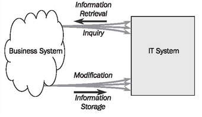

# Information Systems and IT Systems

In almost all occupations, part of the job is dealing with information. It has been this way for thousands of years and is one of the reasons behind the development of writing. Some of the oldest texts found in Europe include, for instance, stock lists from the palace of Knossos in Crete. If we were able to watch the stock managers work as they did 3,500 years ago, we could probably map the business processes that people followed back then. We could see that these people were dealing with suppliers and buyers, that they were exchanging goods, and that they kept written records of their business activities. The same was true for a Roman olive merchant 1,500 years later, for a Hanseatic merchant’s trading office in fifteenth century Northern Germany, or at Lloyd’s of London at the beginning of the last century.

In the above examples, more or less complex information systems were used to handle daily tasks. The purpose of these information systems was, and is, to manage the information needed to operate a business. Of course, all of this took place without computers. Information systems were supported by other techniques such as chalkboards, large filing systems, and index cards. Today, computers allow us to implement information systems as IT systems. This creates new possibilities that would probably be unthinkable for the Roman olive merchant. But basically, the point is still to provide and to process data that is needed for dealing with everyday business processes. We will generally be talking about IT systems in this book, since we assume that information systems modeled with UML are implemented by IT technology.

In our case study—passenger services at UML Airport—employees at the check-in deal with passengers, plane tickets, and flights that are real. On the other hand, there is a representation or image of these passengers, plane tickets, and flights in the information system. These images consist of information about the passengers, tickets, and flights stored in the information system, needed for operating processes, as shown in Figure 2.7:

	Figure 2.7 Objects from the real world and their images

An IT system is a computer-based system—a system that provides information needed for the execution of certain business processes, generally in response to a query by a user. Of course the IT system has to be ‘fed’ with information, so that it can answer queries.

Figure 2.8 shows the cooperation between business systems and IT systems schematically. Within the framework of the business processes of a business system, information is retrieved from and stored in IT systems:

	Figure 2.8 IT System
	
The modeling techniques introduced in this book not only hold true for the development of IT systems, but they can also be used whenever an information system needs to be analyzed. To illustrate this, we invented a second example—in addition to our case study on passenger services at UML Airport—which we will come back to in different places of this book.

The second example is a medieval Hanseatic merchant’s trading office owned by a Mr. Hafenstein. (The Hanseatic League was a powerful alliance of merchant guilds in cities of Northern Germany and the Baltic that controlled trade in this region during the middle ages.) The supervisor of the office is the faithful and diligent secretary Hildebrandt. The office keeps several books, namely a daybook, a sales ledger, and a customer index. Each book is the responsibility of a different clerk. Nobody besides the clerk responsible is allowed to make any changes in a book, and only he knows exactly where in the book a particular piece of information is recorded.

In our terminology, the office, including Hildebrandt, the clerks, and the books, make up the information system. With the help of this example we want to show in different places in this book that, even though an information system can be implemented as an IT system with the help of computer technology, conceptually it has nothing to do with computers. Instead, it can be realized in many ways.
