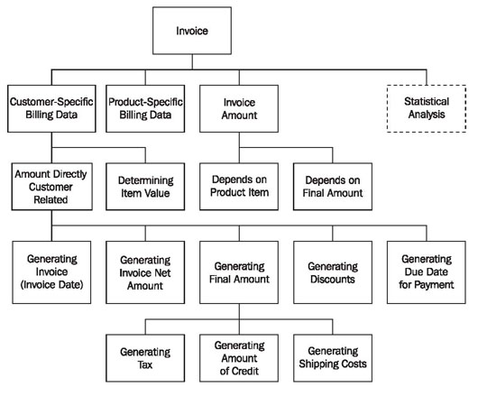

# Foreword
In its short history, information technology has already produced a plethora of methods and notations. We have methods and notations for design, structure, processing, and storage of information. We also have methods for the planning, modeling, implementation, assembly, testing, documentation, adjustment, etc. of systems. Some of the concepts used are relatively fundamental, and because of that, they can also be found beyond the field of information technology. One example of that is inheritance, which is present in nature, but is also a cornerstone of object-oriented programming.

Until about the 1970s, software developers viewed the development of software as an artistic venture. But because systems became more and more complex, software development and maintenance could no longer be conquered with this creative-individual approach. Eventually, this approach led to the software crisis.

This crisis leads to the engineering approach (software engineering) and structured programming. Methods were developed for the structuring of systems and for the processes of design, development, and maintenance. Process-oriented approaches, for example the Hierarchy Input Processing Output (HIPO) method, emphasized the functionality of systems. With this method the total system is divided into smaller components through functional decomposition.

Figure 2.10 gives a visual overview (hierarchical diagram) of the sub-functions in the invoice example. An input-process-output schema describes every functional element.

At the same time, data-structure oriented approaches were developed, such as the Jackson method, in which the program structure is derived from the graphical display of data structures.

Figure 2.11 shows, in the left-hand column, the structure of an inventory data set. The right-hand column shows the program structure that was derived from the data structure:

	
	Figure 2.10 HIPO diagram
	

	Figure 2.11 Jackson diagram
	
In all these methods and notations, we split the system into two portions—a data section and a procedure section. This is clearly recognizable in older programming languages such as COBOL. Data flow-charts, structure charts, HIPO diagrams, and Jackson diagrams are used to illustrate the range of functions. Naturally, these early methods emphasized the development of new systems.

In the 1980s, classical structural analysis was developed further. Developers generated entity relationship diagrams for data modeling and Petri nets for process modeling.

As systems became more complex, no longer could every system be designed “from scratch”. Properties, such as maintainability and re-usability, became more and more important. Object-oriented programming languages were developed, and with them, the first object-oriented modeling languages emerged in the 1970s and 1980s. In the 1990s, the first publications on object-oriented analysis and object-oriented design became available to the public. In the mid-1990s, already more than 50 object-oriented methods existed, as well as just as many design formats. A unified modeling language seemed indispensable.

At the beginning of the 1990s, the object-oriented methods of Grady Booch and James Rumbaugh were widely used. In October 1994, the Rational Software Corporation (part of IBM since February 2003) began the creation of a unified modeling language. First, they agreed upon a standardization of notation (language), since this seemed less elaborate than the standardization of methods. In doing so, they integrated the Booch Method of Grady Booch, the Object Modeling Technique (OMT) by James Rumbaugh, and Object-Oriented Software Engineering (OOSE), by Ivar Jacobsen, with elements of other methods and published this new notation under the name UML, version 0.9. The goal was not to formulate a completely new notation, but to adapt, to expand, and to simplify the existing and accepted types of diagrams of several object-oriented methods, such as class diagrams, Jacobson’s Use Case Diagrams, or Harel’s Statechart Diagrams. The means of representation that were used in structured methods were applied to UML. Thus, UML’s activity diagrams are, for example, influenced by the make-up of data flow charts and Petri nets.

What is outstanding and new in UML is not its content, but its standardization to a single unified language with formally defined meaning.

Well-known companies, such as IBM, Oracle, Microsoft, Digital, Hewlett-Packard, and Unisys were included in the further development of UML. In 1997, UML version 1.1 was submitted to and approved by the OMG. UML version 1.2, with editorial adaptations, was released in 1998, followed by version 1.3 a year later, and UML 1.5 in March, 2003. Developers had already been working on version 2.0 of UML since the year 2000, and it was approved as a Final Adopted Specification by OMG in June, 2003.

