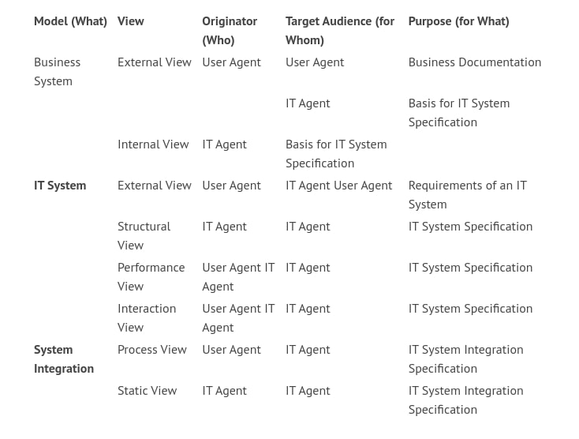

# Requirement Specification

Models of the system to be developed make up an integral part of every requirement specification. This book provides a substantiated basis for the development of these models. Unfortunately, there is no universal recipe for the specification of requirements. Rather, the choice and level of detail of models depend on various factors. Our experience shows that the following three points are most important:

	* Who is specifying??
	* For whom is it being specified?
	* What is being specified?
	
# Guidance for Decision Making

The models and views that are provided by this book are basically the building blocks from which you can choose the required models for a requirement specification. The following table will support you in making the proper choice of models and views:

# Verification
All the views introduced in this book describe a model that documents the requirements from the viewpoint of the user. This means that all utilized models and views:

	* Can only be created in cooperation with user agents
	* Can only be verified by user agents with respect to correctness of content

Even though we develop the model of the IT system for the target audience, the IT agents, we cannot do so without user agents, who have to provide the requirements and verify the model. They represent the user’s point of view and are knowledge carriers of the user domain.

Since various groups are involved in the development and verification of requirement specifications, it is especially important to use a unified modeling language, in order to prevent misunderstanding though misinterpretation.
	

