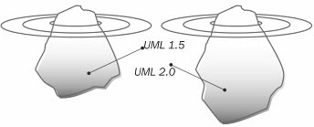

# UML 2.0

This book is based on the new version of UML—UML 2.0. In this version, the structure and documentation of UML was completely revised. There are now two documents available that describe UML:

 * UML 2.0 Infrastructure defines the basic constructs of the language on which UML is based. This section is not directly relevant to the users of UML (our readers), but is directed more towards the developers of modeling tools.
 
 * UML 2.0 Superstructure defines the user constructs of UML 2.0, meaning those elements of UML that users work with at the immediate level.

Among other things, this revision of UML was created to pursue the following goals:

 * To restructure and refine UML so that usability, implementation, and adaptation are simplified.		
 * The UML infrastructure is supposed to:
		
* Provide a reusable meta-language core, with which UML can define itself

		
* Provide mechanisms for the adjustment of language

 * The UML superstructure is supposed to:
		
* Feature better support for component-based development

		
* Improve constructs for the specification of architecture

		
* Provide better options for the modeling of behavior

In addition to the proposal of UML Infrastructure and UML Superstructure specifications, separate proposals were published for a new Object Constraint Language (OCL) as well as for Diagram Interchange. Together, they make up the complete UML 2.0 package, as shown in Figure 2.12:

	Figure 2.12 The complete UML 2.0 package
	
UML 2.0, as a whole, is more extensive and more complex than earlier versions. The extent of UML documentation has also further increased. While the documentation of UML 1.5, including OCL, comprised about 730 pages, the documentation of UML 2.0, also including OCL, contains approximately 1050 pages.

Even though part of the documentation doesn’t concern the ‘normal’ UML user, for a member of a software development project, reading the complete work is unrealistic. This is not only due to the number of pages, but also because of the number and complexity of UML constructs. Because of this, reduction to the UML constructs necessary for everyday project work is even more necessary than with earlier versions.

The concept of this book is to show a very simplified picture of UML. This is becoming even more important with the increasing scope of UML, since the accessibility of UML did not become any greater with version 2.0.

We consciously only show the tip of the iceberg, while the part hidden under water becomes bigger and bigger. More than ever, we are of the opinion that the tip of the iceberg (as shown in Figure 2.13) is sufficient for our target audience—members of IT project teams—to understand UML enough to use it meaningfully in projects:

	Figure 2.13 The UML iceberg
	
We would also like to point out a new possibility that UML 2.0 opens up. One of the goals of UML 2.0 was the definition of formal and completely defined semantics. If this new possibility is utilized for the development of models, corresponding systems can be generated from these models. This yields the following advantages:

 * A model that was described with UML reflects the real system.
 * It is possible to correct mistakes in the model early and continuously.
 * Intermediate steps such as amending code outside of the model design are omitted.
 * It is possible to make the same model executable on different platforms (hardware as well as software).

However, a price has to be paid for these advantages. It becomes necessary to acquire a deep and accurate understanding of UML and considerable effort has to be invested in the development of the models.

## Effects on the Business System Model

Some changes made in performance modeling enhanced the possibilities for modeling business systems. First, we’ll give examples of several of the changes and improvements.

Activity diagrams are no longer special cases of the statechart diagram. Initially, this fact was not relevant for the normal UML user. However, in addition to the new autonomy in the meta-model, several other changes and improvements were made:

Until now, the separate steps in the activity diagram were referred to as activities. Now the entire diagram is called an activity, whereas the steps previously called activities are now referred to as actions. An action can call a primary operation as well as another activity. This enables flexible modulation in the top-down view of models.

A division does not necessarily have to be re-synchronized.

An activity can have more than one initial state. With this, several events can be started at the same time.

Input and output parameters can be added to an activity.

One of the improvements made in the sequence diagram is the addition of so-called operators. These operators make it possible to package several actions/activities within a sequence diagram. For instance, operators can be used to refer to other sequence diagrams or individual sequences. Appropriate operators can also represent iterations. With the newly introduced operators, sequence diagrams now support a top-down view.

OCL is now an inherent part of UML. It can be used to describe agreements, invariants, preconditions, and post conditions within UML models, which enables more precise modeling of business systems and business processes.

## Effects on the IT System Model

The diagrams that we have used in this book in the different views of the IT system did not undergo any significant changes.

The biggest change occurred in the notation of the sequence diagram. Here, among other things, the interaction reference is available as a construct for modularization. However, nothing changed concerning the meaning and functionality of sequence diagrams at the level of detail used in this book. The same holds true for the class diagram and the case diagram.

Statechart diagrams underwent the most interesting changes for the modeling of IT systems: connection points allow, for example, better modulation of statechart diagrams. However, we decided not to use this language element in our simplified approach to UML.

## Effects on the Systems Integration Model

Of course, the improvements in behavioral modeling also had an effect on the process view in the systems integration model. A significant improvement is the ability to add input and output parameters to activities.

Hardly any changes were made in the area of static views, meaning the design of business objects with class diagrams.

In addition to the changes that were made within the framework of UML 2.0, the UML profile for Enterprise Application Integration (EAI) is of increasing importance in the field of system integration. Besides the basic operations needed in the field of system integration, it shows the data meta-models of various programming languages that are not object-oriented. However, this occurs at a more detailed level, which has no influence upon this text.

## Conclusion

For the normal user, UML 2.0 does not turn the previous versions of UML upside down, but represents an improvement on existing concepts. It is probably wise to use UML 2.0 for future models. On the other hand, it should be possible to continue using existing constructs and models based on earlier UML versions. For ongoing projects the advantages (more exact modeling) have to be weighed against the disadvantages (additional work).

