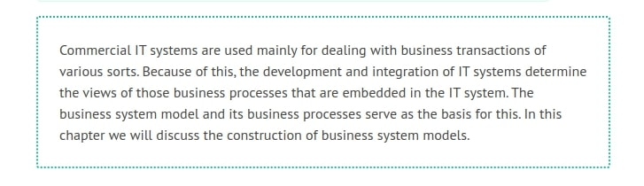
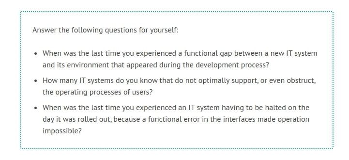
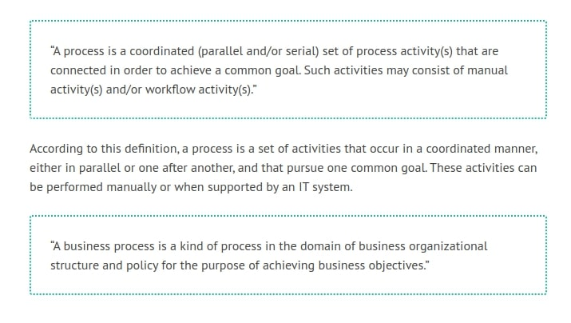
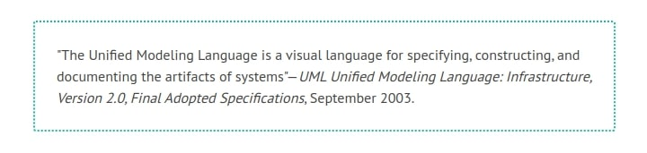

# Modeling Business Systems

To ensure smooth business transactions through the use of IT systems, it is indispensable to know and understand the business environment of IT systems. Therefore, analysis and modeling of business processes are important components of development and integration of IT systems.

Today, most IT systems are not only embedded in a business environment, but are also connected with other IT systems. Thus, every new IT system has to fit not into one, but two different target environments:

	* Integration on the business-process level: Each IT system has to be assigned the activities of a business process in a way that enables correct and efficient execution of the entire business process with all involved components.
	* Integration at the IT-system level: Communication with other IT systems involved in the business process has to go smoothly. This requires semantically and technically perfect interfaces. Integration on the IT-system level will be discussed in Modeling for System Integration.

	
We don’t want to look only at the dynamic aspects of our model, but also at the static elements. Because of this, we will construct a business system model that entails both business processes and business structures.

# Business Processes and Business Systems

# What is a Business Process?

Most people intuitively understand a business process to be a procedure or event with the purpose of reaching a goal. When looking at our UML Airport we can find many different business processes and goals:

	* The goal of our passenger is to go on vacation. To achieve this goal, he has to book a flight and hotel, pack his bags, drive to the UML Airport, check in and board his airplane, exit the plane at his destination airport, go to the hotel, move into his room, and unpack his bags.
	* The owner of the newsstand at the UML Airport wants to sell her goods. For this, she buys items inexpensively and sells them to her customers at a higher price.
	* In order for passengers to check in at the UML Airport, an employee of passenger services accepts their tickets and luggage, inquires about their seat preferences, and uses an IT system. By the end of the procedure, the passengers receive their boarding passes on which their reserved seats and the appropriate gates are marked.

As you can see, business processes are often completed in several steps. These steps are also referred to as activities, and have to be completed in a predetermined order. The newsstand owner cannot sell any goods unless she has purchased them beforehand.

A passenger packs his or her suitcase before he or she drives to the airport. The employee of passenger services at the check-in counter can only issue a boarding pass after check-in is completed (Figure 3.1):

	Figure 3.1 Activity of the business process “Passenger Services” (simplified)
	
Activities can run sequentially or in parallel. Thus, a passenger can buy a bottle of whiskey in the duty-free shop, while his or her luggage is being loaded into the Airbus 320 to London.

Individual activities can be organizationally distributed. The check-in procedure takes place at the check-in counter and is performed by an employee of passenger services, while the subsequent boarding occurs at a different location and is performed by different employees of passenger services.

Usually, the activities of a business process are interdependent. This interdependency is created by the interaction of all the activities belonging to a business process that pursue one common goal.

	
# Definition of the Workflow Management Coalition

Official definitions of the terms process and business process were adopted by the Workflow Management Coalition. The following definitions can be found in the glossary of the Workflow Reference Model of the Workflow Management Coalition:

# Business Systems

So far, we have explained business processes. Business processes are dynamic in nature and involve activities. However, if we want to look at the entire business system, we also have to consider the static aspects. This involves, for instance, the organizational structures within which business processes are conducted. This also involves various business objects and information objects, such as tickets or orders. For the static and dynamic aspects as a whole, we use the term business system.

In business terminology, a business system refers to the value-added chain, which describes the value-added process, meaning the supply of goods and services. A business can span one or several business systems.

Each business system, in itself, generates economic benefit. Thus, the business administrative meaning of business system does not differ very much from our use of the term business system. We also refer to the ‘results’ of a business system as ‘functionality’.

For the analysis and modeling of a business system it is important to define system limits. A business system that is to be modeled can span an entire organization. In this case, we talk about an organization model.

It is also possible to consider and model only a selected part of an organization. In our case study, an IT system is to be integrated into the Passenger Services operation. Therefore, it is sufficient to observe this operation and to narrow the business system to Passenger Services only.

Passenger Services is a division within the UML Airport, with employees, organizational structure, an IT system, and defined tasks (Figure 3.2). The surrounding divisions, such as baggage transportation or catering, also belong to the UML Airport, but not to our business system. So, we will treat them like other, external, business systems:

	Figure 3.2 System boundary during analysis of the business system
	
We are not interested in any of the external business systems as a whole, but only in the interfaces between them and our business system. For instance, the staff of passenger services need to know that they have to transfer passengers’ luggage to baggage transportation, so that it can be loaded into the airplane. Of course, for this, passenger services have to know how baggage transportation accepts luggage, so that it can be made available accordingly. It is possible that the IT systems of passenger services and baggage transportation will have to be connected, meaning that interfaces will have to be created. On the other hand, passenger services are completely unconcerned with how baggage transportation is organized, and whether each suitcase is individually carried across the runway or carts are used to transport luggage to the airplane.

# Using UML to Model Business Processes and Business Systems

Before we move on to the modeling of business processes and business systems with UML, we should ask ourselves whether UML is even suitable for the modeling of business processes and business systems. For this purpose we will take a look at UML’s definition by OMG (Object Management Group Inc.—the international association that promotes open standards for object-oriented applications, which publishes each version of UML that is submitted for standardization at www.omg.org):

	
This definition indicates that UML is a language for the modeling and representation of systems in general, and thus, also of business systems.

In any case, UML fulfills at least one of the requirements of business-system modeling: it reflects various views of a business system, in order to capture its different aspects. The various standardized diagram types of UML meet this requirement, because every diagram gives a different view of the modeled business system.

We reach the limits of UML when modeling extensive business process projects, for instance, business process reengineering, or when modeling entire organizations. However, for these kinds of projects powerful methods and tools are available, such as Architecture of Integrated IT Systems (ARIS). This doesn’t mean that we want to keep anyone from using UML for projects like that, although we recommend a thorough study of the UML specifications (OMG: Unified Modeling Language: Superstructure, Version 2.0, Revised Final Adopted Specification, October 2004) and the use of CASE tools.

This text is tailored toward projects with the goal of developing IT systems. Moreover, it is tailored toward projects for which a concern of the business system is the assurance of the smooth integration of an IT system. The following characteristics mark such projects:

	* Those business processes that are affected by the construction and integration of IT systems are considered.
	* Business-process modeling is not the focus of these projects. Instead, the model serves as the foundation for the construction and integration of IT systems. Business process integration can determine the success or failure of such a project; but the main task still is the construction of IT systems.
	* Because budgets are often tight, time investment in the methodology and language required for business-process modeling should not amount to more than 5-10% of the total project effort.
	
# Practical Tips for Modeling Business Processes

Often one is warned about the complexity of business process analysis and business-process modeling. However, in our experience most business processes are thoroughly understandable and controllable. Rather, the lack of clarity and transparency makes them seem more complex than they really are.

In many cases, existing business processes are documented poorly or not at all. This can be traced to the fact that for many years most functionalities were treated as ‘islands’ instead of parts of comprehensive business processes. Because of that, the link between activities—the process chain—is missing. If this overview is missing, business processes seem complicated.

There are more hurdles to overcome if business processes are handled by IT systems. Most of the time, documentation of the manual workflow that is carried out between individual systems is not available. In other cases, the functionality of IT systems is unknown because processes run automatically, hidden somewhere in a black box, and only the input and output are visible.

Existing business process architectures or reference models that already exist can speed up and ease the modeling process. Comparing processes with similar or identical processes in other organizations can be helpful in identifying discrepancies and deriving possibilities for improvement.

