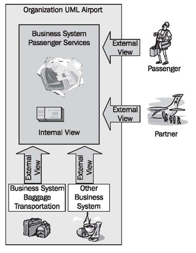
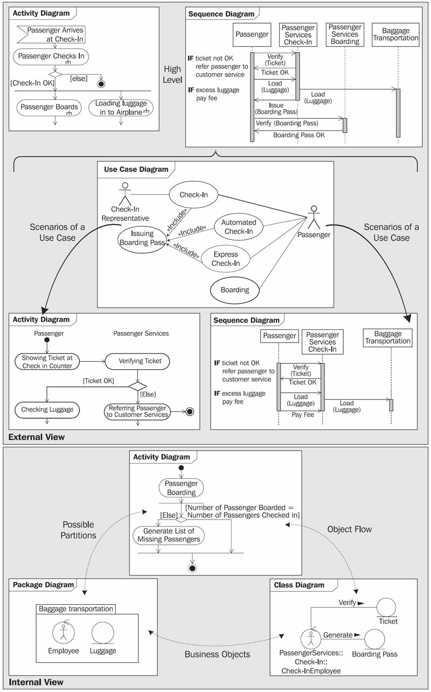

# One Model—Two Views

A business system can be viewed from different perspectives. Because of this, our business system model consists of two different views. Each of the views emphasizes certain aspects of the business system, and each of them is linked to the other. We clarify the different views in Figure 3.3.

Viewing a business system from the outside, we take on the role of a customer, a business partner, a supplier, or another business system. From this external view, only those business processes that involve outsiders are of interest. The external view describes the environment of a business system. The business system itself remains a black box.

Within the business system, we find employees and tools that are responsible for fulfilling the demands of the environment, and for handling the necessary business processes. Behind the business processes are workflows and IT systems. Each individual employee is part of the organizational structure. Normally this internal view remains hidden to outsiders.

	Figure 3.3 External and internal view of the business system

We begin with the external view in modeling our business system. In this way, we start with the description of the business system from the perspective of customers, business partners, and suppliers:

	Figure 3.4 The different views and diagrams

Following this, the internal view describes how the business system provides these services. The use cases of the external view serve well as the basis for constructing test scenarios, which are necessary for testing a finished IT system.

The individual views that we use for the business-system model, and the UML diagrams that they incorporate, are depicted in Figure 3.4.

