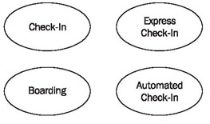
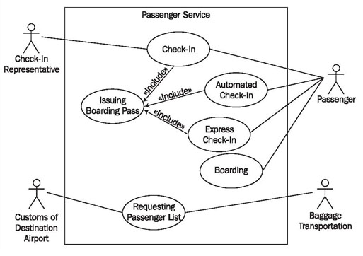
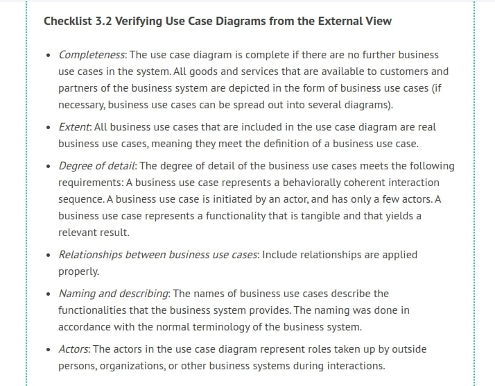

# Constructing Use Case Diagrams

The following checklist shows the steps necessary for the construction of use case diagrams. After this, we will explain the individual steps further.

We deliberately chose the order in which the steps are performed. However, this order is not mandatory, since in practice, the individual steps often overlap heavily.

On one hand, a general understanding of the business system and business processes is important for the realization of each individual step. On the other hand, for many steps it is also necessary to consult knowledge carriers. It makes little sense to cling to the personal view of the analyst, who knows too little about the area of application.

## Collecting Information Sources—How am I Supposed to Know That?

As a first step, it is important to find knowledge carriers, in order for analysts and knowledge carriers to work out the basic principles together. Such knowledge carriers are, for example:

 * People who are involved in performing, operating, and controlling business processes
 * Users of similar or related IT systems
 * Customers, who are often critical and creative knowledge carriers
 * Business partners
 * Domain experts
 * Management
 * External observers

Several helpful techniques have proven to be practical for the analysis and understanding of business processes:

 * Observing employees at work
 * Participating in the business processes being investigated
 * Taking the role of an outsider (e.g., of a customer)
 * Giving out surveys
 * Performing interviews
 * Brainstorming with everyone involved
 * Discussing with domain experts
 * Reviewing existing forms, documentation, specifications, handbooks, and work tools
 * Describing organizational structure and workflow management
 * Reviewing organization charts and job descriptions
	

The result of this first step is often a collection of forms, work instructions, completed surveys, existing process descriptions, business objects such as tickets or boarding passes, etc. This overview is often not yet complete, and will be further extended during the modeling process.

## Identifying Potential Actors—Which Partners and Customers Use the Goods and Services of the Business System?

This step is all about identifying potential actors. Here, this rule applies: the more the merrier. You can work with these actors in later steps; or they can be reduced in number or combined.

More potential actors can be found by answering the following questions (e.g., through consulting knowledge carriers). In doing this, it is advisable to create groups of people and types of organizations by abstracting directly from concrete examples of specific persons and organizations:

 * Which customers are customers of the business system, and which are customers of the business processes?
 * Who are the external partners of the business system? Which goods and services do these external partners use?
 * Which in-house positions and organization units are partners of the business system and use its goods and services?
 * With what external business systems does the business system interact?

As a first step, the previous explanations of our case study result in the following actors:

	Figure 3.10 Potential actors
	
In addition to the passenger, who represents travelers, there is the check-in representative. The check-in representative is a person who is not the actual passenger, but an agent of the passenger. The check-in representative has the task of performing the check-in with the ticket of the passenger.

## Identifying Potential Business Use Cases—Which Goods and Services can Actors Draw Upon?

This step is about finding potential business use cases. The rule—the more the merrier—applies here as well (in reasonable moderation). Potential business use cases can be found by answering the following questions:

 * Which goods or services are provided to and used by the customer?
 * Which goods or services are provided to and used by external partners?
 * Which goods and services that are provided by the business system involve suppliers (suppliers of goods and suppliers of services)?
 * What are the individual actors doing?
 * How and on what occasions does communication take place with other business systems or business partners?
 * Which events trigger what activities?
	
First considerations of our case study result in the following business use cases:

	Figure 3.11 Potential business use cases
	
Initially, the business use cases can only be described in a concise and informal manner:

 * The check-in procedure includes submitting the ticket, baggage check-in, seat reservation, and issuing and handing over the boarding pass.
 * Passengers who only have hand luggage can use express check-in. No baggage check-in is performed.
 * During boarding, the boarding pass of the passenger is verified at the gate.
 * Automated check-in is conducted without the help of a check-in clerk, directly at a machine (screen). Baggage cannot be checked in.
	
## Practical Tips

For us, in practice, the observation technique has proven effective for identifying business use cases. By observing people involved in the business processes, activity lists can be created. Following this, the activities can be grouped by events that lead to the first business use cases.

## Connecting Business Use Cases—Who Can Make Use of What Goods and Services of the Business System?

By assigning business use cases to actors, a first draft of the use case diagram evolves (Figure 3.12). This is achieved by answering the following question:

Which customers or business partners have what functionalities available to them?

	Figure 3.12 First draft of the use case diagram
	
With this first draft we obtain the basis from which we can further edit and refine the use case diagram.

The passenger can choose between a normal check-in, automated check-in, and express check-in. The passenger walks to the gate and presents his or her boarding pass. The check-in representative can perform a regular check-in, but is not able to perform express check-in and automated check-in.

## Describing Actors—Who or What do the Actors Represent?

An actor in a diagram has to be named in a way that clarifies the role that is represented. Here, it is of utter importance that the terminology of the domain area, meaning a business-oriented term, is used. In addition to the name, an actor can be further defined with a description. The question to this end is:

How can an actor be described further? For instance, this description can include an area of responsibility, requirements from the system, or a formal definition of his, her, or its role. Don’t be afraid to add job descriptions or organizational profiles (for example of a catering company)—even if these are not represented in UML.

## Searching for More Business Use Cases—What else Needs to be Done?

Once you have found several business use cases, they can be used as starting points for further questions. Starting from a particular business use case, the following questions can be asked:

 * Is there anything that has to be done at some point beforehand, prior to accessing a particular functionality?
 * Is there anything that has to be done at some point afterwards, after performing a particular business use case?
 * Is there anything that needs to be done if nobody performs a particular business use case?
	
In doing so, it is important to consider the proper business system. Many of the events that occur before or after a business use case take place outside the business system under consideration. In our case study, for instance, booking the flight or getting to the airport does not belong to the system being considered.

If we take a closer look, we notice that a passenger often travels with luggage, which he or she checks in. Baggage transportation is responsible for loading luggage into the airplane. Baggage transportation is carried out by an independent organization, known as a handling agent. Consequently, it is considered an actor, more specifically, an outside service provider. It does not matter for our diagram that individual employees of the partner enterprise perform these tasks.

Ten minutes before a flight leaves, baggage transportation requests a passenger list from passenger services, which includes every passenger who checked in, but did not board the airplane. On the basis of this list all affected luggage will be unloaded again from the airplane. If the flight is an international flight, the customs authorities of the country in which the destination airport is located also request a passenger list.

This results in two new actors: baggage transportation and the customs authorities at the destination airport (Figure 3.13):

	Figure 3.13 Extended use case diagram
	
## Editing Business Use Cases—What actually has to be Included in a Business Use Case?

Without a doubt, it is difficult to find the right amount of detail in the modeling of business systems. If almost all the activities of an actor in a business use case are combined, the use case diagram will lose practically all of its significance. If the activities are itemized too thoroughly, the use case diagram gets too complex and contains too many activities with interrelationships that are hardly recognizable.

Fortunately, some criteria will help you determine the optimal scope of a business use case. For this purpose, ask yourself the following questions:

 * Does the business use case consist of a behaviourally related sequence of interactions that belong together (an interaction sequence)? Items that are included in a business use case have to be directly related. Issuing a boarding pass and searching for lost luggage are not related at all. Business use cases that violate this criterion have to be divided. This prevents the occurrence of oversized business use cases.
 * How many actors are involved in a business use case? Business use cases that have too many actors have to be divided. This also prevents oversized business use cases.
 * Does the business use case deliver tangible and relevant goods or services? A business use case is not supposed to describe incomplete steps, for example, counting pieces of luggage. Rather, at least in a regular case, it is supposed to produce a benefit that has meaning from a customer’s perspective. Business use cases that violate this criterion have to be combined with other business use cases. This way, undersized business use cases are prevented.
 * Is the business use case never performed alone, but always in a sequence in combination with other business use cases? A business use case is not supposed to describe goods and services that are only used in combination with other goods and services. Business use cases that violate this criterion, have to be combined with other business use cases. This also prevents undersized business use cases.
 * Is the business use case initiated by an actor? Business use cases that are not initiated by an actor are not use cases but internal activities that are depicted in the internal view of the business system.

A review of the existing business use cases on the basis of these questions can lead to the consolidation or division of business use cases.

## Documenting Business Use Cases—What Happens in a Business Use Case?

To understand a business use case, the information from the use case diagram is not sufficient. The chain of interactions and of the various scenarios that are behind each business use case have to be described. This means that the goods and services that the business system provides have to be described, namely the chain of events from the perspective of the customer or business partner.

In addition to purely verbal description, documentation in activity diagrams and sequence diagrams has proven to be especially valuable. The construction of these diagram types will be treated in the following sections: Activity Diagrams, and High-Level Sequence Diagrams.

## Modeling Relationships between Business Use Cases—What Activities are Conducted Repeatedly?

If you realize that certain parts of an interaction are the same in several business use cases, you can extract these similarities and combine them into their own business use case. This new business use case can be used in other business use cases with an include relationship.

In our case study, the business use case issuing boarding pass has not yet been assigned. We know that the boarding pass is generated and issued during check-in. At some point during the business use cases check-in, express check-in, and automated check-in, the boarding pass is issued (see Figure 3.14):

	Figure 3.14 Extended use case diagram
	
## Verifying the View—Is Everything Correct?

All diagrams and records have to be verified by the knowledge carriers. What we should ask the knowledge carriers for every diagram or view is:

Is everything that is contained in the diagram correct and complete?
Even if knowledge carriers can read and understand diagrams themselves (they can use the reading directions in this text), we should still read the diagrams to them. Only with this last step is the circle completed. This results in a verified view, which reflects a current shared understanding of business systems and business processes.

The completed use case diagram can be verified with the following checklist:

## Practical Tips

When using use case diagrams for modeling business systems and business processes, it is advisable to keep the level of abstraction low. For the comprehensibility of the diagrams and for communication between the involved parties, it is better to add redundancies than to abstract too much.

It is of fundamental importance that the terminology of the business processes or the organization is used, and that the descriptions of the business use cases are chosen in a way that can be understood intuitively.

Terminology from the field of Information Technology does not belong in use case diagrams on the business-process level. The mixing of terms from the business process and IT communities leads to poor results. In reality, we often encounter use cases that are already very close to IT on the business-process level, e.g., updating a customer index. This leads to confusion in two aspects:

 * Users—meaning people who are involved in business processes, and who are not familiar with IT terminology—do not understand the business use cases. Since business use cases describe the performance requirements for a business system, the business system and business processes cannot be understood, and therefore cannot be verified. In a project with poorly formulated business use cases, an IT department presented the business use cases to users for verification and received just one short answer: “Men throwing arrows?!”.
 * Technical details on the level of business use cases distract from the business-process specific requirements for a system.

