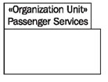
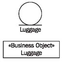
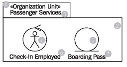

# Package Diagram

The structure of organization units is important for the internal view of the business system. In UML, organization units are depicted as packages, which can contain employees, business objects, and other organization units. In our case study, we chose the organization unit passenger services (see Figure 3.30):

	Figure 3.30 A package diagram
	
Organization units can be responsible for the execution of business-process activities. Organization units are abstractions of individual jobs within an organization.

In UML an organization unit spans workers, business objects, other organization units, and their relationships. As a basic principle, organization units are located within business systems. Organization units that are located outside business systems are actors.

In package diagrams we work with the following elements:

## Package «Organization Unit»

Organization units are depicted as packages. In the small box in the upper left the name of the organization unit is inserted below the stereotype «Organization Unit»:

The content of organization units is inserted into the main box. Most of the time, it is sufficient to list the most important elements (employees, business objects).

## Class «Worker»

The stereotype «Worker» is used to describe the roles of those people who execute business processes or who are involved in the execution of business processes:

We are not concerned with the ‘status’ of workers, such as salaried employee, free-lancer, or volunteer, but with their roles, meaning jobs. Workers are responsible for providing goods and services. They are located within a business system. Here, the following characteristics are important:

 * Workers are people.
 * Workers are located within the business system.
 * Workers can communicate with other workers and with actors outside the business system.
 
Workers can have their own symbol; below the worker symbol the role of the worker is inserted. The symbol shows an actor symbol that is surrounded by a circle—this is supposed to indicate that the worker is located within something. The worker symbol can also be omitted. In this case, the class symbol is used and the term «worker» is written as a stereotype in angle brackets.

## «Business Object»

Business objects are passive, meaning they do not initiate interactions. Business objects can be involved in several different business use cases and outlive individual interactions. This makes them a form of connecting link between business use cases or workers that are involved in various use cases:

Workers handle (utilize, control, manipulate, produce, etc) handle business objects. In our case study business objects are, for instance, a ticket, a piece of luggage, or a boarding pass. Business objects are also illustrated with their own symbol; the description of the business object is written below the business object symbol.

The business object symbol can also be omitted. In this case, the class symbol is used and the term «Business Object» is written as a stereotype in angle brackets.

## Reading Package Diagrams

	Figure 3.31 A package diagram

Through the stereotype «Organization Unit» (1) you can see that the package (2) represents an organization unit. The name of this organization unit is passenger services (3). Within this organization unit you can find the check-in employee (4) and the business object: boarding pass (5). The graphic symbol (4) on the left represents a worker; the label (6) below the graphic symbol indicates the worker’s role within the organization. The graphic symbol (5) on the right represents a business object; the label (7) below the graphic symbol indicates the type of business object we are dealing with.

There is only one symbol for the check-in employee. That doesn’t mean there is only one check-in employee, but rather the symbol represents a role that can be fulfilled by any number of real check-in employees. Surely, there are other worker roles within passenger services (manager, assistant, etc.). However, these are irrelevant for the illustration of our processes, and so do not have to be included in the package diagram (see Figure 3.31).

