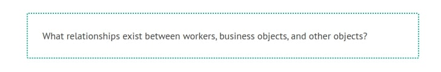
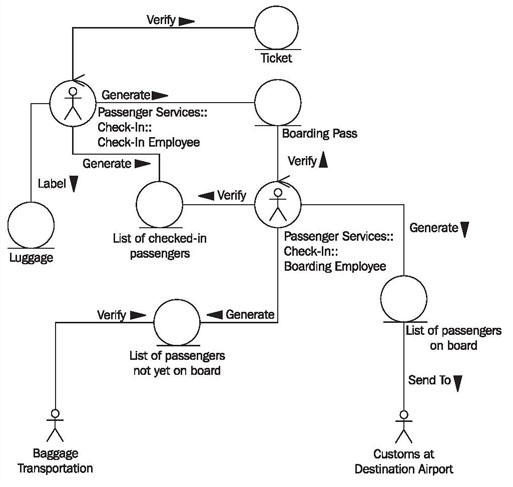
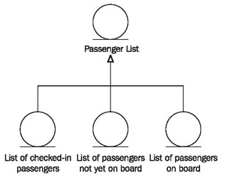

# Constructing Class Diagrams

The following steps have to be executed for the construction of class diagrams:

## Find Classes—Which Classes Exist in the Class Diagram?

You can use the classes of package diagrams for the class diagram of the business system’s internal view, meaning workers and business objects. Actors from use case diagrams are also classes that can be adopted into this class diagram. In our example, you’ll find the classes that are displayed in Figure 3.37:

	Figure 3.37 Classes of the internal view of the business system
	
# Create Associations Between Classes—Which Classes Deal with Each Other?

In class diagrams, the relationships between the found classes as well as business rules are modeled as associations.

The question is:

Even though we begin with the classes that have already been found, we usually find more classes in this work step through domain discussions.

## Substantiate Associations—What do these Relationships Mean?

Associations between individual classes have to be labeled with meaningful names, so that the class diagram can be understood easily and intuitively. Generally, a direction is added to the association, according to which it can be read (see Figure 3.38).

## Insert Generalizations—Can Business Objects be Grouped?

It might make sense to group business objects into another higher-ranking class. In our case study, it is helpful to illustrate that the list of checked-in passengers, the list of passengers on board, and the list of passengers not yet on board, are of the type Passenger List (see Figure 3.39):

	Figure 3.38 Class diagram of passenger services
	
This shows that the lists have the same structure (see also Generalization, Specialization, and Heredity):

	Figure 3.39 Generalization in the class diagram

## Verify the View—Is Everything Correct?

The completed class diagram can be verified with the following checklist:

