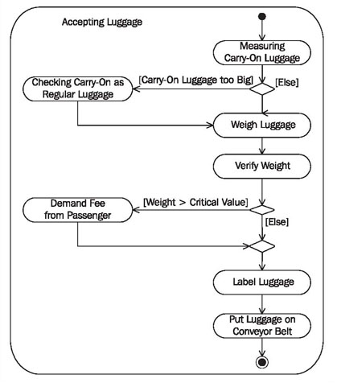

# Activity Diagram

Activity diagrams are suitable to show the internal processes of a business system. Contrary to activity diagrams of the external view, in activity diagrams of the internal view the relationships to actors are no longer the focal point.

Activity diagrams of the internal view are also suitable as a basis for instructions.

## Reading Activity Diagrams

The reading instructions in previous Activity Diagrams section, can be used for activity diagrams of the internal view.

## Constructing Activity Diagrams

Essentially, the construction of activity diagrams of the internal view takes place exactly like the construction of activity diagrams of the external view.

The following checklist and the explanations of the individual steps are adapted to the modified view.

## Collect Information Sources—How am I Supposed to Know That?

When constructing activity diagrams of the internal view, the same directions as in previous Constructing Use Case Diagrams section, hold true in order to obtain the necessary information.

## Find Activities and Actions—Which Activities Have to be Performed so that the Goods and Services Utilized by Actors can be Provided and Delivered?

Here, we can borrow from use cases and actions of activity diagrams of the external view. We have to ask the following question for the individual business processes that are depicted in the external view: How does the internal processing take place and what do the internal business processes look like? Answering the following questions will help you find activities and actions:

 * Which work steps have to be performed by employees of the business system to provide and deliver a service?
 * What does each employee do?
 * Which outside events initiate which activities and actions?
 
Often, we can find pre-existing documentation of flows, either informal or structured, that we can use to find activities.

## Adopt Actors from Business Use Cases—Who is Responsible for Each Action?

Predominantly, workers and organization units from the package diagram are responsible for the actions. Actors from use case diagrams are also used, as long as they are involved in the depicted business processes.

Each worker, each organization unit, and each actor is responsible for certain activities and is inserted into an activity partition (swimlane) as the responsible party. The individual actions are assigned to these responsibilities.

If activity diagrams are refined, it is possible that other areas of responsibility will be added, for example, individual positions or teams.

## Connect Actions—In Which Order are Actions Processed?

Connecting the individual actions in a flow generates an initial activity diagram, which describes internal business processes. The following questions help with the construction of the control flow:

* In which order are actions processed?
* Which conditions have to be met in order for an action to be executed?
* Where are branches necessary?
* Which actions occur simultaneously?
* Is the completion of some actions necessary before the flow can proceed to other actions?

## Refine Activities—Do any Other Activity Diagrams Have to be Added?

It is possible that individual actions have to be further divided or refined with other activity diagrams. Different scenarios are also described in other activity diagrams.

## Verify the View—Is Everything Correct?

Activity diagrams of the internal view also have to be verified in terms of correctness of content. This should be done in collaboration with knowledge carriers.

In the following Figure 3.40 depicts an activity diagram that represents the internal processing of the activities accepting luggage during check-in by passenger services:

	Figure 3.40 Activity diagram of the internal activity “Accepting Luggage”
	
The activity accepting luggage, as shown in Figure 3.40, is carried out by passenger services. It is not important for the passenger or for baggage transportation which actions are performed in what way. The passenger is only interested in whether his or her carry-on is too big and if he or she has to pay for excess weight; baggage transportation needs labels on each piece of luggage. All other details that are shown in the diagram are internal processing details of passenger services and will therefore be labelled as ‘internal view’.

