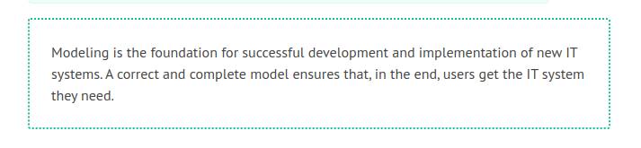

# Modeling IT Systems

	Figure 4.1 Different views of a system
	
In this chapter, we show how a conceptual model of an IT system can be developed with the help of UML. Taking into consideration the 80:20 rule, we do not use all the features of UML. Practice shows that it is unrealistic to model everything in full depth with UML. This is because in the implementation stage new insights are gained, which cannot be foreseen during the conception stage. In addition to that, models should be developed with the least amount of effort possible.

The IT system model consists of four different views, each of which emphasizes certain aspects and which are closely related to each other. This approach of a model consisting of different views, is illustrated in Figure 4.1. The individual views we use for the IT system model, and the UML diagrams included in them are depicted in Figure 4.2:

	Figure 4.2 Different views of an IT system
	
 * <b>External View</b>—Use case diagram and use case sequence diagram
 * <b>Structural View</b>—Class diagram
 * <b>Interaction View</b>—Sequence diagram and communication diagram
 * <b>Behavioral View</b>—Statechart diagram
 
Each of these views emphasizes certain aspects, and thus, disregards all others. All the views combined make up a fairly complete model of the functionality of an IT system:

 * The external view shows the use cases of the IT system in the form of UML use case diagrams and an interface prototype. It makes apparent which functionalities the IT system provides to users.
 * The structural view shows the relevant classes of the IT system in the form of UML class diagrams. It makes apparent in which structures information is filed in the IT system.
 * The behavioral view shows the behavior of the individual objects in the form of statechart diagrams. It makes apparent everything that can happen with an object that is filed in the IT system.
 * The interaction view shows flows that take place during mutations or queries within the IT system, in the form of sequence diagrams and communication diagrams. It makes apparent what takes place in the IT system when a user utilizes it.

Events are the real links that hold the different views together. They are contained in three of the four views:

 * In the external view the individual use cases are described as a sequence of events that are sent to the IT system.
 * The behavioral view shows for each class how the objects respond to the events that reach them.
 * The interaction view shows how the individual events in the IT system are relayed to the affected objects.
 
Only in the class diagram of the structural view are events not visible. The class diagram shows classes and the relationships, but not the dynamic aspects between them.

We do not use all types of diagrams that UML provides to model IT systems. In practice, the combination of diagrams that we describe in this chapter has proven to be valuable for modeling IT systems. A consistent and complete model of the IT system can be developed with these diagrams. For other models the optimal combination of diagrams looks different. For instance, activity diagrams have proven to be valuable for the business system model.In the following sections, we will discuss the four views individually. In practice, the development of these four views does not simply follow this order. Rather, working on each view will provide new insights for the other views. The dashed arrows in Figure 4.2 show the most important of these relationships.

