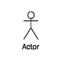
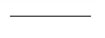
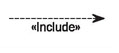
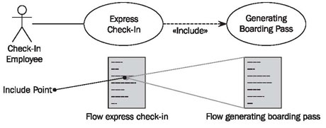
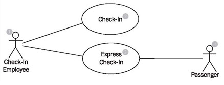
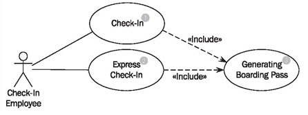

# Use Case Diagram

	Figure 4.8 Elements of the use case diagram

In use case diagrams, as shown in Figure 4.8, we work with the following elements:

## Actor

You can picture an actor as a user of the IT system, for example Mr. Steel or Mrs. Smith from check-in. Because individual persons are irrelevant for the model, they are abstracted. So the actors are called “check-in employee” or “passenger”:

Actors represent roles that users take on when they use the IT system, e.g., the role of a check-in employee. One person can act in more than one role toward the IT system. It is important for the IT system in which role a person is acting. Therefore, it is necessary to log on to many IT systems in a certain role, for instance, as a normal user or as an administrator. In each case access to the appropriate functionalities (use cases) is granted.

Actors themselves are not part of the IT system. However, as employees they can be part of the business system (see Figure 4.5).

## Use Case

Use cases describe the interactions that take place between actors and IT systems during the execution of business processes:

A use case represents a part of the functionality of the IT system and enables the user (modeled as an actor) to access this functionality.

Anything that users would like to do with the IT system has to be made available as a use case (or part of a use case). Functionalities that exist in the IT system, but that are not accessed by means of use cases, are not available to users.

Even though the idea behind use cases is to describe interactions, flows of batch processing, which generally do not include interactions, can also be described as use cases. The actor of such a batch use case is then the one who initiates batch processing. For instance, generating check-in statistics would be a batch use case.

## Association

An association is a connection between an actor and a use case. An association indicates that an actor can carry out a use case. Several actors at one use case mean that each actor can carry out the use case on his or her own and not that the actors carry out the use case together:

According to UML, association only means that an actor is involved in a use case. We use associations in a restricted manner.

## Include Relationships

An include relationship is a relationship between two use cases:

It indicates that the use case to which the arrow points is included in the use case on the other side of the arrow. This makes it possible to reuse a use case in another use case. Figure 4.9 shows an example of this relationship. In the flow of the use case, express check-in is a point at which the use case generating boarding pass is included. This means that at this point the entire process generating boarding pass is carried out. Include relationships can be viewed as a type of call to a subprogram:

	Figure 4.9 Include relationships between use cases
	
## Reading Use Case Diagrams

Figure 4.10 shows a use case diagram with the actors (employee and passenger) as well as the use cases check-in and express check-in:

	Figure 4.10 A simple use case diagram

According to your interest, you can start reading a use case diagram with the actor or with the use case.

Starting with the actor check-in employee (1) you can find associations between the two use cases check-in (2) and express check-in (3). This means that persons who interact with the IT system as check-in employees can carry out the use cases check-in and express check-in.

For the readability of the diagram it makes sense that use cases are located one below the other. However, this means nothing. A meaningful order in which a worker carries out use cases cannot be documented in a use case diagram.Unless the use case diagram has to be amended, the use cases check-in (2) and express check-in (3) are everything that a check-in employee can do with the IT system.

The actor passenger (5) has an association to the use case express check-in (3), which means that people who interact with the IT system as passengers can carry out the use case express check-in (3) directly with the IT system. The actor check-in employee (1) also has an association to the use case express check-in (3), which means that both passengers and check-in employees can carry out this use case. It does not mean that these two work together during express check-in.

Of course, during the use case check-in (2) too, a passenger checks himself or herself in and not an employee, but actor of the IT system is always the one who directly interacts with the IT system. For the use case express check-in (3) this can be either the passenger, who, with his or her plane ticket, can obtain a boarding pass at a machine, or a check-in employee who can do this in place of the passenger. However, for the business system the passenger is always the actor, because he or she is located outside the business. The employee, on the other hand, is not an actor from the perspective of the business system, because he or she works inside the business system.

	Figure 4.11 Use case diagram with include relationships

Figure 4.11 shows a use case diagram with the include relationships that both the use cases check-in (1) and express check-in (2) have with the use case generating boarding pass (3). This means that during both check-in and express check-in, a boarding pass is generated. According to our practical experience, this is the easiest way to reuse parts of use cases.

